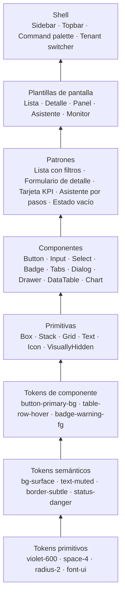
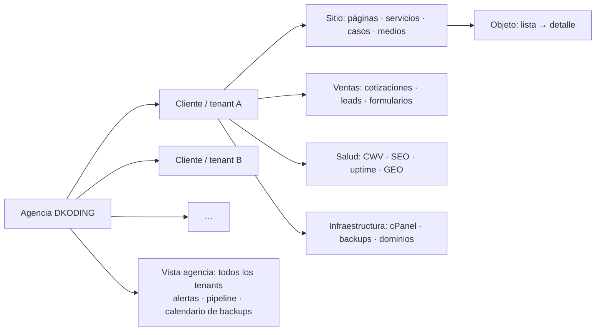
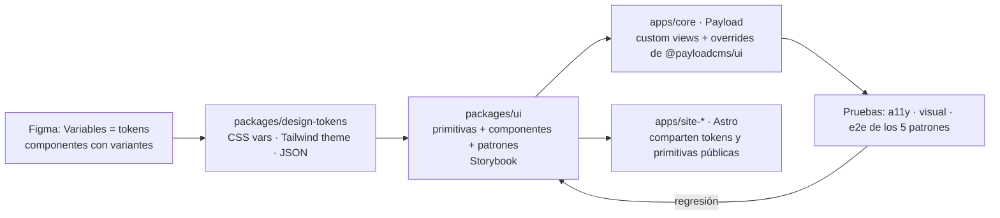

# Arquitectura de diseño para el administrador DKODING: moderno y escalable

> Fecha: 2026-10-06. Aplica al núcleo definido en `arquitectura-plataforma-agencia.md`
> (Payload CMS 3 sobre Next.js) y a sus vistas propias: panel de monitoreo, cotizaciones,
> leads, integridad y backups de cPanel de clientes.

---

## 0. Respuesta corta

La forma más sólida de diseñar un administrador que crezca sin romperse es **no diseñar
pantallas, sino un sistema de cinco capas y cinco patrones**:

1. **Cinco capas** de abajo arriba: tokens (en tres niveles) → primitivas → componentes →
   patrones → plantillas. Cada capa solo usa la de abajo.
2. **Cinco patrones de pantalla** y ninguno más: Lista, Detalle, Panel, Asistente y
   Monitor. Toda funcionalidad nueva se expresa como uno de ellos.
3. **Interfaz dirigida por esquema**: el 80 % de las pantallas (CRUD) las genera Payload
   desde la definición de la colección; el diseño se invierte en el 20 % que es propio.
4. **Un shell único** (barra lateral, barra superior, paleta de comandos, selector de
   cliente) que no cambia aunque se añadan 50 módulos.
5. **Tenant y permisos como dimensiones del diseño**, no como parches: cada componente
   sabe ocultarse, deshabilitarse o cambiar de marca según quién mira.

Lo demás de este documento desarrolla cómo.

---

## 1. Las cinco capas

### 1.1 Tokens en tres niveles (la decisión que más escala)

| Nivel | Qué contiene | Ejemplo | Quién lo cambia |
|---|---|---|---|
| Primitivo | Valores crudos, sin significado | `--violet-600: #6C00C2`, `--space-4: 16px` | Casi nunca |
| Semántico | Propósito en la interfaz | `--bg-surface`, `--text-muted`, `--border-focus`, `--status-ok/warn/danger` | Al cambiar tema (claro/oscuro, alto contraste) o marca por tenant |
| De componente | Enganche puntual | `--button-primary-bg: var(--accent)`, `--table-row-hover: var(--bg-raised)` | Al ajustar un componente sin tocar los demás |

Reglas: los componentes **solo** leen tokens semánticos o de componente, nunca primitivos.
Modo oscuro y marca blanca por tenant se resuelven **cambiando el nivel semántico**, no
con clases por elemento. Los colores de estado (ok, aviso, crítico) son independientes
del acento de marca, para que un tenant con acento rojo no confunda "error" con "marca".

Nomenclatura: `--{categoría}-{rol}-{variante?}-{estado?}` → `--bg-surface`,
`--text-on-accent`, `--border-input-focus`. En código, los tokens viven en un paquete
`packages/design-tokens` que exporta CSS variables, un tema Tailwind v4 y JSON para Figma
Variables. Una sola fuente, tres salidas.

### 1.2 Primitivas y componentes

- **Primitivas** (`Box`, `Stack`, `Grid`, `Text`, `Icon`): layout y tipografía sin
  opinión. Resuelven espaciado con `gap`, nunca con márgenes sueltos.
- **Componentes**: Radix/shadcn como base accesible (teclado, foco, ARIA), estilizados
  con los tokens. Un componente nuevo entra al sistema solo si tiene: variantes
  documentadas, estados (hover, foco, activo, deshabilitado, cargando, error), versión
  clara y oscura, y una historia en Storybook.
- **Densidad**: dos modos (`comfortable`, `compact`) resueltos por tokens de espaciado.
  El admin de una agencia vive en tablas; el modo compacto es el que más se usa.

### 1.3 Patrones y plantillas

Un patrón es una composición con reglas (dónde va el botón primario, qué pasa en vacío).
Una plantilla es una pantalla completa con sus regiones fijas. Ver §3.

---

## 2. Arquitectura de información y shell

### 2.1 Modelo mental: Agencia → Cliente → Módulo → Objeto

- El **selector de cliente** está siempre en la barra superior. Cambia el contexto de
  toda la interfaz (datos, marca, permisos) sin cambiar el layout.
- La **vista agencia** (sin tenant) agrega lo de todos: alertas rojas primero, pipeline
  de cotizaciones, próximos backups, leads sin contactar.
- Un cliente que entra ve solo su tenant, con su logo y su acento en el shell.

### 2.2 El shell

| Región | Contenido | Regla |
|---|---|---|
| Barra lateral (colapsable, con hoja en móvil) | Módulos del tenant agrupados: Sitio · Ventas · Salud · Infraestructura · Ajustes | Máximo 7 grupos; los módulos se registran como plugins y aparecen solos |
| Barra superior | Selector de cliente · buscador/paleta `⌘K` · notificaciones · usuario | No cambia nunca |
| Paleta de comandos | Ir a cualquier objeto, crear, filtrar en lenguaje natural ("leads sin contactar esta semana") | Es el atajo que hace escalar la navegación cuando hay 40 módulos |
| Área de contenido | Una de las cinco plantillas | Siempre con migas de pan `Cliente / Módulo / Objeto` |
| Barra de estado contextual | Guardado automático, versión, quién edita | Visible en Detalle |

---

## 3. Los cinco patrones de pantalla

Toda pantalla del administrador es una de estas cinco. Si una funcionalidad nueva no
encaja, el problema está en la funcionalidad, no en el sistema.

| Plantilla | Para qué | Regiones fijas | Reglas clave |
|---|---|---|---|
| **Lista** | Cualquier colección: páginas, leads, cotizaciones, backups | Título + acción primaria · barra de filtros · tabla densa · paginación · barra de acciones masivas al seleccionar | Estado de filtros en la URL (compartible) · filtros facetados con conteo · columnas configurables y persistidas · ordenación en servidor · vista guardada |
| **Detalle** | Crear/editar un objeto | Cabecera con estado y acciones · pestañas de contenido · columna lateral de metadatos (SEO, publicación, historial) · barra de guardado | Autosave con historial de versiones · validación en línea · vista previa · campos condicionales desde el esquema |
| **Panel** | Resumen de un tenant o de la agencia | Fila de KPIs con semáforo · gráficos de tendencia · lista de "requiere atención" | Resumen antes que detalle · cada tarjeta enlaza a su Lista filtrada · semáforos con forma además de color |
| **Asistente** | Flujos de varios pasos: alta de cliente, conectar cPanel, crear cotización manual, lanzar sitio | Indicador de pasos · un bloque de decisión por paso · resumen final | Se puede abandonar y retomar · validación por paso · el último paso siempre es revisión |
| **Monitor** | Tiempo real o casi: uptime, ejecución de backup, deploy, cola de envíos | Línea de tiempo / log · estado actual grande · acciones (reintentar, pausar) | Actualización en vivo · marca de "última actualización" · exportar log |

Mapeo de los módulos de DKODING:

| Módulo | Lista | Detalle | Panel | Asistente | Monitor |
|---|---|---|---|---|---|
| Contenido del sitio | páginas, servicios, casos, medios | editor con bloques | — | lanzar sitio | deploy en curso |
| Cotizaciones y leads | cotizaciones, leads | cotización (líneas, versión de tarifas, PDF) | pipeline | cotización manual | — |
| Salud (CWV, SEO, GEO) | URLs auditadas, alertas | detalle de alerta | panel de tenant y de agencia | — | uptime |
| cPanel y backups | cuentas conectadas, backups | cuenta (credenciales cifradas, dominios, espacio) | calendario de backups | conectar cPanel | backup ejecutándose, verificación de integridad |
| Ajustes | usuarios, roles, tarifas | versión de tarifas | — | alta de cliente | — |

---

## 4. Estados, feedback y permisos como parte del diseño

- **Cinco estados obligatorios por pantalla**: vacío (con la acción para salir de él),
  cargando (esqueleto, no spinner), error (qué pasó y cómo arreglarlo), éxito (toast con
  deshacer cuando aplique), sin permiso (explica a quién pedirlo).
- **Permisos en tres grados** por componente: visible, deshabilitado con motivo, oculto.
  Un `client_viewer` ve el panel y las listas, no los botones de editar.
- **Acciones destructivas** siempre con confirmación en la propia pantalla y, si son
  irreversibles (borrar backup, eliminar tenant), con escritura del nombre.
- **Marca por tenant** limitada a logo y acento; el resto del sistema no cambia. Así el
  cliente se siente en casa y la agencia mantiene una sola interfaz.

---

## 5. Qué hace que escale (principios de ingeniería del diseño)

| Principio | Cómo se aplica |
|---|---|
| **Dirigido por esquema** | Payload genera listas y formularios desde la config de cada colección. Añadir un campo es una línea; la UI aparece sola, con los tokens del sistema. El diseño manual se reserva para Panel, Asistente y Monitor |
| **Módulos como plugins** | Cada módulo (cotizador, monitoreo, cPanel) se registra con sus colecciones, vistas, ítems de menú y permisos. El shell los descubre; nadie edita el menú a mano |
| **Composición sobre configuración** | Un `DataTable` genérico con columnas declarativas en vez de una tabla por módulo |
| **Estado en la URL** | Filtros, pestaña, página y selección viven en la URL. Compartir un enlace reproduce la pantalla |
| **Datos en servidor** | Las vistas custom son React Server Components que llaman a la Local API de Payload: sin capa HTTP intermedia, sin estado duplicado |
| **Feature flags por tenant** | Un módulo nuevo se enciende para un cliente piloto antes que para todos |
| **i18n desde el día uno** | Textos en diccionarios; español por defecto, inglés listo |
| **Tokens como contrato** | Figma Variables ↔ `design-tokens` ↔ Tailwind. Un cambio de color de marca es un PR de una línea |
| **Pruebas de componentes** | Storybook con pruebas de accesibilidad y capturas visuales; una regresión visual bloquea el merge |

---

## 6. Stack concreto

| Capa | Elección | Motivo |
|---|---|---|
| Admin base y CRUD | **Payload 3** con `@payloadcms/ui` | Genera Lista y Detalle desde el esquema; mismas primitivas que usa Payload internamente |
| Vistas propias (Panel, Asistente, Monitor) | **Custom Views** de Payload (RSC) + **shadcn/ui** sobre **Radix** | Accesibilidad resuelta, estilizable con tokens, guía oficial de Payload para Tailwind + shadcn |
| Estilos y tokens | **Tailwind CSS v4** con `@theme` alimentado por `packages/design-tokens` | Una fuente de verdad; modo oscuro por tokens |
| Tablas densas | **TanStack Table** (headless) dentro de `DataTable` | Ordenación/paginación en servidor, columnas configurables, selección masiva |
| Filtros avanzados | Patrón de filtros facetados con estado en URL (referencia: openstatus data-table-filters) | Conteos por faceta, rangos estables |
| Formularios custom | **React Hook Form + Zod** | Validación tipada compartida con el servidor |
| Gráficos | **Recharts** o Tremor sobre tokens | Suficiente para tendencias y KPIs; ver skill `dataviz` al implementarlos |
| Paleta de comandos | `cmdk` (incluido en shadcn) | Búsqueda global y acciones |
| Iconos | Lucide | Consistente con shadcn |
| Documentación viva | Storybook + Chromatic (o Playwright screenshots) | Catálogo y regresión visual |

Regla de oro: **usar Payload para todo lo que sea CRUD y shadcn solo en las vistas que
Payload no genera**. Mezclar dos sistemas de componentes en la misma pantalla es la forma
más rápida de perder coherencia.

---

## 7. Flujo de trabajo de diseño

Checklist para añadir un módulo nuevo al admin:

1. ¿Qué colecciones tiene? → Payload genera Lista y Detalle.
2. ¿Necesita Panel, Asistente o Monitor? → se componen con patrones existentes.
3. ¿Qué permisos por rol? → visible / deshabilitado / oculto por componente.
4. ¿Qué ítem de menú y en qué grupo? → se registra en el plugin.
5. ¿Qué estados vacío/error tiene? → copys escritos antes de programar.
6. ¿Qué eventos de analítica interna emite? → para saber qué se usa.

---

## 8. Errores que matan la escalabilidad (evitar)

1. Tokens primitivos usados directamente en componentes (`bg-violet-600` en un botón).
2. Una tabla distinta por módulo en vez de un `DataTable` declarativo.
3. Menú lateral editado a mano cada vez que entra un módulo.
4. Pantallas que no son ninguno de los cinco patrones ("la vista especial de X").
5. Modo oscuro con clases por elemento en vez de por tokens.
6. Estado de filtros solo en memoria: no se puede compartir ni volver atrás.
7. Marca por tenant que cambia más que logo y acento.
8. Componentes sin estado vacío ni de error definidos.
9. Dos librerías de componentes en la misma pantalla.
10. Diseñar en Figma sin Variables: los tokens no se sincronizan y el sistema se bifurca.

---

## 9. Fuentes

- Payload, vistas y componentes personalizados: https://payloadcms.com/docs/custom-components/custom-views · https://payloadcms.com/docs/admin/components · https://payloadcms.com/docs/v3/custom-components/root-components.md
- Payload + Tailwind + shadcn (guía oficial): https://payloadcms.com/posts/guides/how-to-setup-tailwindcss-and-shadcn-ui-in-payload
- Personalización del admin de Payload (FocusReactive): https://focusreactive.com/blog/payload-cms-ui-customization/ · https://www.buildwithmatija.com/blog/md/payload-cms-custom-admin-ui-components-guide
- Arquitectura de sistemas de diseño y tokens en tres niveles: https://www.techinterview.org/post/3233475029/design-system-architecture-tokens-components/ · https://primestack.it.com/blog/design-systems-2026
- Tablas y filtros en productos de administración: https://data-table.openstatus.dev/docs/ui-components.md · https://uxplanet.org/best-practices-for-usable-and-efficient-data-table-in-applications-4a1d1fb29550 · https://developer.dynatrace.com/design/filtering/ · https://design.visa.com/patterns/filters · https://developer.adobe.com/commerce/admin-developer/pattern-library/displaying-data/filters
- Plantillas shadcn para admin 2026 (referencia de stack: TanStack Table, RHF + Zod, Recharts, Sidebar): https://dev.to/bishoy_semsem/11-best-open-source-shadcn-dashboard-templates-for-2026-479d · https://shadcnstudio.com/templates/admin-dashboard/admincn
