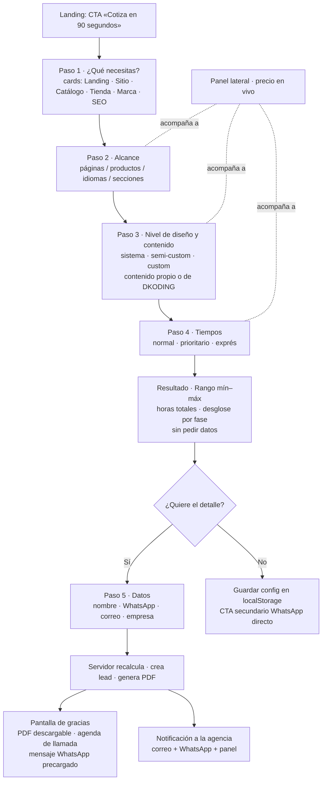
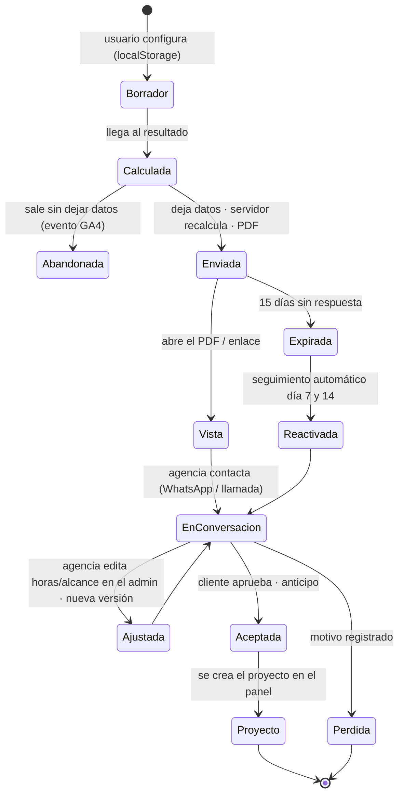
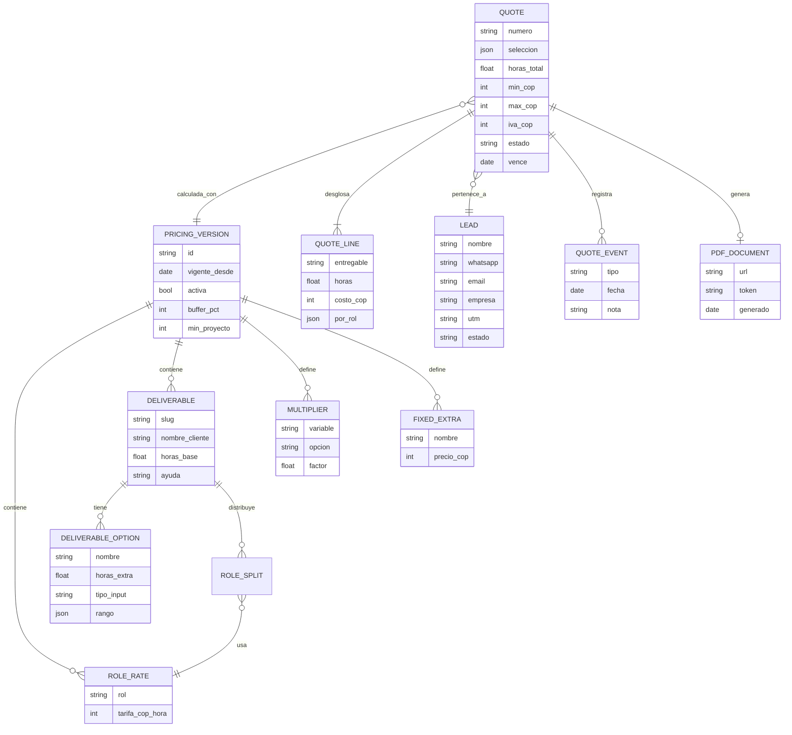

# Cotizador por hora para DKODING: mejores prácticas, cualidades y diagramas

> Fecha: 2026-10-06. Se integra con `arquitectura-plataforma-agencia.md` (el cotizador
> es una isla de Astro que habla con Payload) y con el blueprint de la landing.
> Los diagramas están en Mermaid y se renderizan directamente en GitHub.
> **Las tarifas y horas de las tablas son valores semilla de mercado; DKODING debe
> reemplazarlos por los suyos antes de publicar.**

---

## 0. Qué es un cotizador efectivo (en una frase)

Una herramienta que en menos de 90 segundos le da al prospecto un **rango de precio
creíble con su desglose de horas**, le hace sentir que está diseñando su proyecto y no
llenando un formulario, y convierte esa sesión en un **lead calificado con contexto**
para la agencia. Los leads que pasan por un cotizador cierran alrededor de 5× más que
las consultas simples, y los formularios por pasos convierten entre 86 % y 300 % más
que los de una sola página (ver fuentes §10).

---

## 1. Por qué cotizar por hora (y cómo hacerlo sin asustar)

| Ventaja | Riesgo | Cómo se mitiga en el diseño |
|---|---|---|
| Transparente: el cliente ve de dónde sale el número | El cliente compara tu tarifa/hora con un freelancer barato | Mostrar **horas por fase y por rol**, no una sola tarifa; vender el equipo, no la hora |
| Escala con el alcance sin reinventar precios | Parece "sin tope": miedo a que se dispare | Entregar **rango** (mín–máx) con **buffer explícito** y opción de **precio cerrado** tras la llamada |
| Fácil de administrar desde el CMS: cambias tarifa, cambia todo | Horas mal estimadas = margen perdido | Tabla de horas versionada, calibrada con proyectos reales cada trimestre |
| Educa al mercado sobre el valor del trabajo | Alcances pequeños se ven caros por el mínimo | **Mínimo de proyecto** y paquetes "desde" en la landing como ancla |

Regla de oro: el cotizador **no vende horas, vende un proyecto estimado en horas**. El
número grande que ve el usuario es el total; las horas son la prueba.

---

## 2. Fórmula de cálculo

```
Para cada entregable e seleccionado:
  horas_e        = horas_base_e + Σ horas_opcion_j         (p. ej. +páginas, +idioma)
  costo_e        = Σ_rol ( horas_e × distribucion_rol_e × tarifa_rol )

Subtotal_horas   = Σ costo_e
Complejidad      = multiplicador por nivel (Plantilla 1.0 · Semi-custom 1.4 · Custom 1.9)
Urgencia         = 1.0 normal · 1.25 prioritario · 1.5 exprés
Buffer           = 15 % (contingencia declarada; 10–25 % es el estándar)

Base             = Subtotal_horas × Complejidad × Urgencia
Mín              = Base × (1 − 0.10)            (optimista, sin cambios de alcance)
Máx              = Base × (1 + Buffer)          (con contingencia)
Extras fijos     = hosting, dominio, licencias, pasarela (no llevan multiplicador)

Total mín/máx    = (Mín/Máx + Extras) redondeado a múltiplos de COP 50.000
IVA              = 19 % discriminado (servicios digitales gravados en Colombia)
Anticipo         = 50 % al firmar · 50 % a la entrega (o 40/30/30 por hitos)
Vigencia         = 15 días calendario
Mínimo proyecto  = COP 1.500.000 (si el total es menor, se muestra el mínimo)
```

Decisiones de diseño detrás de la fórmula:

- **Rango, no número exacto.** El usuario acepta un rango como "estimación honesta"; un
  número exacto generado por una web pierde credibilidad y ata a la agencia.
- **Buffer visible.** Decir "incluye 15 % de contingencia" genera confianza y reduce la
  fricción posterior cuando aparece un cambio.
- **Extras fijos fuera del multiplicador.** El hosting no es más caro porque el diseño sea
  custom.
- **Redondeo.** Un total de COP 4.350.000 se lee mejor que 4.312.480; redondear también
  evita la falsa precisión.
- **Mínimo de proyecto.** Protege la rentabilidad y filtra leads fuera de rango sin
  rechazarlos con mala experiencia.

---

## 3. Tablas semilla (editables desde el admin)

### 3.1 Roles y tarifas (COP/hora, referencia de mercado Colombia 2026)

| Rol | Tarifa semilla | Rango de mercado agencia CO |
|---|---:|---|
| Estrategia / dirección de proyecto | 180.000 | 150.000–250.000 |
| Diseño UX/UI | 140.000 | 110.000–200.000 |
| Desarrollo front (Astro, integraciones) | 150.000 | 120.000–220.000 |
| Desarrollo back / CMS / e-commerce | 160.000 | 130.000–240.000 |
| Contenido / copy / SEO on-page | 110.000 | 80.000–160.000 |
| QA / pruebas / lanzamiento | 100.000 | 80.000–140.000 |

Mercado: la mediana de agencias colombianas en Clutch ronda USD 37/h; las top cobran
USD 50–99/h; freelancers mid USD 38–58/h. A COP 4.000–4.200/USD eso es ~150.000–400.000.

### 3.2 Horas base por entregable y distribución por rol

| Entregable | Horas base | Estrategia | UX/UI | Front | Back | Contenido | QA | Opciones que suman horas |
|---|---:|---:|---:|---:|---:|---:|---:|---|
| Landing page (1 página, 5–7 secciones) | 32 | 10 % | 30 % | 35 % | 0 % | 15 % | 10 % | +4 h por sección extra; +6 h animación avanzada; +8 h segundo idioma |
| Sitio corporativo (5 páginas) | 80 | 10 % | 25 % | 30 % | 15 % | 10 % | 10 % | +6 h por página extra; +12 h blog; +10 h formularios avanzados |
| Catálogo virtual (sin carrito) | 110 | 10 % | 20 % | 25 % | 30 % | 5 % | 10 % | +0,5 h por producto cargado; +8 h filtros avanzados |
| Tienda online (carrito + pasarela) | 180 | 10 % | 20 % | 25 % | 30 % | 5 % | 10 % | +16 h segunda pasarela; +12 h envíos por zona; +20 h facturación electrónica |
| Identidad / logo profesional | 40 | 15 % | 70 % | 0 % | 0 % | 15 % | 0 % | +12 h manual de marca; +6 h papelería |
| SEO inicial (auditoría + on-page) | 24 | 20 % | 0 % | 20 % | 0 % | 60 % | 0 % | +8 h por cada 10 páginas adicionales |
| Mantenimiento mensual (retainer) | 8/mes | 25 % | 0 % | 50 % | 0 % | 0 % | 25 % | Se cotiza aparte como recurrente |

Benchmarks que respaldan la semilla: landing simple 20–35 h; sitio corporativo 20–30 h de
diseño + 40–60 h de desarrollo; e-commerce custom 300–500 h. La distribución típica de
presupuesto es 35–45 % desarrollo, 25–35 % diseño, 10–20 % contenido, 10–15 % gestión.

### 3.3 Multiplicadores

| Variable | Opciones | Multiplicador |
|---|---|---|
| Nivel de diseño | Basado en sistema DKODING · Semi-custom · 100 % custom con animación | 1.0 · 1.4 · 1.9 |
| Urgencia | Normal (6–8 sem) · Prioritario (4 sem) · Exprés (2 sem) | 1.0 · 1.25 · 1.5 |
| Contenido | Lo entrega el cliente · Lo redacta DKODING | +0 h · +horas de contenido ×1.5 |
| Idiomas | 1 · 2 · 3+ | 1.0 · 1.2 · 1.35 |

### 3.4 Extras fijos (COP, sin multiplicador)

Dominio .com (1 año) 80.000 · Hosting Cloudflare + correo (1 año) 350.000 · Pasarela
(configuración) 250.000 · Licencias de tipografía/stock según caso.

---

## 4. Cualidades de un cotizador efectivo (checklist de diseño)

### 4.1 Experiencia

- [ ] **Por pasos, 4–6 pantallas, una pregunta principal por pantalla**, con barra de
      progreso y posibilidad de volver atrás sin perder datos.
- [ ] **Empieza fácil**: primera pregunta "¿Qué necesitas?" con cards visuales, no con
      datos personales. Los datos de contacto van al final (compromiso progresivo).
- [ ] **Valores por defecto inteligentes** en cada paso: el usuario puede llegar al
      resultado con 4 clics si acepta los defaults.
- [ ] **Precio en vivo** en un panel lateral fijo (desktop) o barra inferior (móvil): el
      total cambia con cada selección; eso es lo que hace sentir "configurador".
- [ ] **Resumen siempre visible**: lista de lo seleccionado, horas totales, rango.
- [ ] **Resultado sin muro**: el rango se muestra sin pedir datos. El **desglose
      detallado + PDF + agenda de llamada** se entregan a cambio de nombre, WhatsApp y
      correo. Así se captura al interesado real sin espantar al curioso.
- [ ] **Lenguaje del cliente, no de la agencia**: "Quiero vender en línea", no
      "WooCommerce con pasarela". Cada opción con una línea de ayuda de qué incluye.
- [ ] **Microcopy que reduce ansiedad**: "Estimación orientativa. Incluye 15 % de
      contingencia. Precio cerrado tras una llamada de 20 min."
- [ ] **Móvil primero**: en LATAM la mayoría llega desde el celular. Inputs grandes,
      sliders con valor numérico editable, teclado numérico.
- [ ] **Guardar y retomar**: la configuración se guarda en `localStorage`; al volver, se
      ofrece continuar.
- [ ] **CTA doble al final**: "Enviar por WhatsApp" (principal en Colombia) y "Recibir
      PDF por correo"; ambos crean el lead.
- [ ] **Accesible**: navegación por teclado, etiquetas reales, contraste, sin depender
      solo del color para el estado.

### 4.2 Negocio

- [ ] Rango con mínimo y máximo, nunca número único.
- [ ] Buffer y mínimo de proyecto explícitos.
- [ ] IVA discriminado y moneda COP con formato local (`$ 4.350.000`).
- [ ] Vigencia de 15 días impresa en el PDF, con número de cotización único.
- [ ] Anticipo y forma de pago en el PDF.
- [ ] Lo que **no** incluye (hosting de terceros, contenido, fotografía) listado.
- [ ] Toda cotización crea un lead con la configuración completa en el CRM/Payload.
- [ ] Horas y tarifas versionadas: el PDF guarda la versión de tarifas con la que se
      calculó, para que cambiar precios no altere cotizaciones ya enviadas.

### 4.3 Técnica

- [ ] Isla de Astro (`client:visible`), estado en una máquina de estados simple.
- [ ] Cálculo en el cliente para el precio en vivo **y recálculo en el servidor** al
      enviar (nunca confiar en el total que manda el navegador).
- [ ] Tablas de horas/tarifas servidas desde Payload (colección `pricing_versions`),
      cacheadas en el build y refrescadas por webhook.
- [ ] PDF generado en servidor (Satori → PNG o `@react-pdf/renderer`), enviado por
      correo y disponible por enlace con token.
- [ ] Anti-spam con Turnstile; validación de teléfono colombiano (+57).
- [ ] Eventos GA4 por paso (`quote_step_1`…`quote_result`, `quote_lead`) para medir
      abandono por pantalla.

---

## 5. Diagramas

### 5.1 Flujo del usuario



### 5.2 Lógica de cálculo


### 5.3 Ciclo de vida de la cotización



### 5.4 Modelo de datos (Payload)



### 5.5 Arquitectura técnica

```mermaid
flowchart LR
    subgraph Sitio Astro en Cloudflare
        UI[Isla «Cotizador»<br/>client:visible<br/>cálculo en vivo]
        LS[(localStorage<br/>borrador)]
        UI <--> LS
    end
    subgraph Payload CMS · Next.js
        API[/POST /api/quotes/]
        CALC[Recalcular con pricing_version activa]
        DB[(PostgreSQL)]
        PDF[Generar PDF]
        NOTIF[Notificar: correo · WhatsApp API · panel]
        ADMIN[Admin: tarifas · horas · cotizaciones · leads]
    end
    UI -- tablas de precios en build + webhook --> API
    UI -- envío con Turnstile --> API
    API --> CALC --> DB
    CALC --> PDF --> DB
    CALC --> NOTIF
    ADMIN --> DB
    GA[GA4 eventos por paso] -.- UI
```

---

## 6. Wireframe del resultado (lo que más convierte)

```
┌──────────────────────────────────────────────────────────────────────┐
│  Tu proyecto estimado                                   [← Ajustar]  │
│                                                                      │
│  Sitio corporativo · 7 páginas · diseño semi-custom · 2 idiomas      │
│                                                                      │
│  COP 14.750.000 – 18.750.000       ≈ 112 horas · 5–6 semanas         │
│  + IVA 19 %  ·  Anticipo 50 %  ·  Vigente 15 días                    │
│                                                                      │
│  Desglose por fase          Horas    Inversión                       │
│  Estrategia y dirección       11     COP 1.980.000                   │
│  Diseño UX/UI                 28     COP 3.920.000                   │
│  Desarrollo (front + back)    50     COP 7.600.000                   │
│  Contenido y SEO on-page      11     COP 1.210.000                   │
│  Pruebas y lanzamiento        12     COP 1.200.000                   │
│  Dominio + hosting (1 año)     —     COP   430.000                   │
│  Horas ya ajustadas por diseño e idiomas. Mín. = líneas × 0,90;      │
│  máx. = líneas × 1,15 (contingencia). Extras sin ajuste.             │
│                                                                      │
│  No incluye: fotografía, redacción si eliges «contenido propio».     │
│                                                                      │
│  [ Recibir cotización en PDF ]   [ Hablar por WhatsApp ]             │
│  Estimación orientativa. Precio cerrado tras una llamada de 20 min.  │
└──────────────────────────────────────────────────────────────────────┘
```

---

> **Corrección 2026-10-06.** La primera versión de este wireframe mostraba
> COP 9.800.000 – 11.300.000, que no coincide con sus propias líneas: las horas por
> fase suman COP 15.910.000 antes de contingencia. Con la fórmula de §2 el rango
> correcto es COP 14.750.000 – 18.750.000 (redondeado a 50.000, extras incluidos).

---

## 7. Anti-patrones a evitar

1. Pedir correo antes de mostrar nada: mata la conversión del curioso.
2. Número exacto sin rango ni buffer: ata a la agencia y pierde credibilidad.
3. Jerga técnica en las opciones ("CMS headless", "SSR").
4. Más de 7 preguntas o más de una decisión difícil por pantalla.
5. Slider sin valor numérico editable: en móvil es frustrante.
6. Calcular solo en el cliente y confiar en ese total al guardar.
7. Cambiar tarifas sin versionar: las cotizaciones viejas cambian de precio.
8. Precio sin IVA discriminado en Colombia: sorpresa en la factura y mala fe percibida.
9. Sin seguimiento: una cotización enviada sin recordatorio al día 7 y 14 se pierde.
10. Un cotizador escondido en /contacto: debe estar en la landing y en cada servicio.

---

## 8. KPIs para medir y calibrar

| KPI | Objetivo inicial | Dónde se mide |
|---|---|---|
| Inicio de cotizador / visitas landing | > 8 % | GA4 `quote_step_1` |
| Finalización (llega a resultado) | > 55 % de los que inician | GA4 `quote_result` |
| Lead (deja datos) / resultado | > 30 % | Payload `quotes.estado = enviada` |
| Paso con más abandono | identificar y rediseñar | embudo GA4 por paso |
| Cotización → conversación | > 60 % en 48 h | `quote_events` |
| Cotización → aceptada | > 20 % | `quotes.estado` |
| Desviación horas estimadas vs. reales | < ±15 % | comparar con horas del proyecto cada trimestre |

La última fila es la que mantiene vivo el cotizador: cada trimestre se ajustan las
horas base con los proyectos cerrados y se publica una nueva `pricing_version`.

---

## 9. Referencias de UI para inspirarse

- Framer "Smart Cost Estimator" (panel lateral con total en vivo):
  https://www.framer.com/community/marketplace/components/smart-cost-estimator/
- Calconic, calculadora de cotización de diseño web (sliders + select + fórmula):
  https://www.calconic.com/inspo/web-design-price-quote-calculator
- CalcPro, calculadora de costo de diseño web (rango + desglose + anticipo):
  https://usecalcpro.com/tools/web-design-cost-calculator
- Involve.me, generador de cotización por pasos: https://www.involve.me/templates/price-quote-generator
- Paperform, cotizador de diseño web: https://paperform.co/templates/squarespace-website-design-quote-calculator
- Quotira, cotizador embebible para servicios: https://hunted.space/product/quotira
- Astuteo, estimador por fases y horas (código en GitHub): https://www.astuteo.com/estimator
- Harvest, calculadora de costo de proyecto web: https://www.getharvest.com/project-management/website-project-cost-calculator

---

## 10. Fuentes

Conversión y UX de calculadoras/formularios:
- https://www.calconic.com/blog/make-your-pricing-page-efective-with-web-calculators
- https://www.convertcalculator.com/use-cases/price-quote-calculator/
- https://zuko.io/blog/single-page-or-multi-step-form
- https://www.leadgen-economy.com/blog/multi-step-forms-conversion-optimization/
- https://www.atticusli.com/blog/posts/multi-step-forms-vs-single-page-behavioral-science-progressive-commitment/
- https://reform.app/blog/how-to-create-multi-step-forms-that-convert-a-guide/
- https://www.shapediver.com/blog/sliders-in-product-configurators
- https://gokickflip.com/blog/what-are-major-features-of-product-configurator
- Anclaje de precio: https://www.ionos.com/digitalguide/online-marketing/online-sales/using-the-anchoring-effect-in-marketing.md

Estimación por horas, buffers y tarifas:
- https://www.getharvest.com/calculators/hourly-rate-calculator-for-web-developers
- https://projectcostestimator.com/freelance-website-cost
- https://www.blockerry.com/blog-web-developer-rates
- https://www.abbacustechnologies.com/how-many-hours-to-build-a-website/
- https://www.developersdigest.tech/blog/how-much-should-i-charge-for-a-website
- https://usecalcpro.com/tools/web-design-cost-calculator (distribución 35–45/25–35/10–20/10–15)
- Tarifas Colombia/LATAM: https://clutch.co/co/web-developers · https://www.curotec.com/insights/latam-developer-hourly-rates-in-2025/ · https://www.index.dev/blog/latam-developer-hourly-rates · https://bestarion.com/offshore-vs-nearshore-outsourcing/

Ciclo de vida de cotización (CPQ):
- https://www.cincom.com/blog/cpq/cpq-process-flow/
- https://www.everstage.com/cpq/cpq-process-flow
- https://prospeo.io/s/cpq-process

IVA en Colombia para servicios digitales:
- https://www.mercadopago.com.co/developers/es/docs/checkout-pro/additional-settings/iva-colombia
- https://incp.org.co/publicaciones/infoincp-publicaciones/impuestos/nacionales/2016/02/cobro-del-iva-por-servicios-prestados/
