# Especificación de UX del administrador DKODING

Fecha: 2026-10-06 · Estado: **PROPUESTA**

> **Reemplazado el 2026-10-07 por `docs/admin-mvp.md`** en stack, alcance y tamaño del MVP. Se
> conserva como referencia para las fases siguientes.

> Resumen ejecutivo para decidir: `docs/ux-admin-resumen.md`. Diseño navegable de las pantallas principales: https://claude.ai/artifact/3gfSHhiYsQGuhm9qXYbX8X (fuente en `diseno/admin/`).

> Versión final tras tres revisiones (seguridad, usabilidad y viabilidad). Lo aplicado y lo rechazado está en «Cambios tras revisión», al final.
> Base: los cinco documentos de `docs/` (arquitectura de la plataforma, diseño del admin, los dos del cotizador y la landing), siete investigaciones (web y SEO, monitoreo y copias, métricas, contraseñas, cotizador, módulos faltantes y shell) y las tres revisiones.
> Convenciones:
> - Patrones: **Lista · Detalle · Panel · Asistente · Monitor**. Un Asistente solo existe cuando hay 3 o más decisiones que dependen unas de otras; si no, es un diálogo dentro del Detalle.
> - Salud y severidad: **● ok · ▲ aviso · ◆ crítico · ◌ sin dato · – no aplica**, siempre con forma, color y texto [94][120]. Estas formas no significan nada más: los estados de flujo (Publicado, Borrador, Enviada…) son chips de texto.
> - Fase de cada pantalla: `0`, `1A`, `1B`, `F2`, `F3` (§11).
> - `[n]` remite a las fuentes del §13. "(no verificado)" marca lo que no se pudo confirmar en una fuente primaria; "(supuesto)" marca una estimación propia.

---

## 0. Decisión y principios

**Decisión:** un solo administrador en Payload 3, con un shell fijo de 7 grupos de **5 ítems como máximo**, donde **el cliente funciona como filtro y la unidad operativa es el sitio**, sea Astro o WordPress. Se construye en dos tramos cortos: **1A comercial** (lo que la landing necesita: leads y cotizador) y **1B operación** (monitoreo sin llaves y estado de copias de los 30+ sitios). Entre los dos suman unas **16 pantallas propias y unas 20 colecciones con pantallas generadas por Payload** en unas 10 semanas (§11). Lo demás se integra o espera a F2.

- **DKODING construye** lo que vende y lo diferencia: el cotizador gobernable, la vista unificada de salud y copias de los dos mundos, el SEO/GEO multi-tenant y el informe.
- **DKODING integra** lo genérico: un proveedor de uptime con guardias y llamadas, los productores de copias (JetBackup de SeguriServer, UpdraftPlus o ManageWP), Bitwarden para las contraseñas de personas, Cloudflare Access para el segundo factor de la agencia, Clockify para las horas y, en F2, Alegra o Siigo y MainWP.
- **El relay propio** (copias y monitoreo de cuenta cPanel con token) pasa a F2. Solo se construye para lo que las integraciones no cubran y después de cumplir las condiciones del §9.4.

| # | Principio | Consecuencia en la interfaz |
|---|---|---|
| P1 | **El sitio es la unidad; el cliente, un filtro** | Cada sitio declara `stack` (astro_payload · wordpress · otro) y `hosting` (cloudflare · cpanel · otro); sus capacidades se derivan de eso y de las conexiones activas. Selector de dos niveles **Cliente › Sitio**. **El menú se oculta solo por rol o por fase, nunca por stack**: si algo no aplica, la página lo dice ("Este sitio se edita en WordPress · Abrir wp-admin ↗"). Al cambiar de cliente se conservan el módulo y los filtros [86] |
| P2 | **Ningún secreto se lee en pantalla, ni pasa en claro por el servidor del admin** | Las contraseñas de personas viven en Bitwarden; el admin muestra metadatos y "Abrir en Bitwarden ↗". Los tokens de máquina de cada cliente (F2) se **sellan en el navegador** con la llave pública del relay [165]: el admin los escribe sin poder leerlos, y el destino (host, puerto, usuario) va sellado junto con el token |
| P3 | **"Sin dato" nunca es verde** | ◌ es gris y distinto de ●. Cada Panel muestra su cobertura ("copias: 31 de 38 con fuente"). Si una fuente cae, su columna pasa a ◌ y el resto de la pantalla sigue funcionando |
| P4 | **Lo destructivo es raro, lento y a cuatro ojos** | Una sola tabla de acciones N3 (§9.2). Se ejecutan solo desde el Detalle, en escritorio, escribiendo el nombre y con WebAuthn de dos personas. En el móvil solo se **aprueban**, viendo el resumen completo y con passkey. Nunca desde la paleta de comandos |
| P5 | **Cinco patrones, un shell, estado en la URL** | Toda pantalla es uno de los cinco patrones. Cada tarjeta de un Panel abre su Lista ya filtrada; un Panel no copia la lista de otra pantalla. El shell no cambia aunque entren módulos nuevos |
| P6 | **Cada número es trazable** | Cada cotización guarda la versión de tarifas inmutable con la que se calculó; el informe usa un snapshot congelado; cada KPI muestra fuente, ventana y "datos hasta". **Muestra pequeña:** con n < 20 se muestra "x de y", no un porcentaje. Nunca se inventan valores |
| P7 | **La alarma no depende de lo que vigila** | Disponibilidad, SSL y dominio avisan **directo desde el proveedor externo** al teléfono (app, llamada o SMS). El núcleo refleja los incidentes. Heartbeats externos vigilan el núcleo, el ejecutor de jobs, cada ingesta y, en F2, el relay |
| P8 | **Una bandeja y un orden** | ALR-01 es la única bandeja de "requiere atención". Todas las pantallas ordenan igual: severidad → impacto → antigüedad, y cada fila dice por qué está ahí |
| P9 | **El cliente ve resultados, no la cocina** | Portal aparte (F2) con 7 destinos, lenguaje llano y un diccionario (§2.2). El cliente nunca ve costos, horas por rol, IP, códigos de evento ni pantallas técnicas de SEO o integridad |

### 0.1 Contradicciones resueltas

| Tema | Conflicto | Decisión |
|---|---|---|
| Alcance del MVP | El borrador ponía unas 68 de 91 pantallas en 1A+1B. La arquitectura §9.3 recomendaba Looker Studio los primeros 2 meses y §10 dejaba el monitoreo v1 para las semanas 8–10 | **~16 pantallas propias + ~20 colecciones con pantallas generadas** en unas 10 semanas (§11). Looker Studio sirve de informe al cliente hasta F2. El relay, el portal, el shell completo y las vistas WEB propias pasan a F2 |
| Orden | "Primero landing" frente a la sección 9 de la landing ("Monitoreo incluido") | Tras el backend de la landing (1A) va el monitoreo sin llaves y el estado de copias (1B), antes que la profundidad del cotizador y el SEO. Si 1B no está listo al lanzar, la sección 9 de la landing se reescribe para no prometer lo que aún no existe |
| Roles | 5 en arquitectura §4; 8 en el shell; 3 en la revisión de viabilidad | **7 roles** como objetivo (§3). En el MVP solo los 4 de agencia (owner; ops, que incluye al PM; sales; production). Los de cliente llegan con el portal (F2) |
| Portal del cliente | "El mismo admin con permisos" frente a separar las colecciones de autenticación | Payload admite **una sola colección de autenticación en el panel** [127]. Se mantiene un solo panel, pero el cliente entra por **otro hostname**, con un menú de 7 destinos; gestiona `memberships` y nunca edita documentos `users`. Los roles de agencia solo inician sesión por el hostname protegido con Cloudflare Access |
| 2FA de la agencia | payload-totp en beta / passkeys sin verificar / SSO sin investigar | **Cloudflare Access delante del admin de la agencia**, con el IdP (Google Workspace si §12.3 es sí) imponiendo el segundo factor. FIDO2 es obligatorio para owner y ops (cómo imponerlo depende del IdP: no verificado). payload-totp solo para el portal (F2), tras auditarlo |
| Contraseñas | Teams o Enterprise; recuperación de cuenta como KPI deseable | **Bitwarden Enterprise** (comparación de planes [64]), por las políticas que exigen los controles: Require two-step login, Remove export y Manage Send, documentadas como "Enterprise Policies" [65]. **No** se activa la recuperación de cuenta para todos (§9.1). El admin no revela nada. Vaultwarden descartado [74] |
| Secretos de máquina | KMS y "solo el relay descifra" / KMS asimétrico en el navegador / sobre sellado sin AWS | MVP: **no se guarda ningún token cPanel**. Los secretos de la agencia viven en el almacén de su consumidor (variables cifradas de Vercel, secretos de Workers) y CON-01 los inventaría sin valores. F2: **sobre sellado** con la llave pública del relay [165], con token + host + puerto + usuario + conexión dentro. KMS solo si un cliente lo exige o para el borrado criptográfico (§9.4) |
| Copias | Relay propio en el MVP / integrar | **Integrar en el MVP**: los productores (JetBackup, UpdraftPlus o ManageWP) escriben en una **cuenta Cloudflare separada**, con un bucket por cliente, y el admin lee el destino. Relay propio en F2 |
| "Copias inmutables" | "Ni el owner borra antes de N días" | Es falso: el bloqueo de R2 lo quita quien pueda editar la configuración del bucket [37]. La interfaz dice **"Bloqueada · revocable por un administrador de la cuenta de copias"**. Esa cuenta tiene otros titulares y FIDO2; F2 añade una copia secundaria con bloqueo en modo cumplimiento [132] |
| Agente WordPress | mu-plugin propio / MainWP | **MainWP Child en F2**, con el Dashboard endurecido (§9.2). Los checksums del core se calculan en el verificador aislado [28] |
| Uptime | Sondas propias / Uptime Kuma / UptimeRobot gratis / Better Stack | **Proveedor de pago, con uso comercial, que alerta y escala por sí mismo** (Better Stack o UptimeRobot Team, §10.1). La regla de confirmación visible es la del proveedor elegido. Sondas propias en F3. Se descarta el plan gratis de UptimeRobot, que se presenta para uso no comercial [36][156] |
| Estado frente a severidad | El color del estado y la urgencia del aviso se confundían | El **estado** (● ▲ ◆ ◌) describe el objeto; la **severidad** (S1–S4) decide a quién se avisa y cuándo. Un SSL a 7 días es ◆, pero avisa como S2 en horario laboral. S1 solo para caída confirmada, defacement o malware confirmado y acceso indebido en curso (§7) |
| Umbrales | Distintos según la investigación | Uptime: ◆ < 99,5 %, ● ≥ 99,9 % [126]. Copias: ● en destino externo ≤ 26 h con tamaño en banda, ▲ un fallo o > 26 h, ◆ > 48 h o 2 fallos. SSL: ▲ ≤ 14 d (≤ 21 d con problemas DCV), ◆ ≤ 7 d. Dominio: ▲ ≤ 30 d, ◆ ≤ 14 d |
| "Requiere atención" | Seis lugares y tres fórmulas de orden | Una bandeja (ALR-01) y un orden (§7.3). Los Panels muestran una tarjeta "N alertas de Salud →" que abre ALR-01 filtrado |
| Colores | Crítico #FF6B7A o #FF6B6B. La landing da 7,0:1 al lila | `--status-danger` **#FF6B6B** (6,57:1 sobre #151518). El lila #C755EF mide **5,57:1** sobre #0C0C0C y **5,18:1** sobre #151518; `--dk-lila-link` #D98BFF mide **8,46:1** sobre #0C0C0C (la landing dice 9,8:1). Calculado aquí. Sin tema claro en el MVP; el PDF tiene tokens propios (§2.5) |
| Search Console y GA4 | Usuario de DKODING o cuenta de servicio | Cuenta de servicio con permiso **Restringido** en Search Console y **Lector** en GA4 [143], sin llaves JSON (federación de identidad), en un worker de ingesta aislado (F2). Que la cuenta de servicio funcione como usuario solo tiene fuente secundaria [55] |
| Informe mensual | Envío el día 3 o el día 6 | **Borrador el día 4 y envío el día 6**: GSC llega con 2–3 d de retraso [50] y GA4 tarda 24–48 h [52] |
| Alertas e incidentes | `attention_items`, `incidents`, `alerts` y la pantalla MON-08 | **Una sola entidad `alerts`**. `incidents` agrupa por causa raíz. MON-08 pasa a ser la vista guardada `ALR-01?tipo=incidente` |
| Secretos: bóveda o Conexiones | Dos lugares que el usuario no distingue | El secreto de máquina es un atributo de la conexión (CON-01). VLT-02 muestra filas de solo lectura de las conexiones del cliente, con enlace a CON-02, y la búsqueda devuelve ambas con su tipo |
| Aprobar en el móvil | P4 "en el móvil solo se aprueba" frente a "nunca desde el móvil" | Ejecutar una N3 en el móvil: nunca. Aprobarla: sí, con el resumen completo y passkey, nunca con TOTP |
| Re-autenticación | 15 min o 5 min | **Modo protegido de 15 min** (F2). Toda acción N3 pide WebAuthn en el mismo paso |
| Docs del repo a corregir | — | FAQPage ya no da rich result desde el 7-may-2026 [56] (afecta a la landing §3 fila 10 y §5) · `_redirects` no admite 410 [59] · Cloudflare antepone su robots.txt [60] · dkard.co es un SaaS propio [118], no una colección · "idiomas" está definido de dos maneras en el cotizador · `monitoring_*` debe referenciar `site` · `tenants.deployHookUrl` es un secreto [134] y sale de `tenants` · contrastes del lila en la landing · cotizador §5.3: "Ajustada" es una revisión (R2), no un estado, y falta "Sin reclamar" · el diagrama §5.5 del cotizador no compila en Mermaid 11 (título de subgraph con "·" sin corchetes; verificado aquí con Mermaid 11.17) · el diseño del admin §3 mapea el pipeline como Panel: es una Lista |

---

## 1. Mapa de módulos

| # | Módulo | Origen | Para quién | Fase | Construir / integrar |
|---|---|---|---|---|---|
| 1 | **Administrador web**: bloques, medios, revisión, despliegues, redirecciones, formularios | Pedido | Producción, ops; clientes con sitio Astro | 1A con pantallas de Payload · F2 vistas propias | 1A: drafts, versions, live preview y los plugins SEO, Redirects y Form Builder de Payload [4][5][7][8][9] para el sitio de DKODING. F2: vistas propias cuando se venda el primer sitio Astro de un cliente |
| 2 | **SEO avanzado y GEO** | Pedido | Agencia; el cliente ve resultados | 1A: SEO del documento · F2: Search Console y auditoría · F3: GEO y enlazado | Construir. GEO con runner propio o importando de Peec o LLMrefs [111][112] |
| 3 | **Monitoreo de sitios** en los dos mundos | Pedido | CEO, ops, producción; el cliente, simplificado | 1B sin llaves · F2 monitoreo de cuenta | 1B: **integrar** el proveedor de uptime (monitores creados por API desde `sites`, guardias y llamadas del proveedor) + cron diario de SSL y dominio. F2: monitoreo de cuenta cPanel con el relay |
| 4 | **Copias de seguridad** (cPanel y plataforma), con niveles N0–N3 y restauración | Pedido | Ops, producción; el CEO aprueba | 1B integrado · F2 relay propio y BAK-05 | 1B: **integrar** productores hacia la cuenta de copias; el admin lee el destino y registra simulacros. F2: relay propio solo para lo que no cubran las integraciones |
| 5 | **Métricas esenciales** | Pedido | Todos | 1B: INI-01 (agencia) y MET-01 con 5 tarjetas · F2: GSC y GA4 · F3: IA | Construir sobre `metric_snapshots` |
| 6 | **Gestor de contraseñas** de la agencia y de los clientes | Pedido | CEO, ops, producción; el cliente ve metadatos (F2) | 0: Bitwarden · 1B: registro de accesos · F3: JIT automatizado | **Integrar** Bitwarden Enterprise. 1B: `access_records` generado por Payload, offboarding con checklist y JIT concedido a mano por el owner. F3: sincronización y JIT desde un servicio aislado |
| 7 | **Administrador del cotizador** | Pedido | CEO, ops, comerciales | 1A núcleo · F2 simulador, embudo y calibración | Construir |
| 8 | Usuarios, roles y 2FA | Detectado | Todos | 1A agencia · F2 clientes | Cloudflare Access + IdP para la agencia; `memberships` y TOTP o passkeys auditados para el portal [14] |
| 9 | Registro de auditoría | Detectado | CEO, ops; el cliente, en lenguaje llano | 1A | Construir en un esquema propio, solo inserción, con cadena de hashes anclada fuera (§9.2) |
| 10 | Aprobaciones | Detectado | Quien aprueba y quien pide | 1A | Construir: APR-01 sobre `approval_requests` |
| 11 | Clientes: ficha 360 y alta | Detectado | Agencia | 1B | Construir |
| 12 | Sitios e importación CSV | Detectado | Agencia | 1B | Construir (`sites`) |
| 13 | Conexiones y secretos de máquina | Detectado | CEO, ops | 1B inventario · F2 sellado y pruebas | Construir |
| 14 | Alertas, incidentes y guardias | Detectado | Todos | 1B bandeja · F2 escalera propia | 1B: la escalera de disponibilidad la ejecuta el proveedor; el núcleo refleja y añade sus alertas S2–S4 (correo y campana). F2: Web Push y WhatsApp Cloud API [82] |
| 15 | Leads | Detectado | Comerciales; client_admin en F2 | 1A | Construir (form-builder + Worker público) |
| 16 | Proyectos y horas reales | Detectado | Ops, producción | 1A: la conversión guarda las horas · F2 | Construir + CSV de Clockify [103] |
| 17 | Informes mensuales en PDF | Detectado | Ops, cliente | 1B Looker Studio · F2 PDF | Construir con Browser Rendering [61] |
| 18 | Portal del cliente | Detectado | Clientes | F2 | Mismo panel, hostname aparte, 7 destinos |
| 19 | Soporte con tickets | Detectado | Clientes, producción | F2 (con el portal) | Construir ligero |
| 20 | Software y vulnerabilidades WordPress | Detectado | Producción | F2 | **Integrar** MainWP endurecido + Wordfence v3 [29] |
| 21 | Vencimientos y renovaciones | Detectado | Ops, CEO | 1B avisos · F2 cobro | Construir + RDAP/WHOIS [38] |
| 22 | Retainers, facturación y cartera | Detectado | CEO, ops | F2 | **Integrar** Alegra o Siigo [101][102] |
| 23 | Solicitudes de titulares (habeas data) y registro de tratamientos | Detectado en revisión | Owner, ops | 0: registro de tratamientos como documento · F2 pantalla | Construir ADM-08 (Lista/Detalle con reloj) |
| 24 | Buzones de correo (cPanel) | Detectado | Ops | F3 | Construir sobre la conexión cPanel |
| 25 | Contratos y firma | Detectado | CEO, comerciales | F3 | **Integrar** Documenso [104] |
| 26 | dkard.co y base de conocimiento | Detectado | Comerciales, todos | Integrar | dkard: un enlace por cliente. Base de conocimiento: ayuda contextual en estados vacíos y de error |
| 27 | Sistema: trabajos, heartbeats y cuotas | Detectado | CEO, ops | 1A | Construir (Monitor) |

**Aplazados, no rechazados:** relay propio (F2), BAK-04/05 propios (F2), conectar cPanel (F2), portal (F2), shell completo con paleta, atajos, modo protegido y "Ver como cliente" (F2), PWA con Web Push y WhatsApp (F2), vistas WEB propias (F2), COT-03 y COT-06…11 (F2), JIT automatizado y conciliación con Bitwarden (F3), sondas propias (F3), tema claro del admin (cuando existan sus tokens).

**Rechazados:**

- **Bóveda E2EE propia:** ETH Zúrich publicó 12 ataques contra Bitwarden con servidor malicioso [73]; DKODING no puede costear esa criptografía.
- **Vaultwarden:** no es oficial y su README no menciona auditorías [74].
- **"Revelar 30 s" en el admin:** convertiría el admin en un mapa de llaves.
- **Exportar la organización de Bitwarden para entregar a un cliente:** la exportación incluiría a los demás clientes. Se entrega con un Send por ítem.
- **Recuperación de cuenta de Bitwarden para todos los miembros:** quien robe la cuenta de un owner se quedaría con las de todos (§9.1).
- **Escalera de guardias propia en el MVP:** ya la venden los proveedores de uptime (§10).
- **Facturación electrónica propia:** la DIAN exige un proveedor tecnológico.
- **Gestor de tareas, temporizador, helpdesk omnicanal, agente WordPress propio, CRM externo como fuente de verdad, firma propia o panel dkard propio:** ya existen y duplicarían datos.
- **Informes de pauta y redes, calendario editorial, chat interno, app nativa (basta una PWA), página de estado pública y contabilidad:** fuera del alcance.
- **Clon de Ahrefs:** el rastreador se limita a ≤ 500 URLs por sitio.
- **Editar el SEO de WordPress desde el admin:** la REST de Yoast es de solo lectura [33].
- **Clic en la vista previa para editar:** es una función Enterprise de Payload [13]; queda como spike en F3.
- **Suplantar la sesión del cliente:** se reemplaza por la lente "Ver como cliente".
- **Mapa de calor completo de copias (14 d × todos los sitios):** con 120 sitios son unas 1.680 celdas que no se leen; se muestran solo las filas con algún fallo.

---

## 2. Arquitectura de información

**Modelo:** Agencia DKODING → Cliente (tenant) → Sitio (1..n) → Módulo → Objeto.

- **DKODING también es un tenant** ("DKODING · casa"): ahí viven su landing, su cotizador, sus leads y su blog, con los mismos módulos que se venden a los clientes.
- Cada pantalla declara su **ámbito** en el registro de módulos:

| Ámbito | Significa | Ejemplos | Comportamiento del selector |
|---|---|---|---|
| **agencia** | Solo existe para toda la agencia | Tarifas, Rendimiento, Equipo, Avisos y reglas, Sistema | Ignora el selector y muestra el chip "Vista de agencia" |
| **cliente** | Existe agregada ("Todos los clientes", con columna Cliente) y filtrada | Directorio, Alertas, Leads, Copias, Accesos | Filtra; en "Todos" añade la columna Cliente |
| **sitio** | Necesita un sitio | Contenido, Medios, Ajustes del sitio, MON-04 | Si el cliente tiene un sitio, entra directo; si tiene varios, muestra el chip de sitio en la miga y pide elegir |

- **Al cambiar de cliente** se conservan el módulo y los filtros, se descarta el ID del objeto abierto y se abre la Lista. Si el cliente tiene un solo sitio, los Panels de flota (MON-01) redirigen a su MON-04.

### 2.1 Navegación de agencia

Tope de **5 ítems por grupo** (Shopify trunca desde el 7.º [97]) y unos 25 ítems visibles por rol. Lo apagado por flag o por fase no aparece. Lo demás vive como pestaña o filtro de su pantalla madre, no como ítem (divulgación progresiva [147]).

| Grupo | Ítems → pantalla (patrón) · fase | Pestañas y filtros que absorbe |
|---|---|---|
| **Fijo arriba** | Inicio → INI-01 (Panel) `1A` · Alertas → ALR-01 (Lista, contador "asignadas a mí + sin asignar de mis clientes") `1B` · Aprobaciones → APR-01 (Lista) `1A` | Incidentes (MON-08) es la vista `tipo=incidente` de Alertas |
| **1 · Clientes** | Directorio → CLI-01/03 `1B` · Proyectos → CLI-07 `F2` · Solicitudes → CLI-08 `F2` · Planes y facturas → CLI-09 `F2` · Informes → CLI-05 `F2` | Alta de cliente (CLI-04) se lanza desde Directorio |
| **2 · Sitio** | Contenido → WEB-01 `1A` · Medios → WEB-06 `1A` · Revisión → WEB-07 `F2` · Formularios → WEB-10 `1A` · Ajustes del sitio → WEB-11 `F2` | Por revisar (SEO-04) es un filtro de Contenido; Redirecciones (WEB-09) y Despliegues (WEB-08) son pestañas de Ajustes del sitio |
| **3 · Métricas y SEO** | Métricas → MET-01 `1B` · Búsqueda → SEO-02 `F2` · Auditoría → SEO-06 `F2` · IA → SEO-09 `F3` | Resumen SEO (SEO-01) y Velocidad (SEO-08) son pestañas de Métricas; Canibalización (SEO-03) de Búsqueda; Enlazado (SEO-05) de Auditoría |
| **4 · Salud y copias** | Flota → MON-01 `1B` · Sitios → MON-02/04 `1B` · Copias → BAK-01 `1B` · Vencimientos → MON-07 `1B` | Disponibilidad (MON-05), Integridad (MON-06) y Software (MON-09) son pestañas de Sitio; Ejecución (BAK-04) es pestaña de Copias |
| **5 · Ventas** | Leads → VEN-01 `1A` · Cotizaciones → COT-01 `1A` · Tarifas → COT-04/05 `1A` · Rendimiento → VEN-03 `F2` | Simulador (COT-06) es pestaña de Tarifas; Embudo (COT-08) y Calibración (COT-09) son pestañas de Rendimiento |
| **6 · Bóveda** | Accesos → VLT-02 `1B` · Salud de accesos → VLT-01 `1B` | Temporales (VLT-06), Rotación (VLT-10) y Solicitudes y entregas (VLT-07/08) son pestañas de Accesos |
| **7 · Agencia** | Equipo y roles → ADM-01 `1A` · Conexiones → CON-01 `1B` · Avisos y plantillas → ALR-04 `1B` · Registro y cumplimiento → ADM-05 `1A` · Sistema y ajustes → ADM-07 `1A` | Matriz de permisos (ADM-04) es pestaña de Equipo; Reglas (ALR-03) y Plantillas (ADM-06) de Avisos; Uso de accesos (antes VLT-11) y Titulares (ADM-08) de Registro; Ajustes del cotizador (COT-11) de Sistema y ajustes |

**Qué ve cada rol:** el menú se genera desde la matriz del §3.2 (ADM-04 es la única fuente). Un grupo aparece si el rol puede ver al menos uno de sus ítems. Ejemplos: producción ve el grupo Ventas solo con "Tarifas" (lectura, sin costos); ventas no ve Salud ni Bóveda, y del grupo Clientes solo ve el Directorio con la forma de estado de cada cliente.

### 2.2 Portal del cliente (F2)

El cliente entra por **otro hostname** (`portal.`), sin Cloudflare Access, al mismo panel con un menú propio de 7 destinos. No ve las pantallas técnicas de la agencia.

| Destino | Contenido | Roles |
|---|---|---|
| Inicio | CLI-02 "Mi sitio" | Todos |
| Contactos | Los leads de su sitio (y el cotizador, si lo compró) | admin; editor si se habilita (con 2FA); viewer, solo conteos |
| Estado del sitio | Disponibilidad de 30 d, incidentes en lenguaje llano, "Copia probada: hoy", vencimientos de dominio, SSL y plan · "Pedir una restauración" (formulario de 3 preguntas) | Todos (solo admin pide) |
| Métricas | MET-01 en vista cliente | Todos |
| Informes | CLI-05/06 en lectura | Todos |
| Contenido | Contenido, Medios, Formularios, Revisión, solo si el sitio es Astro. En WordPress: "Tu sitio se edita en WordPress · Pedir un cambio" | admin y editor |
| Mi cuenta | Plan y horas · Proyectos (hitos y estado) · Solicitudes · Mis accesos (VLT-14, solo admin) · Usuarios (solo admin) · Mis avisos · Actividad en lenguaje llano | Según rol |

**Ocultas al cliente:** SEO-02, SEO-03, SEO-06, SEO-08, MON-05, MON-06, BAK-02/04/05, CON-*, ADM-05 en bruto y cualquier campo con costos, horas por rol o primitiva, IP, fuente técnica o códigos de evento.

**Diccionario agencia → cliente** (se revisa con 5 clientes reales antes de publicar el portal [148]):

| Agencia | Cliente |
|---|---|
| Leads | Contactos |
| N1 / N2 / N3 | Copia guardada / Copia probada / Restauración de prueba completa |
| CWV, LCP, p75 | Velocidad real (lo que viven tus visitantes) |
| p95 de respuesta | Tiempo de respuesta del servidor |
| Δ | vs. mes anterior |
| ◌ sin dato | Aún sin datos suficientes |
| Incidente S1 | Tu sitio no estuvo disponible |
| Provisional (GSC) | Datos de los últimos días, pueden cambiar |
| Share of voice, k/3 | Cuántas veces te mencionan las IA frente a tu competencia |

### 2.3 Elementos globales del shell

| Elemento | Comportamiento | Fase |
|---|---|---|
| **Hostnames** | Agencia en `admin.` detrás de Cloudflare Access; portal en `portal.` sin Access. Un hook de inicio de sesión rechaza a un rol de agencia que no llegue por el hostname protegido | 1A (portal F2) |
| **Barra lateral** | En 1A/1B: la navegación de Payload agrupada con `admin.group` [2] y el selector del plugin [1]. En F2: generada desde un registro en el que cada módulo declara grupo, ítems, patrón, ámbito, flag, fase y permisos; reemplaza `admin.components.Nav`. Lo que el rol no puede ver queda oculto. `[` la colapsa (con alternativa reasignable) | 1A / F2 |
| **Selector Cliente › Sitio** | Arriba a la izquierda, sobre `useTenantSelection` [1] (puede devolver vacío: se trata como "Todos"). Muestra logo, nombre y el peor estado, o "Todos los clientes · 31". Secciones: Todos · Fijados ★ · Recientes · Requieren atención · A–Z. Busca por nombre, NIT o dominio. En F2, el contexto viaja en la URL (`/c/{cliente}/s/{sitio}/…`). **La URL solo elige el contexto**: la autorización vive en las funciones de acceso y en cada consulta, nunca en el middleware de Next.js (CVE-2025-29927 permitió saltárselo [140]) | 1B / F2 |
| **Paleta Ctrl+K / ⌘K** | `cmdk`: acciones de la pantalla · Ir a · clientes y sitios (@) · ID (DK-2610-0142, INC-0087) · recientes. Solo muestra lo que el rol puede hacer. **Nunca ejecuta** acciones N2 ni N3: abre el Detalle. Devuelve accesos y conexiones con su etiqueta de tipo | F2 |
| **Atajos** [87] | `?` · `/` o `F` filtrar · `G I` Inicio · `G A` Alertas · `G P` Aprobaciones · `G M` Salud · `G B` Copias · `G L` Leads · `G Q` Cotizaciones · `G T` Tarifas · `G V` Bóveda · `C` crear · `J/K` · `E`. No se disparan dentro de un campo. Se prueban con teclado latinoamericano y se pueden reasignar (que `/` y `[` exijan Shift o AltGr no está verificado) | F2 |
| **Buscador global** | El mismo campo que la paleta. Busca clientes, dominios, páginas, cotizaciones, incidentes, accesos (solo el nombre) y leads (solo roles con acceso a datos personales). Filtra siempre por los tenants del usuario y revalida cada resultado con la Local API y `overrideAccess: false` [12] | F2 |
| **Notificaciones** | La campana es una vista previa de ALR-01: Asignadas a mí · Sin asignar de mis clientes · Todo. Hilos por incidente. Acciones iguales en todas partes: Reconocer · Asignar · Posponer · Silenciar · Resolver. Cada aviso lleva "Por qué recibes esto: regla X · Ajustar". La **franja S1** solo la ven la guardia, la cadena de escalamiento y los owners; con varios S1 hay una sola franja ("2 incidentes críticos · Ver"). Los toasts quedan para el resultado de las acciones, con Deshacer | 1B |
| **Migas** | `Cliente › Sitio › Módulo › Objeto`. El cliente abre el selector; el módulo vuelve a la Lista con sus filtros | 1B |
| **Entorno** | Staging y preview: franja de 28 px con trama de chevrón ("Entorno de pruebas · los cambios no llegan a los sitios"), prefijo [PRUEBAS] y favicon gris. Datos sintéticos, nunca copias de producción. Tenant demo: "Datos de ejemplo". Nunca ámbar ni coral [96] | 1A |
| **"Ver como cliente"** | Una sola lente, con selector de rol (admin · editor · viewer), bajo la franja "Así lo ve 4Bellú como editor · Salir". Permiso efectivo = **intersección** entre el rol de quien mira y el rol simulado. Cada uso queda registrado. Ventas solo la usa en el tenant demo. No suplanta la sesión | F2 |
| **Modo protegido** | WebAuthn abre 15 min (GitHub usa 2 h [92]) para roles, tarifas, aprobaciones, conexiones y exportaciones. Chip "Modo protegido · 12 min · Salir". Las N3 piden además WebAuthn en el mismo paso | F2 |
| **Usuario** | Perfil · segundo factor (en el IdP para la agencia) · avisos y horario silencioso · densidad (compacta para la agencia, cómoda para el cliente). Solo tema oscuro hasta definir los tokens del tema claro | 1A |
| **Guardado** | Con autosave: "Guardado hace 5 s · v14 · Ana edita". Sin autosave (Tarifas, Reglas): "Cambios sin guardar · Descartar · Guardar" | 1A |
| **Analítica interna** | Cada pantalla emite `vista`, `accion_primaria` y `estado_vacio_mostrado` a una tabla propia, sin terceros. Sirve para podar la navegación (diseño del admin §7 punto 6) | 1A |

### 2.4 "Noche violeta" en el admin

| Token | Valor | Regla |
|---|---|---|
| `--bg` · `--bg-surface` · `--bg-deep` | #0C0C0C · #151518 · #1A0B2B | La barra superior usa `--bg-deep` |
| `--accent` | #6D00C2 | Solo como fondo de botón primario con texto blanco (8,64:1). Nunca en líneas ni en texto sobre oscuro (2,26:1) |
| `--accent-soft` | #C755EF | Ítem activo, foco y serie actual de los gráficos: 5,57:1 sobre #0C0C0C y 5,18:1 sobre #151518. Nunca sobre blanco |
| `--status-ok/warn/danger/unknown` | #5BE49B · #E0A93B · **#FF6B6B** · #9A96A5 | 11,3 · 8,6 · 6,6 · 6,3:1 sobre #151518. Siempre con su forma ● ▲ ◆ ◌ [120] |
| **PDF e informes (fondo blanco)** | ok #16784A · aviso #8A5A00 · crítico #B42318 · sin dato #5F5B6B · acento #6D00C2 | 5,50 · 5,93 · 6,57 · 6,57 · 8,64:1 sobre #FFFFFF (calculado aquí). Los tokens oscuros fallan sobre blanco (1,6 a 2,9:1), por eso no hay tema claro hasta definir este juego para la interfaz [153] |
| Tipografía e iconos | Blinker 700 para cifras · Barlow para la interfaz · Lucide · SVG de `recursos/marca/iconos/` para las familias del cotizador | El chevrón `»` marca las secciones y la trama del entorno de pruebas |
| Marca por cliente | Logo + acento | Se rechaza un acento parecido a un color de estado; si no llega a 4,5:1 con blanco, se oscurece |
| Textos | Diccionarios desde el día uno, es-CO por defecto (diseño del admin §5); las pantallas de Payload usan su i18n | Ningún texto de interfaz escrito en el componente |

### 2.5 Mapa del admin

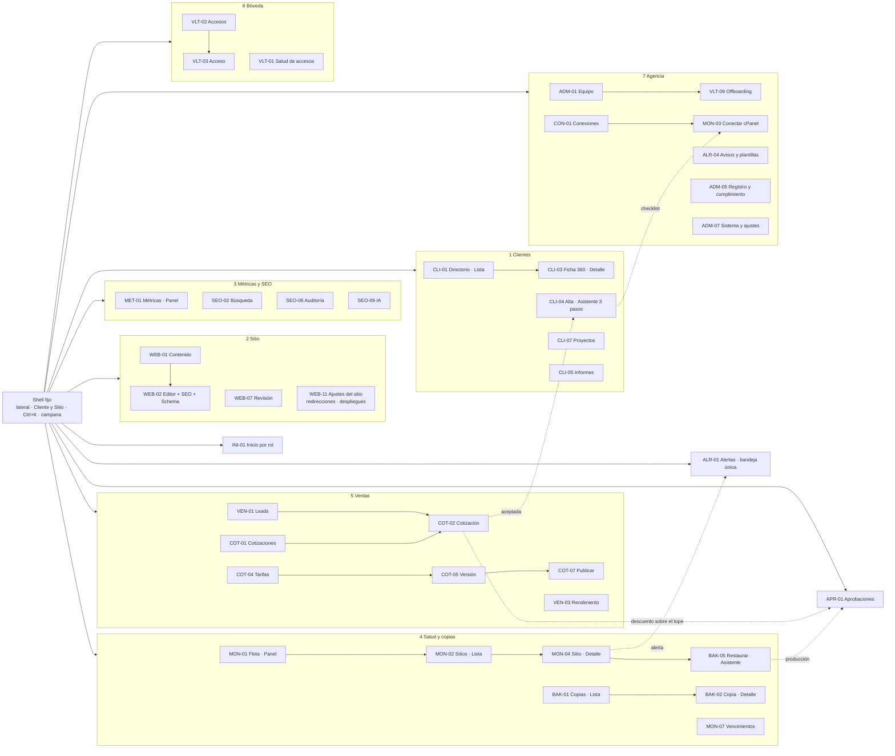

### 2.6 Móvil

- **Barra inferior de 4 destinos:** Inicio · Alertas · Aprobaciones · Buscar (Material recomienda de 3 a 5 [152]; Vercel usa una barra flotante para una mano [86]). El resto vive en la hoja "Más".
- **Pantallas que existen en el móvil:** INI-01 (solo los bloques 1–3, como tarjetas), ALR-01, ALR-02, APR-01 y, en el portal, CLI-02. Las demás se abren con un aviso "Mejor en computador · Recordármelo".
- **Tablas → tarjetas:** una fila es una tarjeta con estado, título, por qué está ahí y una acción primaria. Objetivos táctiles de 48 px.
- **Aprobar en el móvil:** la tarjeta de APR-01 muestra qué se pide, quién, impacto en lenguaje llano y cuándo vence; aprueba con passkey, nunca con TOTP. Ejecutar una N3 nunca es posible desde el móvil.
- **Sin conexión:** se muestra la última versión con su hora. La caché guarda solo metadatos (sin datos personales ni detalles de bóveda) y se borra al cerrar sesión.
- **Avisos al teléfono:** en el MVP, la app del proveedor de uptime (llamada, SMS, push). La PWA con Web Push llega en F2; en iOS solo funciona instalada en la pantalla de inicio [95].

---

## 3. Roles y permisos

### 3.1 Roles

Amplía los 5 roles de la arquitectura §4: `agency_admin` se divide en owner y ops, y `agency_member` en sales y production. El PM es un ops con `clientesAsignados`. El rol de cliente se guarda **por tenant** en la colección `memberships`, nunca en el documento `users`.

| Rol | Persona | Alcance | Autenticación | Fase |
|---|---|---|---|---|
| `agency_owner` | CEO (máximo 2 personas) | Todos los clientes + ajustes de la agencia | Cloudflare Access + IdP con FIDO2 obligatorio; WebAuthn en el admin para N3 | 1A |
| `agency_ops` | COO | Todos los clientes | Igual que owner | 1A |
| `agency_ops` con alcance (PM) | Gestor de proyectos | Sus clientes asignados | Igual que owner | 1A |
| `agency_sales` | 3 comerciales | Tenant "DKODING · casa"; contactos de un cliente solo si contrató gestión de leads; clientes en lectura comercial | Access + IdP con segundo factor | 1A |
| `agency_production` | Diseño y desarrollo | Sus clientes asignados; salud de todos en lectura, sin conexiones | Access + IdP con segundo factor | 1A |
| `client_admin` | Dueño o gerente del cliente | Su tenant (o sus tenants) | Portal: TOTP o passkey obligatorio; sesión de 12 h; recuperación con un 2.º client_admin o con llamada verificada | F2 |
| `client_editor` | Marketing del cliente | Su tenant, contenido | 2FA obligatorio si ve contactos; opcional si no | F2 |
| `client_viewer` | Socio o junta | Su tenant, lectura | Opcional | F2 |
| `machines` (colección aparte) | Worker público, builds del sitio, ingestas, relay (F2) | Llave de API por máquina y propósito; ningún humano tiene `useAPIKey` | — | 1A |

### 3.2 Matriz rol × módulo

Leyenda: **V** ver · **E** editar u operar · **A** aprobar o ejecutar acciones críticas (incluye E y V) · **S** solicitar (crea una petición en APR-01) · **—** sin acceso (oculto, también en la API). El superíndice ¹ significa "solo sus clientes asignados o su propio tenant". Columna PM = ops con alcance.

| Módulo / acción | owner | ops | PM | sales | production | c_admin | c_editor | c_viewer |
|---|---|---|---|---|---|---|---|---|
| Inicio (INI-01 / CLI-02) | V | V | V¹ | V (su variante) | V¹ ("Mi trabajo") | V¹ | V¹ | V¹ |
| Aprobaciones (APR-01) | A | A (nunca lo propio) | A¹ (no N3) | S | S | S¹ | — | — |
| Clientes: ficha 360, alta, archivar | A (archivar; no hay borrado directo) | E | E¹ (sin alta) | V (sin notas técnicas ni accesos) | V¹ | — | — | — |
| Contenido, medios, formularios (Astro) | A | A (publicar) | A¹ | — | E¹ (publica si se le delega) | A¹ (publica si el plan lo permite) | E¹ (envía a revisión) | V¹ |
| SEO técnico: canonical, indexación, slug publicado, redirecciones, robots.txt, llms.txt | A (saltar bloqueantes, política de bots) | E | E¹ | V | E¹ | — | — | — |
| Búsqueda, auditoría, GEO | V | E | E¹ | V (sin exportar datos personales) | E¹ | — | — | — |
| Métricas (MET-01) e informes | V | A (aprobar envío) | A¹ | V | V¹ | V¹ | V¹ | V¹ |
| Salud: sitios, incidentes, integridad | A | A | A¹ | — (solo la forma de estado en Directorio y Ficha) | E¹ (reconocer, aceptar línea base) | V¹ (Estado del sitio simplificado) | V¹ (ídem) | V¹ (ídem) |
| Silenciar sitio / ventana de mantenimiento | A | E | E¹ | — | E¹ | — | — | — |
| Política de copias | A (reducir retención: §9.2) | E | V¹ | — | V¹ | V¹ (fecha y "copia probada") | — | — |
| Copia manual y verificar (F2) | E | E | E¹ | — | E¹ | — | — | — |
| **Restaurar en carpeta de prueba** (solo archivos, fuera del docroot, se borra sola) | E | E | E¹ | — | E¹ | S¹ (formulario de 3 preguntas) | — | — |
| **Restaurar en staging** (BD aislada) | A | A | S¹ | — | S¹ | — | — | — |
| **Restaurar en producción, modo espejo o BD** (N3) | A (+ 2.º aprobador) | A (nunca lo propio) | S¹ | — | S¹ | S¹ | — | — |
| Descargar una copia | A | A | — | — | — | S¹ ("Solicitar copia descargable") | — | — |
| Borrar copias / reducir retención (N3) | A (cuatro ojos + 72 h) | — | — | — | — | — | — | — |
| Conexiones y secretos de máquina | A | A | V¹ | — | V¹ (estado y "Probar") | — | — | — |
| "Abrir cPanel" (sesión de 15 min, F2) | A (modo protegido + motivo) | A (ídem) | — | — | — | — | — | — |
| **Bóveda: metadatos de accesos de clientes** | A | A | V¹ | — (solo conteo en la ficha) | V¹ (solo los que puede usar) | V¹ ("Mis accesos", sin custodio del 2FA ni titulares) | — | — |
| Bóveda: usar acceso B/C (Bitwarden, según grupo) | E | E | E¹ | — | E¹ | — | — | — |
| Bóveda: acceso nivel A (JIT) | A (lo concede en Bitwarden) | A solo con delegación temporal del owner | S¹ | — | S¹ | A¹ (aprueba si el contrato lo exige) | — | — |
| Bóveda: accesos de la agencia y colección "Dirección" | A | E (sin "Dirección") | — | — | — | — | — | — |
| Offboarding de empleado y cola de rotación | A | A | E¹ | — | E¹ (rotar lo asignado) | — | — | — |
| Entregar accesos / fin de contrato | A | E | — | — | — | S¹ | — | — |
| Leads de DKODING (tenant casa) | V | E | V | E | — | — | — | — |
| Contactos de un cliente (sus leads) | V | E | E¹ | E¹ solo si el cliente contrató gestión de leads | — | E¹ | V¹ si se habilita (con 2FA) | Conteos |
| Exportar datos personales | A | A (modo protegido, motivo, límite, marca de agua, aviso a ops) | — | — | — | E¹ (sus contactos, mismo control) | — | — |
| Pipeline y cotizaciones | A | A (reasignar, convertir) | V¹ | E (las propias; descuento hasta el tope) | V¹ (pestaña "Alcance vendido" de CLI-07) | — | — | — |
| Aprobar descuento > tope o precio < mínimo | A | A | — | S | — | — | — | — |
| Tarifas, catálogo y reglas | A (publicar) | E (borradores; publicar pasa por APR-01) | V | V (vigente, sin costo interno) | V (sin costo) | — | — | — |
| Costo interno y margen | V | V | — | — | — | — | — | — |
| Calibración e imputación de horas (F2) | V | E | E¹ | — | E (sus horas, desde "Mi trabajo") | — | — | — |
| Rendimiento comercial y embudo (F2) | V | V | — | V (sus filas) | — | — | — | — |
| Soporte (F2) | V | E | E¹ | V | E¹ | E¹ (crear) | E¹ (crear) | V¹ |
| Equipo de la agencia | A (crear o promover un rol privilegiado: §9.2) | E (invita sales y production; no promueve) | — | — | — | — | — | — |
| Usuarios del cliente (`memberships`) | A | E | E¹ | — | — | E¹ (solo memberships de su tenant; nunca correo, contraseña ni 2FA) | — | — |
| Avisos propios | E | E | E | E | E | E | E | E |
| Guardias, reglas y umbrales | A | E | — | — | — | — | — | — |
| Registro de actividad | V | V | V¹ | — | — | V¹ (en lenguaje llano) | — | — |
| "Ver como cliente" (F2) | V | V | V¹ | Solo tenant demo | V¹ | — | — | — |
| Sistema (trabajos, heartbeats, cuotas) | A | E | — | — | V | — | — | — |

### 3.3 Reglas transversales

1. **Tres grados por componente**: visible · deshabilitado con motivo y a quién pedirlo · oculto. Los datos de negocio (pipeline, costos, notas internas) se **ocultan** también en la API: si `read` devuelve false, el campo no viaja [11].
2. **Denegar por defecto.** Si una colección no define su acceso, Payload aplica `Boolean(user)` [129], y el plugin multi-tenant no filtra las colecciones que no están en su configuración [1]. Por eso:
   - el build falla si una colección no define `create`, `read`, `update`, `delete`, `readVersions`, `unlock` y `admin`;
   - GraphQL queda desactivado mientras no se use;
   - cada vista RSC pasa `overrideAccess: false` explícito a la Local API [12];
   - `/admin` y `/api` responden `Cache-Control: private, no-store` y no usan caché compartida de Next.js;
   - una prueba automática recorre todas las colecciones × los roles × REST, Local API y `/versions`, más los casos de "el cliente no ve campos internos" del §2.2.
3. **Colecciones de agencia sin tenant.** Lo que abarca varios clientes vive sin tenant y solo para la agencia: conexiones WHM de un servidor, incidentes correlacionados por servidor, plantillas de reglas, guardias. El cliente ve una **proyección por tenant** con su propio texto ("Tu sitio no estuvo disponible 23 min"), nunca el incidente agrupado. Los overrides de KPI por cliente viven en una colección con tenant.
4. **Usuarios.**
   - El cliente nunca edita documentos `users`: gestiona `memberships(tenant, user, rol)` de su tenant.
   - `rolAgencia`, `tenants`, `clientesAsignados` y `bitwardenMemberId` tienen `update: false` salvo para el owner.
   - Invitar a un correo que ya tiene cuenta crea una solicitud que el usuario acepta.
   - `useAPIKey` está desactivado en `users` (las llaves de API no caducan y sobreviven al cambio de contraseña [130]); las máquinas usan `machines`.
   - `auth.useSessions` en true: un JWT sin estado no se puede revocar [131].
   - Hay pruebas automáticas de las tres escaladas conocidas: cambiar el correo de un usuario compartido, asignarse un rol de agencia y añadirse un tenant ajeno.
5. **Cuatro ojos (F2).** Cada aprobación N3 es una aserción WebAuthn sobre el hash de la operación (sitio, copia, destino, modo, BD), de dos personas distintas con autenticadores registrados al menos 7 días antes. El relay la verifica contra llaves públicas que el admin no puede escribir. Nadie aprueba lo propio. El "romper el vidrio" está en §9.2 y se decide en §12.
6. **Asignación y delegación.** Los clientes asignados se guardan en la ficha (responsable comercial, responsable técnico). La **delegación temporal del owner** (ADM-02) da a un ops los permisos A del owner con fecha de fin. Cambiar una asignación o una delegación queda en el registro.

---

## 4. Pantallas por módulo

**Regla de estados**, que vale para todas las pantallas (los textos de vacío se escriben antes de programar, como pide el diseño del admin §7 [149]):

- **V · Vacío:** explica qué aparecerá y ofrece la acción para salir de él. Cuatro casos, cada uno con su texto:
  - primer uso,
  - filtros sin resultado ("Ningún resultado con estos filtros · Limpiar filtros"),
  - falta una dependencia externa ("Falta Search Console · Pedir acceso al cliente"),
  - buena noticia (● "Sin incidentes en 30 días").
- **C · Cargando:** esqueleto con la geometría final; solo se anota abajo si cambia.
- **E · Error:** dice qué pasó y ofrece "Reintentar" en el mismo bloque, sin tumbar la pantalla.
- **P · Sin permiso:** explica a quién pedir acceso.
- **Éxito:** toast con "Deshacer" cuando aplica.
- **Muestra pequeña:** con n < 20, "x de y" en lugar de porcentaje y tarjeta atenuada con "Pocos datos".
- **No aplica:** cuando la pantalla no corresponde al stack del sitio, se dice en la página con la acción alternativa; el menú no cambia.

Abajo, la columna **Estados** recoge lo propio de cada pantalla; el V de filtros sin resultado es el genérico salvo que se indique otro.

### 4.1 Inicio, aprobaciones, clientes y portal (INI, APR, CLI)

| ID | Pantalla · patrón · fase | Propósito | Elementos clave | Estados |
|---|---|---|---|---|
| INI-01 | Inicio · **Panel** por rol · `1A` básico, `1B` completo | Saber en 10 s qué atender y decidir. Es el **dashboard de métricas esenciales de la agencia** | Un solo Panel con widgets por módulo, filtrados por rol (reemplaza `views.dashboard` [3]). Orden en §6. **≤ 5 KPI**, para leerse de un vistazo [150]. Cada bloque con tope y "Ver las N →" hacia su Lista filtrada. Sello "Datos al 6 oct 06:00 COT". En el móvil, solo los bloques 1–3 como tarjetas | V primer uso: "Configura DKODING en 5 pasos: equipo · importar sitios · proveedor de uptime · copias · avisos" · V buena noticia: "● Nada requiere tu decisión hoy" · E: por widget · P: el widget se oculta |
| APR-01 | Aprobaciones · **Lista** · `1A` | Una sola bandeja para todo lo que espera un sí o un no | Tarjeta por solicitud: qué se pide · quién · **impacto en lenguaje llano** ("se pierden los pedidos recibidos desde las 01:00") · vence · Aprobar / Rechazar con motivo. Tipos: descuento sobre el tope, precio bajo el mínimo, versión de tarifas propuesta por ops, acceso nivel A, exportación de datos personales, promoción de rol, reducción de retención, restauración (F2). Nadie aprueba lo propio. En N3, passkey sobre el hash de la operación (F2) | V: "● Nada por aprobar · la última la aprobó Ana hace 2 d" · vencida: ▲ en la fila y aviso al solicitante · P: el solicitante ve el estado de lo suyo |
| CLI-01 | Directorio · **Lista** · `1B` | La cartera y su salud | Cliente · sitios y stacks · salud (su peor estado) · plan · próxima renovación · responsables · alertas abiertas. Vistas guardadas "Requieren atención" y "Sin retainer con riesgo". Ventas ve la columna de salud solo como forma | V primer uso: "Aún no hay clientes · Alta de cliente · Importar CSV" · P: PM y producción ven solo sus asignados |
| CLI-02 | Mi sitio · **Panel** (inicio del portal) · `F2` | Que el cliente vea que su sitio está cuidado | Orden en §6. Estado **"Primeros 7 días"**: checklist de lo que se está configurando. Si falta una fuente, la tarjeta lo explica una vez y después se oculta ("Tu sitio aún no tiene visitas suficientes para medir la velocidad real; la medimos en laboratorio"). **"Lo que hicimos este mes" se genera solo** desde los trabajos (copias, actualizaciones, publicaciones). La línea de estado varía según la fuente ("Copias: las gestiona tu hosting"). Sin conmutador de vista: la agencia usa la lente "Ver como cliente" | V plan sin monitoreo: "Tu plan no incluye monitoreo · Ver qué incluiría" · P: el viewer no ve botones |
| CLI-03 | Ficha 360 · **Detalle** · `1B` | Todo el cliente en un lugar | **≤ 6 pestañas:** Resumen (salud de la cuenta = alertas + SLA + cartera + renovaciones) · Sitios · Contactos · Comercial (servicios, leads y cotizaciones) · Proyectos · Actividad. Columna lateral: responsables, flags de módulos, marca (logo y acento validados), **checklist de onboarding** (cada ítem con responsable y su propio Asistente o diálogo), accesos (solo conteo y estado), documentos y enlace a dkard | V Actividad: "Sin actividad registrada todavía" · V checklist completo: "● Onboarding terminado el 3 oct" · E: si falla una pestaña, solo esa · P: ventas no ve notas técnicas ni accesos |
| CLI-04 | Alta de cliente · **Asistente** de 3 pasos · `1B` | Crear el cliente con monitoreo sin llaves en minutos | Flujo 5a: datos y contactos → sitios por URL → responsables y plan → revisión. Lo demás (copias, Google, cPanel, usuarios, accesos) nace como checklist en CLI-03 | Se precarga desde una cotización aceptada · se puede retomar · P: owner y ops |
| CLI-05/06 | Informes · **Lista** + Informe · **Detalle** · `F2` (`1B`: enlace a un tablero de Looker Studio por cliente) | Ciclo del PDF mensual | Estados: Borrador · En revisión · Programado · Enviado · Fallido (chips de texto). Detalle con vista previa con los tokens del PDF (§2.4), comentario de la agencia en 3 viñetas, destinatarios verificados, aviso "se envía el 6 oct 08:00 si no lo detienes" y snapshot congelado | V: "El primer informe se genera el día 4 del próximo mes" · E: fuente sin datos, la sección queda marcada y no se inventan valores |
| CLI-07 | Proyectos · **Lista/Detalle** · `F2` (`1A`: la conversión guarda las horas presupuestadas) | Línea base para calibrar el cotizador | Agencia: horas presupuestadas por rol y primitiva, hitos, alerta si se consume el 70 % de las horas con el 40 % de avance, horas de Clockify por CSV. Pestaña **Alcance vendido** para producción. Cliente: hitos, estado y horas del plan consumidas, **sin** rol ni primitiva | V: "Se crea al aceptar una cotización" |
| CLI-08/09 | Solicitudes de soporte · Planes y facturas · **Lista/Detalle** · `F2` | SLA, bolsa de horas y cartera | Soporte: los campos del formulario actual [117] más estado, SLA, horas y notas internas o públicas. Incluye "Pedir una restauración" (qué falla · desde cuándo · ¿se perdieron pedidos o formularios?), que crea una solicitud para ops. Planes: retainer con su bolsa de horas y facturas de Alegra o Siigo (estado DIAN, saldo) | V: "Sin solicitudes abiertas" · E: "Alegra no responde desde 10:42" |

### 4.2 Administrador web (WEB)

En `1A` el sitio de DKODING se edita con las pantallas que genera Payload (drafts, versions, live preview y los plugins SEO, Redirects y Form Builder [4][5][7][8][9]) y con hooks de validación para los bloqueantes del §5f. Las vistas propias de esta tabla llegan en `F2`, cuando se venda el primer sitio Astro de un cliente. En un sitio WordPress cada pantalla muestra el estado "no aplica" con "Abrir wp-admin ↗"; el menú no cambia.

| ID | Pantalla · patrón · fase | Propósito | Elementos clave | Estados |
|---|---|---|---|---|
| WEB-01 | Contenido · **Lista** · `1A` generada, `F2` propia | Encontrar contenido y actuar en masa | Una pestaña por colección. Columnas: título y URL · estado como chip de texto (Publicado · Cambios sin publicar · Borrador · En revisión · Programado) · SEO "n de m" · última revisión · indexable · enlaces entrantes · clics 28 d. Filtros: huérfanas, noindex, **Por revisar** (antes SEO-04). Acciones masivas: revisión, programar, CSV | V: "Sin páginas · Crear desde plantilla · Importar desde WordPress" · sin GSC: la columna de clics dice "Conectar Search Console" · P: el viewer no ve acciones · WordPress: no aplica |
| WEB-02 | Editor por bloques · **Detalle** · `1A` generado, `F2` propio | Editar con vista previa en vivo | Publicar ▾ (ahora, programar, despublicar). Pestañas: Contenido · SEO · Schema · Enlaces · **Historial** (diff y "Restaurar como borrador" [5]). Formulario 40 % + iframe `/preview` 60 % (390/768/1280), servido desde **otro origen** y con `sandbox`, que se recarga con cada autosave [7]. Cajón de bloques por plantilla; Hero único con el único H1 [10] | Error de autosave: "No cierres la pestaña" · conflicto de edición · P: el editor ve "Publicar" deshabilitado con "Requiere aprobación" · desplegando (~1–3 min) · despliegue fallido: Reintentar |
| WEB-03 | Pestaña SEO · **Detalle** · `F2` (`1A`: campos del plugin SEO) | SEO del documento con checklist en vivo | SERP simulada por ancho (Google no fija caracteres). Generar title y description [8]. Slug: "creará una 301". Canonical autorreferencial (override solo de la agencia). OG con Satori. Checklist **◆ Bloqueante · ▲ Mejora · ● Correcto**, con "por qué" e "ir al campo". Estado Listo / Mejorable / Bloqueado, sin puntuación 0–100 ni densidad de palabra clave | Banner fijo si la página tiene noindex o canonical a otra URL · saltar un bloqueante queda registrado · P: el editor no ve canonical ni indexación |
| WEB-04 | Pestaña Schema · **Detalle** · `F2` | JSON-LD sin escribir JSON | Tipo inferido: WebPage, Service sin Offer de precio, Article, BlogPosting+Person, LocalBusiness. FAQPage lleva la etiqueta "sin rich result desde el 7-may-2026" [56]. Lista de campos requeridos que lleva a cada campo. JSON de solo lectura, con `<` escapado. Sin reseñas propias | Falta un requerido ◆: no deja publicar |
| WEB-06 | Medios · **Lista** · `1A` | Que ninguna imagen quede sin alt | Columna de alt (✓, decorativa, ✕), peso y "usado en". La subida pide describir cada imagen o marcarla "Decorativa (alt vacío)" [124]. Los archivos se sirven desde **un dominio aparte sin cookies**, con `Content-Security-Policy: sandbox`, `X-Content-Type-Options: nosniff` y `Content-Disposition: attachment` para lo que no sea imagen. SVG rasterizado o limitado a una lista blanca de elementos. EXIF de ubicación eliminado. AVIF/WebP en R2 | V: "Sin medios · Subir" · E: "SVG rechazado: contiene script" · cuota cerca del límite |
| WEB-07 | Revisión · **Lista** · `F2` | Aprobar sin abrir documento por documento | Pestañas: Esperan mi revisión · Enviadas · Programadas · Vencidas. Diff resumido, con indexación, canonical y slug resaltados. Aprobar y publicar · Aprobar y programar · Pedir cambios (comentario obligatorio) | V: "● Nada pendiente de revisión" · programada que no se ejecutó (falló el ejecutor de jobs) |
| WEB-08 | Despliegues · **Monitor** (pestaña de WEB-11) · `F2` | Que el cambio llegue al sitio | Estado por sitio (al día, construyendo, falló), cola con origen y log, debounce de 60 s. **Builds y concurrencia se cuentan por cuenta** (Free: 500 al mes y 1 a la vez; 100 proyectos por cuenta [58]). Reintentar · Pausar. Antes de construirla se decide entre Pages y Workers con static assets [160] (§12) | V: "Sin despliegues todavía · el primero sale al publicar" · atascado > 20 min · ▲ al 80 % de los builds |
| WEB-09 | Redirecciones · **Lista** (pestaña de WEB-11) · `1A` plugin, `F2` propia | Redirecciones sin cadenas ni bucles | Origen · destino · tipo · motivo · estado (● OK, ▲ cadena, ◆ bucle, ◆ destino 4xx). Aplanar cadenas, "Probar URL" salto a salto desde el worker aislado (§9.2), CSV. Contador frente a 2.000 estáticas + 100 dinámicas [59]. Las 410 las sirve un Worker | V: "Sin redirecciones · Importar CSV" · ▲ al 90 %: propone Bulk Redirects · ◆ choca con un slug publicado · WordPress: no aplica |
| WEB-10 | Formularios · **Lista/Detalle** · `1A` | Formularios y destinos por tenant | Campos, destino (correo, WhatsApp en F2, webhook), Turnstile, texto de autorización de datos versionado. Los webhooks salen del worker aislado, nunca del núcleo | V: "Sin formularios · Crear · Probar formulario" |
| WEB-11 | Ajustes del sitio · **Detalle** · `F2` (`1A`: global `seo_settings` generado) | Entidad, rastreo e indexación del sitio | **Entidad** (alimenta Organization y llms.txt) · **Rastreo e indexación**: sitemap con "excluidas y por qué"; robots por categorías con presets y la consecuencia de cada una (bloquear OAI-SearchBot te saca de la búsqueda de ChatGPT [116]; Google-Extended no afecta a Search [115]); "robots.txt efectivo" frente al generado, detectando lo que antepone Cloudflare [60]; llms.txt, con la nota de que el 97 % de los llms.txt no recibió peticiones [114] · **Plantillas** e intervalos de revisión · pestañas Redirecciones y Despliegues | ◆ conflicto con Cloudflare, con el paso exacto para resolverlo · ▲ entidad incompleta · P: la política de bots la cambia solo el owner |
| WEB-12 | Migración WordPress → Astro · **Asistente** · `F3` | Migrar sin perder SEO | Inventario (sitemap, rastreo y clics de 16 meses) → mapeo sugerido → revisión por clics → redirecciones → seguimiento de 30 días | Bloquea si quedan URLs con clics sin mapear |

### 4.3 Métricas y SEO (MET, SEO): los dos stacks

| ID | Pantalla · patrón · fase | Propósito | Elementos clave | Estados |
|---|---|---|---|---|
| MET-01 | Métricas · **Panel** · `1B` (ámbito cliente o sitio; la agencia usa INI-01) | ¿Funciona, me encuentran, me trae clientes? | **5 tarjetas:** Disponibilidad 30 d · Copias (última en destino externo) · **Velocidad real (usuarios)** o, sin datos de campo, "Velocidad de laboratorio" etiquetada · Contactos con SLA · SSL y dominio. En F2, "Clics en Google" reemplaza a SSL y dominio, que pasan a la línea de estado. Frase resumen arriba y gráfico principal que cambia al hacer clic en una tarjeta. Cada tarjeta: valor, "vs. mes anterior", "mejor si sube/baja", sparkline y botón "i" con fuente y "datos hasta". Pestañas: Resumen SEO (SEO-01) y Velocidad (SEO-08) | V: "◌ Aún sin datos suficientes · primera lectura mañana 06:00" · sin CrUX: laboratorio etiquetado, nunca rojo · GSC "provisional" en sus últimos días · fuente desconectada: la tarjeta explica qué aporta · P: el cliente nunca ve el pipeline |
| SEO-01 | Resumen SEO y GEO · **Panel** (pestaña de MET-01) · `F2` | Lo urgente de SEO primero | Badge del stack. ≤ 5 KPI: clics, impresiones, posición (sin semáforo), salud de auditoría (% de URLs sin errores [121]), visibilidad en IA (F3). Una tarjeta "N alertas de SEO → ALR-01". Cola semanal de SEO (lo que no es alerta, §7.2). Histórico propio, porque GSC guarda 16 meses [125] | V: "Primer rastreo en curso · listo hacia las 04:00" · "Search Console hasta dd/mm" |
| SEO-02 | Búsqueda · **Lista** · `F2` | Consultas y URLs reales | Pestañas: Consultas · Páginas · Seguidas · **Canibalización (SEO-03)** · Países · Dispositivos. En Seguidas: URL objetivo frente a la que posiciona, posición y Δ, CTR, sparkline. Filtros de oportunidad (posición 4–20, CTR bajo). Nota fija: las consultas anónimas no aparecen en la tabla [49] | V sitio nuevo: "Search Console tarda hasta una semana en mostrar datos" [50] · V sin acceso: "Falta Search Console · Pedir acceso al cliente" |
| SEO-03 | Canibalización · **Lista** (pestaña de SEO-02) · `F2` | Resolver con una decisión registrada | Aparece cuando ≥ 2 URLs reciben ≥ 20 % de las impresiones en 90 d, o cuando alternan. Acciones: Es intencional · **Consolidar** (Asistente SEO-07: ganadora → fusión → 301 → enlaces) · Diferenciar · Reforzar. Aviso: no toda coincidencia es canibalización [122] | V: "● Sin conflictos en 90 días" |
| SEO-04 | Por revisar · filtro de WEB-01 + resumen semanal · `F2` | Que nada caduque sin revisar | Intervalos de 6, 12 o 3 meses. "Marcar revisado" **no** cambia `dateModified` ni `lastmod` [123]. Resumen semanal por responsable | WordPress: usa `modified` de la REST y enlaza a wp-admin |
| SEO-05 | Enlazado · **Lista** (pestaña de SEO-06) · `F3` | Enlaces internos explicables | Sugerencias "desde → hacia" con ancla y fragmento; insertar crea un borrador. Huérfanas y enlaces a URLs que redirigen | V: "Con menos de 10 documentos no hay sugerencias" |
| SEO-06 | Auditoría · **Lista** · `F2` | Rastreo propio comparable, en los dos stacks | Rastreo de ≤ 500 URLs desde el worker aislado, solo a dominios registrados (§9.2). Error / Aviso / Nota por tema, incluidos robots, sitemap y llms.txt **efectivos** de los WordPress. Nuevas, resueltas y persistentes. Editar o abrir en WordPress · Ignorar con motivo | V: "La primera auditoría corre esta noche" · bloqueado por el WAF: instrucciones para permitir el user-agent |
| SEO-08 | Velocidad · **Lista** (pestaña de MET-01) · `1B` | Del veredicto a la URL culpable | URL · fuente · dispositivo · LCP/INP/CLS p75 · n · Δ · último deploy. Sparkline de CrUX History [44]. Aviso: "CrUX promedia 28 días". Ejecutar PSI. **Estado por defecto: "sin datos de campo"**, porque se espera que la mayoría de los sitios de pymes no tenga CrUX (se mide en la Fase 0): muestra laboratorio en 1–3 URLs clave y, en WordPress, Cloudflare Web Analytics si está instalado [159] | V: "Sin datos de campo para este sitio · mostramos laboratorio" · URL sin datos: se muestra el origen, etiquetado |
| SEO-09/10/11 | IA y GEO · **Panel** + Prompts · **Lista** + Crear set · **Asistente** · `F3` | Si la marca aparece y es citada en IA | Por motor: % de menciones, % de citas, share of voice, URLs citadas. Prompts con estado en texto (Citada · Mencionada · No aparece · Sin cuota) por motor y k/3. Asistente: servicios + ciudad + competidores → unos 30 prompts → costo (30 × 4 × 3 = 360 ejecuciones al mes). Etiqueta del método y aviso de no determinismo [113] | V: "Crea tu primer set de prompts" · ▲ si supera el presupuesto |

### 4.4 Monitoreo de sitios (MON): plataforma y externos

| ID | Pantalla · patrón · fase | Propósito | Elementos clave | Estados |
|---|---|---|---|---|
| MON-01 | Flota · **Panel** · `1B` | Qué atender hoy y si las copias están sanas | **≤ 5 KPI:** caídos ahora · copias en destino ≤ 26 h ("33 de 38") · vencimientos ≤ 30 d · cobertura por señal ("copias: 31 de 38 con fuente") · cambios no esperados (F2). Una tarjeta "N alertas de Salud → ALR-01". **Mapa de calor de copias de 14 d solo con las filas que tienen algún día distinto de ●**, más "33 sitios sin fallos en 14 d". "Respuesta del servidor (p95): los 5 más lentos". Con un cliente de un solo sitio, redirige a su MON-04 | V primer uso: "Importa tus sitios para empezar · Importar CSV" · V buena noticia: "● Sin pendientes · próxima lectura de copias 06:00" · E: "El proveedor de uptime no responde desde 10:42: la disponibilidad puede estar desactualizada", en su tarjeta · P: ventas no ve este panel |
| MON-02 | Sitios · **Lista** · `1B` | Inventario único con semáforo por señal | Sitio · stack · hosting · servidor · disponibilidad · respuesta p95 · SSL (d) · dominio (d) · velocidad real · última copia y nivel · productor de copias · responsable. F2: integridad y WP/PHP. Tooltip con regla y fuente ("SSL: TLS externo, hace 2 h"). **Agrupar por servidor.** Acciones masivas: mantenimiento N h, asignar responsable; F2: copia ahora (respeta la concurrencia) | V primer uso: "Sin sitios · Registrar o importar" · fuente caída: ◌ en su columna · P: el cliente no ve esta lista |
| MON-03 | Conectar cPanel / WHM · **Asistente** · `F2` | Dar de alta un hosting sin compartir contraseñas | Flujo 5b. **Primero WHM** de revendedor (un token por servidor y función, `whitelist_ip` del relay, caducidad, sin `create_user_session` ni ACL de tokens [19]); si no, **dos tokens por cuenta**: lectura con `readonly=1` para el monitoreo y gestión solo para copias y restauraciones [18]. Aviso visible: **"un token de cPanel abre toda la cuenta, correo incluido, y no admite restricción por IP; `readonly` sigue leyéndolo todo"**. Nombre sugerido `dkoding-monitor-AAAAMM`, 90 d, con vencimientos alineados por servidor. El token se pega en un campo que **lo sella en el navegador** junto con host, puerto y usuario. El host debe ser un nombre con certificado válido; se rechazan IP. Prueba en vivo de cada función → **"Lo que DKODING podrá hacer / lo que no y quién lo hace"** → dominios → sitios → política → revisión | 401: causas típicas · bloqueo de cPHulk: deja de reintentar y ofrece la plantilla de lista blanca para SeguriServer · cPanel antiguo: capacidades reducidas, sin error · el borrador se guarda **sin** el token |
| MON-04 | Sitio · **Detalle** · `1B` lectura, `F2` acciones | Todo el sitio y su historia | Pestañas: **Resumen** (línea de tiempo unificada) · **Disponibilidad** (antes MON-05) · Copias · Integridad (F2) · Dominio y SSL · Rendimiento · **Conexión** (capacidades sí/no con motivo). 1B: "Restaurar en {productor} ↗" y "Registrar simulacro". F2: Copia ahora · Restaurar (BAK-05) · Mantenimiento · **Abrir cPanel** (owner y ops, modo protegido, motivo, registro y aviso al cliente en VLT-14; sesión de 15 min [25]). En Astro: Postgres + R2 + repo | V Copias: "Este sitio aún no tiene productor de copias · Elegir productor" · credencial rechazada (F2): "monitoreo de cuenta ciego desde 03:10; la disponibilidad sigue" + Rotar · P: el cliente ve "Estado del sitio" en el portal |
| MON-05 | Disponibilidad · **Monitor** (pestaña de MON-04) · `1B` | En vivo, sin falsas alarmas | Estado grande, "hace 23 s" y estado por región. **Regla visible: la del proveedor elegido** (periodo de confirmación y de recuperación; con Better Stack, configurables [34]). Ventanas de mantenimiento · p50/p95 · TTFB. Se ingieren por API los incidentes y el uptime diario, no los chequeos crudos | V: "El primer chequeo llega en un minuto" · falla en una sola región: "degradado regional", sin avisar al cliente · proveedor sin responder: ◌ |
| MON-06 | Integridad y defacement · **Lista** (pestaña de MON-04 y vista de flota) · `F2` | Detectar cambios no esperados sin despertar a nadie por nada | Capas con fuente visible: externa (DOM **normalizado**, sin nonces, fechas ni contadores; título; palabras; scripts nuevos) · cuenta (`Fileman::list_files` en zonas críticas, con el token de lectura) · checksums del core [28]. Clasificación: Esperado (actualización, deploy, ventana o, en WordPress, un `modified` de la REST dentro de la ventana) / No esperado / Aceptado. Un cambio de DOM solo es **S3 informativo**; S1 solo con firma de defacement (§7.2). Acciones: aceptar línea base con comentario · cuarentena reversible y restaurar archivo (con el token de gestión, N2) · abrir incidente. Nunca muestra wp-config. **Dos semanas en modo sombra** antes de avisar | V: "La primera instantánea se toma esta noche" · los cambios de una actualización se agrupan como "esperado" · sin cuenta: solo la capa externa |
| MON-07 | Vencimientos · **Lista** · `1B` | Que nada expire sin que alguien lo vea | Dominio, SSL, token, hosting y licencias, con fuente, autorrenovación, problemas DCV, quién paga y responsable. Calendario de 90 d. **.co no tiene RDAP** [38][39]: WHOIS desde un worker o fecha manual. El cliente ve solo dominio, SSL y plan | V buena noticia: "● Nada vence en 90 días" · lo vencido queda fijo arriba en ◆ · "fecha manual" con su propio icono |
| MON-08 | Incidentes → vista guardada `ALR-01?tipo=incidente` · `1B` | Del problema a la causa raíz | Columnas propias de la vista: severidad · sitio o servidor · inicio · duración · estado · responsable · visible al cliente | V: "● Sin incidentes en 30 días" · sin reconocer a los 15 min: resaltado |
| MON-09 | Software · **Lista** (pestaña de MON-04 y vista de flota) · `F2` | Core, plugins y PHP con avisos | Datos de MainWP [31] cruzados con Wordfence v3 [29] (WPScan gratis no admite uso comercial [30]). PHP 8.2 deja de tener parches el 31-dic-2026 [40] | V: "Sin MainWP Child: versión inferida desde el HTML" |
| MON-10 | Registrar o importar sitios · **Asistente** · `1B` | Dar de alta los 30+ sitios en minutos | Por URL o CSV (cliente, dominio, servidor, usuario, stack): mapear → validar → previsualizar → crear. Detecta WordPress (`/wp-json`), el plugin de SEO, SSL y vencimiento. Crea los monitores en el proveedor de uptime por API. Activa el monitoreo **sin llaves** | Plataforma no detectada: se elige a mano · duplicado: se fusiona · cuota del proveedor agotada: ▲ con el número de monitores que faltan |

### 4.5 Copias de seguridad (BAK)

**Niveles de verificación** (valen para cualquier productor):

| Nivel | Significa | Quién lo comprueba en el MVP | En F2 |
|---|---|---|---|
| **N0** | El productor dice que hizo la copia | Reporte del productor (API, correo o carga manual; según §12) | Igual |
| **N1** | El objeto está en el destino externo, con fecha ≤ 26 h y tamaño en banda (−30 % / +50 %) | El lector del núcleo lista el bucket de la cuenta de copias con un token de solo lectura [128] | SHA-256 en el verificador aislado |
| **N2** | Se restauró en prueba y funcionó | **Simulacro registrado** (quién, cuándo, evidencia), mensual en tiendas y trimestral en el resto | Automático en el verificador aislado con `mariadb --sandbox` [133] |
| **N3** | Restauración completa en un entorno aislado, con captura | Simulacro por tipo antes de cerrar 1B | Mensual, en contenedor sin red ni DNS |

| ID | Pantalla · patrón · fase | Propósito | Elementos clave | Estados |
|---|---|---|---|---|
| BAK-01 | Copias · **Lista** · `1B` | Todos los puntos de restauración | Fecha · sitio · alcance · **productor** (JetBackup, UpdraftPlus, ManageWP, DKODING en F2) · destino · tamaño y Δ% · **"Bloqueada hasta 13 oct · revocable por un administrador de la cuenta de copias"** · N0–N3 · **restaurable por** (DKODING / productor / hosting). Pestaña Ejecución (BAK-04, F2). El cliente ve fecha y "copia probada", y "Solicitar copia descargable" | V primer uso: "Sin copias registradas · Elegir productor para este sitio" · fuente sin leer: ◌ "lectura del destino pendiente desde 06:00" · P: el cliente no ve tamaños ni destinos |
| BAK-02 | Copia · **Detalle** · `1B` básico, `F2` completo | Probar que existe, está íntegra y se puede restaurar | Manifiesto (lo que publique el productor; F2: BD, tablas, archivos, versiones) · cadena de custodia (ETag, bloqueo; F2: SHA-256 y cifrado) · checklist N1/N2/N3 con evidencia · simulacros y restauraciones hechos con esta copia | Sin verificar ▲ · verificación fallida ◆ con el paso exacto · expirada: solo metadatos |
| BAK-03 | Política · **Detalle** · `1B` declarada, `F2` ejecutada | Qué, cuándo, cuánto tiempo, dónde | Productor · alcance · ventana 01:00–05:00 COT · GFS 7/4/12 con vista previa de 8 semanas · destino (bucket del cliente en la cuenta de copias, con bloqueo [37]; la retención la aplica el ciclo de vida del bucket, no el productor) · copia secundaria con bloqueo de cumplimiento (F2) · N2 y N3 · costo estimado. **Reducir la retención es N3** | Conflicto ("cuenta completa diaria en hosting compartido") con una alternativa · P: ops edita; reducir retención pasa por APR-01 |
| BAK-04 | Ejecución · **Monitor** (pestaña de BAK-01) · `F2` | Seguir y destrabar trabajos del relay | Cola por servidor (1 trabajo por cuenta, 2 por servidor). Etapas: Preflight → Generando (% real [21][22]) → Al relay → Cifrado → R2 → Verificación aislada → Limpieza. Log en vivo. Topes visibles de 2 h y 6 h [21]. Reintentar desde la etapa que falló · Cancelar · Pausar cola | V: "Nada en curso · próximo a la 01:00" · atascado 15 min · fallido: causa y siguiente paso |
| BAK-05 | Restaurar · **Asistente** · `F2` (`1B`: en la herramienta del productor) | Restaurar con el menor riesgo | Flujo 5c. Alcance → punto (sugiere el último limpio y verificado) → destino → modo → **impacto en lenguaje llano** → salvaguardas → confirmación → Monitor y post-chequeos. Destinos: **Carpeta de prueba** = solo archivos con `WebsiteBackup::extract_backup` en `~/dk-restore-test/<id>`, fuera del docroot, sin BD, borrada a las 24–72 h; **Staging** = BD solo en otra cuenta o en otra BD con nombre distinto, reescribiendo wp-config; **Producción** = N3. `restore_backup` restaura en el mismo lugar y, si no se desactiva, también la BD [27]: **toda llamada a `restore_backup` es producción**, y la restauración de BD se envía desactivada de forma explícita salvo en una restauración a producción aprobada | Cuenta completa: paquete para SeguriServer [24] · bloqueado por otra operación · "faltan 1,2 GB de cuota" · el relay rechaza cualquier directorio dentro de public_html · P: "Solicitar restauración" |

### 4.6 Conexiones (CON) y alertas (ALR)

| ID | Pantalla · patrón · fase | Propósito | Elementos clave | Estados |
|---|---|---|---|---|
| CON-01 | Conexiones · **Lista** · `1B` inventario, `F2` gestión | Gobernar todas las credenciales de máquina | **Inventario por consumidor:** núcleo (variables cifradas de Vercel), workers (secretos de Cloudflare), relay (sobres sellados, F2), servicio aislado (llave de Bitwarden y cuenta de Google, F2/F3). Columnas: tipo (cPanel, WHM, Cloudflare, GSC, GA4, WhatsApp, R2, Bitwarden, deploy hook, proveedor de uptime) · consumidor · almacén · alcance · trabajo que la usa · huella de 8 caracteres · vence · rotación · último uso · estado. **No existe una columna con el valor** | V: "Sin conexiones registradas · Registrar la primera" · ▲ por vencer · ◆ rechazada, con los sitios que quedan ciegos |
| CON-02 | Conexión · **Detalle** · `F2` | Mantener un secreto sin poder leerlo | **Rotar** es un diálogo de 2 pasos: pegar el token nuevo (se sella en el navegador) → "Probar y guardar" (si la prueba falla, no se guarda). Cambiar host o usuario equivale a reemplazar la credencial (N3, alerta al equipo). Historial sin valores · uso por trabajo · Revocar escribiendo el nombre | V uso: "Sin uso registrado todavía" · P: solo owner y ops reemplazan |
| CON-03 | Conectar servicio · **Asistente** · `F2` | Google, Cloudflare, WhatsApp, Bitwarden | GSC y GA4: añadir la cuenta de servicio con permiso **Restringido** en GSC y **Lector** en GA4 [143] y verificar (`sites.list`, `runReport`); el formato tiene que coincidir (`sc-domain:` o prefijo de URL). Federación de identidad en lugar de llaves JSON; varias cuentas de servicio para acotar el impacto. Cloudflare: token por zona. WhatsApp: plantillas aprobadas. Bitwarden: client credentials en el servicio aislado | E: el motivo exacto (permiso o formato) |
| ALR-01 | Alertas · **Lista** · `1B` | **La única bandeja de triage** | Vistas: Asignadas a mí · **Sin asignar** (◆ si un S1 o S2 lleva > 15 min sin responsable) · Incidentes (antes MON-08) · Silenciadas · Todo. Columnas: severidad · **por qué está aquí** ("S2 · afecta ingresos · 26 h") · cliente · sitio · tipo · desde · responsable · estado. Agrupada por causa raíz. Orden del §7.3. Acciones: Reconocer · Asignar · Posponer (S2–S4, con motivo) · Silenciar · Resolver con nota. En 1B, los incidentes de disponibilidad se reflejan desde el proveedor y se reconocen allí | V: "● Nada requiere atención · última revisión 06:00" · E: "Sin sincronizar con el proveedor desde 10:42" · P: ventas ve solo alertas de leads y cotizaciones |
| ALR-02 | Alerta o incidente · **Detalle** · `1B` (con su diseño móvil) | Qué pasó y qué hacer | Línea de tiempo (detección, avisos, reconocimiento, actualizaciones, acciones) · minigráfico con el umbral · regla que la disparó · **"Explicación para el cliente"** (pasa al informe y a la proyección del cliente) · causa raíz. En el móvil: diagnóstico, cronología y botones de 48 px: Reconocer · Avisar al cliente (plantilla del §7.4) · Llamar (`tel:`) · Aprobar (si hay una solicitud pendiente) | Resuelta sola: banner con la hora de recuperación · sin conexión: última versión en caché con su hora |
| ALR-03 | Reglas y umbrales · **Lista** (pestaña de ALR-04) · `1B` umbrales, `F2` reglas | Semáforos y reglas sin tocar código | Pestañas KPI (`kpi_definitions`) y Reglas (evento, severidad, canal, escalamiento). Override por cliente con motivo. Antes de guardar: "**4 sitios cambiarían de estado**". En F2, una regla nueva pasa 2 semanas en **modo sombra** (se registra sin avisar) antes de activarse | V: "Usando los umbrales por defecto" · cada cambio queda auditado |
| ALR-04 | Avisos y plantillas · **Lista/Detalle** · `1B` | Quién recibe qué y cuándo | Guardia semanal y escalamiento (en 1B configurados en el proveedor de uptime y reflejados aquí; F2 propios) · horario silencioso · preferencias de cada usuario dentro de su rol · **carga por persona** (alertas y rotaciones de la semana). Pestañas Reglas (ALR-03) y Plantillas (ADM-06) | ▲ "Sin guardia la próxima semana" |

### 4.7 Bóveda: accesos y secretos (VLT)

El admin guarda **solo metadatos**. Las contraseñas viven en la organización Bitwarden Enterprise de DKODING, con una colección `Clientes/{slug}` por cliente y **solo empleados como miembros**: la llave de la organización es común a todas las colecciones [69], así que un cliente nunca entra en ella. Configuración obligatoria de la organización (Fase 0): políticas Require two-step login, Remove export y Manage Send [65]; **Automatic confirmation apagado** [136]; recuperación de cuenta **no activada para todos** (si se activa, solo para owners, sin inscripción automática y con alerta S1 en sus eventos [135]); FIDO2 para Owners y Admins como regla interna (que la política lo imponga no está verificado). Nivel **A** = todo lo que da control de hosting, DNS, registrador, correo o administrador de WordPress.

| ID | Pantalla · patrón · fase | Propósito | Elementos clave | Estados |
|---|---|---|---|---|
| VLT-01 | Salud de accesos · **Panel** · `1B` con datos de la revisión mensual, `F3` sincronizado | Riesgo de credenciales de toda la agencia | ≤ 5 KPI: miembros sin 2FA · accesos A sin dueño o sin 2FA registrado · rotaciones vencidas · **carga de rotación de la semana** · conexiones que fallan. Tabla por cliente. "Preparación de emergencia": ≥ 2 Owners con FIDO2, último simulacro de offboarding. Sin "% en recuperación de cuenta" | V: "Registra la primera revisión mensual" · ▲ revisión vencida · P: ventas y clientes no lo ven |
| VLT-02 | Accesos de {cliente} · **Lista** · `1B` generada | Qué existe, cómo se obtiene, quién lo usa | Tipo · servicio · URL de login · nivel A/B/C · método (**delegado** / Bitwarden / máquina) · dueño legal · dónde vive el 2FA · quién tiene acceso · rotación · último uso. **Nunca el usuario ni la contraseña.** Filas de solo lectura con las conexiones de máquina del cliente, enlazadas a CON-02. "Abrir login" · "Abrir en Bitwarden ↗" [67]. Pestañas Temporales · Rotación · Solicitudes y entregas | V: "Sin accesos registrados · Registrar acceso · Pedir accesos al cliente" · P: producción ve solo los que puede usar; "Pide acceso temporal" |
| VLT-03 | Acceso · **Detalle** · `1B` | Contexto, uso y rotación, sin campo de contraseña | Resumen (método, titular por rol, factor, dependencias: "lo usa el trabajo de copias") · Acceso (permanente y temporal) · Historial (en 1B, enlace al registro de eventos de Bitwarden; en F3, eventos 1107 vio, 1108 vio la contraseña, 1111 copió, 1114 autocompletó, 1101 editó [66]) · Rotación. Las notas tienen un validador que bloquea texto con forma de secreto | V historial: "Sin uso registrado" · ítem no encontrado: Revincular · delegado: "DKODING entra con su propio usuario" |
| VLT-04 | Registrar acceso · **Asistente** · `1B` formulario generado con campos condicionales, `F2` propio | Aplicar "delegar antes que compartir" | Tipo → ¿se puede delegar? (Search Console y GA4, socio de Meta, GoDaddy Delegate Access, usuario nominal en WordPress o FTP) → dueño y nivel → crear el ítem en Bitwarden con un nombre y `dk_id` sugeridos → segundo factor (TOTP en la bóveda solo para B/C) → revisión | E: el enlace es de otra colección |
| VLT-05 | Acceso temporal (JIT) · **Asistente** · `F3` (`1B`: lo concede el owner a mano en Bitwarden y se registra en APR-01) | Nivel A con caducidad y aprobación (modelo PIM [100]) | Alcance · motivo y tarea · 1/4/8/24 h · aprobador. En F3: un grupo JIT por persona, o `members/{id}/group-ids` con bloqueo por persona y GET de verificación (`groups/{id}/member-ids` reemplaza la lista completa [137]). **Al vencer un JIT de nivel A, la rotación es obligatoria** | Pendiente · activo con cuenta regresiva · rechazado · error de API: reintenta, nunca se concede por fuera |
| VLT-06 | Temporales activos · **Monitor** (pestaña de VLT-02) · `F3` | Comprobar que se revocan | n activas · quién, qué, ventana, eventos 1108/1111 dentro de ella · Revocar ya · Extender (se vuelve a aprobar) · conciliación cada 5 min entre la membresía real y las concesiones; cualquier diferencia es S1 | V: "● Sin accesos temporales activos" · revocación fallida: ◆ S1 |
| VLT-07 | Pedir accesos al cliente · **Asistente** · `F2` | Recibir sin WhatsApp ni correo | La lista sale del servicio vendido. Cada ítem: delegar o **Bitwarden Send** (1 acceso, 24 h, contraseña por otro canal [70][71]). Estados: pendiente, delegado, recibido, guardado. Lo que el cliente ya mandó por WhatsApp se marca para rotar | Vencida sin respuesta |
| VLT-08 | Entregar / fin de contrato · **Asistente** · `F2` | Entregar con constancia y borrar | **Send por ítem** (1 acceso, 72 h); nunca la exportación de la organización → confirmación en el portal → al terminar el contrato: revocar delegaciones, borrar y vaciar la papelera, revocar tokens → constancia PDF. El borrado criptográfico de copias depende del §9.4 | Esperando confirmación · supresión completa |
| VLT-09 | Offboarding · **Asistente** · `1B` checklist, `F3` automatizado | Cortar en minutos y rotar lo expuesto | Flujo 5d. Corte: IdP y Access, `members/{id}/revoke` en Bitwarden, sesiones de Payload, suscripciones push y número de guardia. **Checklist de plataformas:** Cloudflare (las dos cuentas), Vercel, Neon, GitHub, Google Workspace y Cloud, Meta Business, MainWP, WHM, proveedor de uptime, AWS si existe. **Rotar todo nivel A** de cualquier colección a la que tuvo acceso; los eventos de uso solo ordenan el nivel B, porque los envía el cliente y se pueden suprimir [66] | Bloqueado por tareas vencidas |
| VLT-10 | Rotación · **Lista** (pestaña de VLT-02) · `1B` | Pendientes con evidencia | Origen (offboarding, JIT A, exposición, política de máquina, sospecha) · vence · responsable · evidencia (en 1B, manual; en F3, el evento 1101 en ±24 h). **Rotar en lote por servidor** ("12 cuentas de SeguriServer-03"). Las contraseñas de personas no se rotan por calendario [78] | V: "● Nada por rotar" · vencidas primero ◆ · sin evidencia ▲ |
| VLT-11 | Uso de accesos → vista `ADM-05?fuente=bitwarden` · `F3` | Quién vio, copió o concedió | Eventos de Bitwarden + admin. Nota: "llegan con ~60 s de retraso; un cliente modificado puede no enviarlos" [66] | Sincronización atrasada |
| VLT-12 | Revisión mensual · diálogo con checklist · `1B` | Salud sin ver contraseñas | Abre los informes de Bitwarden (HIBP, reutilizadas, débiles) y se anotan los conteos (no se encontró API para leerlos) | Vencida ▲ |
| VLT-13 | Incidente de credenciales · **Asistente** · `F2` | Contener y cumplir la ley | Alcance → contención → ¿datos personales? → aviso al Responsable (el cliente) en el plazo contractual de 48–72 h → reporte a la SIC con **reloj de 15 días hábiles** si aplica (fuente secundaria [107]) | Abierto con reloj |
| VLT-14 | Mis accesos (cliente) · **Lista** · `F2` | Transparencia | Qué custodia DKODING y su uso **agrupado por rol** ("El equipo técnico usó tu acceso de hosting el 3 oct"), sin nombres de empleados ni códigos de evento · Pedir entrega o revocación · aprobar el JIT de nivel A si el contrato lo exige | V: "DKODING no custodia accesos de tu empresa" · P: solo client_admin |

### 4.8 Ventas y cotizador (VEN, COT)

Las rutas públicas (envío de formularios, recálculo del cotizador, OG, PDF con token) viven en un **Worker público aparte**, con Turnstile, límite de peticiones y, en F2, tope diario de WhatsApp por tenant. El Worker recalcula con el JSON de la versión vigente, publicado e inmutable (con su hash), y entrega el lead al núcleo con una llave de `machines`. Si el núcleo no responde, guarda el lead en cola y manda copia por correo al comercial.

| ID | Pantalla · patrón · fase | Propósito | Elementos clave | Estados |
|---|---|---|---|---|
| VEN-01/02 | Leads · **Lista** + Lead · **Detalle** · `1A` | Que ningún lead se enfríe | **Por defecto solo "DKODING · casa".** Los contactos de un cliente están en otra vista y solo si el cliente contrató gestión de leads. Origen · UTM · servicio · valor · comercial · **cuenta regresiva en horas hábiles** ("vence lunes 10:00", con el horario y los festivos de COT-11) · consentimiento (texto, versión, fecha). "WhatsApp" con `wa.me` y texto [85]. El Detalle muestra la línea de tiempo con las cotizaciones y sus revisiones | V: "Sin leads todavía · Copiar enlace del cotizador" · V buena noticia: "● Todos contactados a tiempo" · P: producción no ve datos personales |
| VEN-03 | Rendimiento · **Panel** · `F2` | Velocidad y calidad de cierre | Mediana hasta el primer contacto · % de conversación en 48 h · % aceptadas · ciclo · descuento medio · por comercial · motivos de pérdida [91] · cierre por banda de precio y por versión. **Muestra pequeña:** "x de y" con n < 20. Pestañas Embudo (COT-08) y Calibración (COT-09) | V: "Aún no hay cotizaciones cerradas este periodo" · P: cada comercial ve sus filas |
| COT-01 | Cotizaciones · **Lista** · `1A` tabla, `F2` Kanban | Mover oportunidades y ver lo que se enfría | **Empieza en Enviada** (con lead). Estados: Sin reclamar (anónima con código de WhatsApp) · Enviada · Vista · En conversación · Aceptada · Perdida · Expirada · Reactivada, con conteo y valor. Calculada y Abandonada no son filas: son conteos en COT-08. Fila o tarjeta: DK-2610-0142-R2 (la revisión es un badge, no una etapa) · rango · días en la etapa · badges "Desde" (> 200 h), "Versión no vigente" y "Caliente" (3+ aperturas en 48 h). Estancamiento con icono y texto [90]. Perdida exige motivo; Vista y Expirada las pone el sistema | V: "Comparte el cotizador o crea una manual" · P: producción ve solo el alcance vendido de sus proyectos |
| COT-02 | Cotización · **Detalle** · `1A` | Trabajar la oportunidad | **Líneas** (horas calculadas frente a ajustadas; **cada ajuste pide motivo**) · Configuración original · Actividad · **Revisiones** R1, R2… con diff (una abierta por cadena; R(n+1) reemplaza a R(n) [89]) · Documento (PDF con token de ≥ 128 bits no derivado del ID, caducidad, revocar). Pie: descuentos como líneas, mín–máx o precio cerrado, IVA 19 %, anticipo; margen solo para owner y ops. Diálogos: Enviar · Perdida (motivo, competidor, reactivar en 3/6/12 meses) · Convertir en proyecto. Origen "teléfono" o "referido" mientras no exista COT-03 | Enviada: bloqueada · pendiente de aprobación: envío deshabilitado con el motivo y enlace a APR-01 · sin reclamar: "Vincular lead" · expirada: "Reactivar" con la versión vigente |
| COT-03 | Cotización manual · **Asistente** · `F2` | Mismo motor para teléfono y referidos | Cliente y autorización → familias → alcance (incluye los bloques ocultos al público) → nivel → ajustes con motivo → revisión con el PDF. "Duplicar desde…". En 1A, el comercial usa el cotizador público con los datos del prospecto y marca el origen en COT-02 | > 200 h: "desde + sesión de alcance" · sin versión vigente: bloqueado |
| COT-04 | Versiones de tarifas · **Lista** · `1A` | Gobernar el historial | Tarjeta de la vigente (publicada y aprobada por, nota, % aceptado). Estado como chip (Borrador · Programada · Vigente · Archivada) · basada en · Δ medio en los 5 escenarios. Una vigente y como máximo una programada. "Volver a publicar" crea una copia: el precio es inmutable (modelo Stripe [88]). Pestaña Simulador (COT-06, F2) | V: "Importar semilla 2026-10" · P: ventas ve la vigente y las archivadas, sin costos |
| COT-05 | Versión · **Detalle** · `1A` (formulario generado + panel de impacto propio) | Editar lo que mueve el precio, en borrador | Generales (IVA, buffer, mínimo, vigencia, anticipo, umbral de 200 h, **tope de descuento acumulado**) · **orden de cálculo único y visible** · roles (costo solo owner/ops) · P1–P11 (split = 100 %) · bloques · tipos de sitio · multiplicadores ("Sistema DKODING" por defecto) · extras · reglas "Si… entonces…". Panel de impacto: los **5 escenarios semilla** (Esencial, Landing, Corporativo, Tienda, Corporativo + blog + 2 idiomas) con Δ en vivo; son también pruebas de CI | Vigente: solo lectura con "Crear borrador" · errores bloqueantes: no deja publicar y dice por qué |
| COT-06 | Simulador · **Detalle** (pestaña de COT-04) · `F2` | Comparar versiones y explicar cada peso | Columnas por versión + Δ · traza paso a paso · por línea, rol o fase · **"Ver como prospecto"** (iframe con token, móvil y escritorio), cuando exista el diseño del cotizador público (§12) | Versión inválida: dice qué falta |
| COT-07 | Publicar versión · **Asistente** · `1A` simple, `F2` completo | Pasar a vigente sin sorpresas | `1A`: validación → impacto en los 5 escenarios y en las anclas (1,8 M y 6,0 M) → nota → publicar (solo el owner; si la propone ops, pasa por APR-01) → JSON inmutable para el Worker + deploy hook. `F2`: publicación programada con periodo de gracia y "primitivas con n < 5 proyectos" | En espera de aprobación · fallo de despliegue: "vigente en Payload; el sitio sigue con las tablas anteriores · Reintentar" |
| COT-08 | Embudo · **Panel** (pestaña de VEN-03) · `F2` | Dónde se cae la gente | Metas del cotizador §8 (inicio > 8 %, finaliza > 55 %, lead > 30 %, conversación > 60 %, aceptada > 20 %). Abandono por paso, desglosado por dispositivo, UTM, página y versión, con anotaciones de cada publicación. **Eventos propios**, porque el embudo de GA4 está en alpha [57]. Muestra pequeña | V: "Sin sesiones del cotizador todavía" |
| COT-09/10 | Calibración · **Panel** (pestaña de VEN-03) + Imputar horas · **Asistente** · `F2` | Estimado frente a real → siguiente borrador | Por primitiva: estimadas, mediana real, desviación, n, sugerencia ("P3: 18 → 22 h"). Reparto por rol. "Crear borrador con N ajustes"; con n < 5 proyectos la sugerencia sale atenuada. Asistente: proyecto aceptado o histórico → CSV de Clockify o carga manual → mapeo a primitiva y rol | V: "Carga 5 proyectos históricos para ver sugerencias" · P: owner y ops; producción imputa sus horas desde "Mi trabajo" |
| COT-11 | Ajustes del cotizador · **Detalle** (pestaña de ADM-07) · `F2` (`1A`: global `quoter_settings` generado) | Lo operativo, que no cambia el precio | Horario y festivos (de ellos depende el SLA hábil) · SLA de 24 h hábiles · rotación de comerciales · modo de precio público (§12) · numeración · cadencia (D+2 interno, D+7 y D+14 al prospecto, D+15 expira) · umbrales de aprobación · motivos de pérdida · texto de autorización · botón flotante y presets por página (cuando exista su diseño) | Plantilla de WhatsApp rechazada: aviso en la línea |

### 4.9 Agencia (ADM)

| ID | Pantalla · patrón · fase | Propósito | Elementos clave | Estados |
|---|---|---|---|---|
| ADM-01/02 | Equipo · **Lista** + Usuario · **Detalle** · `1A` | Gestionar personas | Rol · clientes asignados · segundo factor en el IdP · último acceso · Bitwarden vinculado. Detalle: sesiones (cerrar), **delegación temporal del owner** (con fecha de fin), **Dar de baja → VLT-09**. Invitar es un **diálogo** (correo, rol, clientes). Crear o promover un rol privilegiado: §9.2 | ◆ miembro de la agencia sin segundo factor · promoción pendiente: "efectiva el 7 oct 14:00 si nadie la detiene" |
| ADM-04 | Matriz de permisos · **Detalle** de un rol (pestaña de ADM-01) · `F2` | Que el §3 se pueda verificar | Generada desde el código: por componente, visible, deshabilitado u oculto. Es la fuente del menú | — |
| ADM-05 | Registro y cumplimiento · **Lista** · `1A` | Auditoría unificada | Actor · acción · objeto · tenant · IP · fuente (admin, Bitwarden, relay) · diff. Registra también **lecturas sensibles**: vistas y exportaciones de leads, descargas de copias, "Ver como cliente" y "Abrir cPanel". Solo se añade (§9.2). Pestañas Uso de accesos (VLT-11) y Titulares (ADM-08). El cliente ve solo su actividad en lenguaje llano, sin IP ni diff | V: "Sin actividad en este periodo" |
| ADM-06 | Plantillas · **Lista/Detalle** (pestaña de ALR-04) · `F2` | PDF, WhatsApp y correo | Estado de aprobación en Meta [83]. Plantillas para el equipo de guardia **sin datos del cliente** | Rechazada ◆ |
| ADM-07 | Sistema y ajustes · **Monitor** · `1A` | Trabajos, heartbeats, envíos y cuotas | Por fuente: último éxito, próximo run, "datos hasta". **Heartbeats** del ejecutor de jobs, de cada ingesta y del relay (F2), vigilados por el proveedor externo, que avisa aunque el núcleo esté caído. Cuotas (GA4 `returnPropertyQuota`, PSI). Cola de PDF, correos, seguimientos y deploys. **El ejecutor de Payload Jobs necesita un cron externo** (en serverless no se usa `autoRun` [6]) y Vercel Pro para correr cada minuto [155]. Pestaña Ajustes del cotizador (COT-11). Reintentar · Pausar · Exportar | ◆ "Jobs sin correr en la última hora" (también llega por el proveedor) · degradado si falla en más del 20 % de los tenants |
| ADM-08 | Solicitudes de titulares · **Lista/Detalle** (pestaña de ADM-05) · `F2` | Cumplir los plazos de habeas data | Solicitante · tenant (DKODING es Responsable de sus leads, sus contactos y su equipo; Encargado de los datos de sus clientes) · tipo (consulta, reclamo, supresión) · **reloj** (consulta 10 días hábiles, reclamo 15, según los artículos 14 y 15 de la Ley 1581; no se pudo abrir el texto oficial) · acciones y constancia. La supresión respeta las copias bloqueadas: los datos suprimidos no se restauran | V: "● Sin solicitudes abiertas" · vence en ≤ 3 días hábiles: ▲ |

---

## 5. Flujos críticos

### 5a. Alta de cliente nuevo (`1B`)

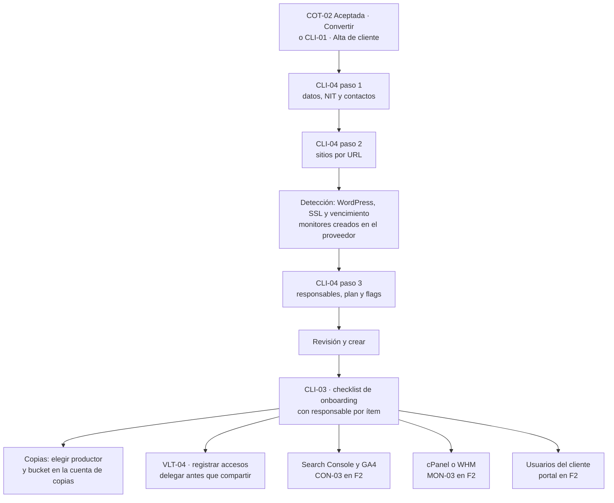

Reglas:

- Al aceptar una cotización, el alta se precarga y el proyecto nace con las horas por rol y primitiva.
- Cada dominio crea un `site`. Disponibilidad, SSL, dominio y CrUX arrancan en minutos, sin pedir credenciales.
- Lo que falta del checklist queda como "pendiente", nunca en rojo; el ítem que depende del cliente (acceso a Search Console, token del hosting) lleva una plantilla de solicitud.
- Lo que el cliente no contrató aparece en su portal como "No incluido en tu plan".
- El logo y el acento los fija la agencia.

### 5b. Conectar cPanel (`F2`)

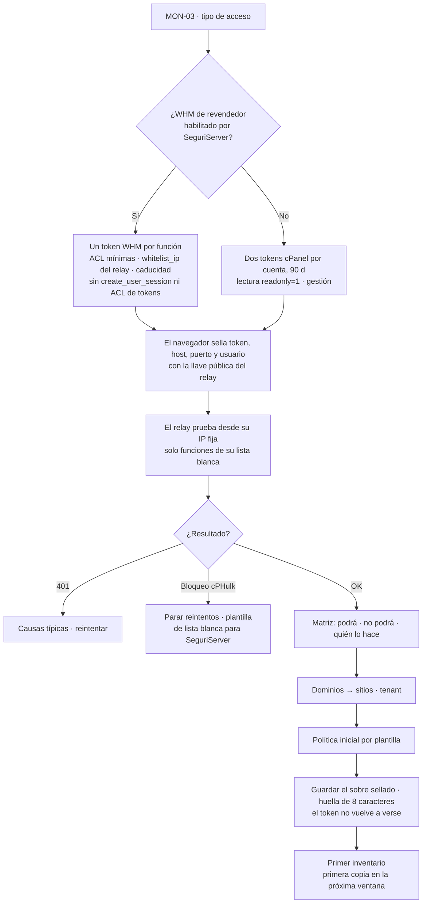

Notas:

- El token se crea en *cPanel › Manage API Tokens*; se muestra una sola vez y su caducidad no se puede editar [17].
- El navegador lo sella con `crypto_box_seal` y la llave pública del relay: solo el relay puede abrirlo, y quien lo selló no puede leerlo después [165]. El servidor del admin solo ve el sobre.
- Dentro del sobre van **token + host + puerto + usuario + connectionId + propósito**. El relay llama al host que trae el sobre, no al que diga la fila de `connections`. Así, quien edite `connections` no puede redirigir el token a un servidor propio.
- El relay llama a `https://host:2083/execute/…` con `Authorization: cpanel usuario:TOKEN` [16], con TLS estricto y nunca a una IP.
- Si SeguriServer da WHM, se rotan pocos tokens por servidor; si no, se alinean los vencimientos de todas las cuentas de un servidor para rotarlas en una sola sesión (VLT-10). 14 días antes del vencimiento nace la tarea; si nadie rota, el monitoreo de cuenta pasa a ◌, nunca a verde.

### 5c. Copias: estado en el MVP, ejecución propia y restauración en F2

**MVP (`1B`): integrar y leer el destino.**

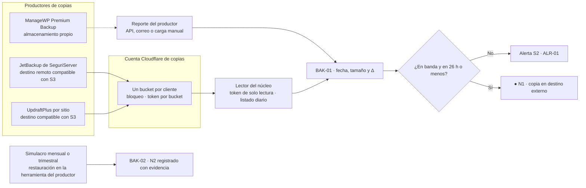

Reglas del MVP:

- **Un bucket por cliente** y un token por bucket: un WordPress comprometido solo ve sus propias copias. R2 no tiene permiso de solo escritura; los tokens de objeto se limitan a buckets concretos [128].
- **La retención la aplica el ciclo de vida del bucket**, no el productor; el bloqueo prevalece sobre el ciclo de vida [37]. Cualquier cambio en la configuración de bloqueo dispara un S1.
- Que JetBackup y UpdraftPlus escriban en un destino compatible con S3 como R2 no está verificado: se confirma en la Fase 0. ManageWP guarda en su propio almacenamiento; su estado entra por reporte y su fila dice "restaurable por: productor".
- "Restaurar" en 1B abre la herramienta del productor; el admin registra la restauración y el simulacro.

**F2: relay propio, verificación aislada y restauración.**

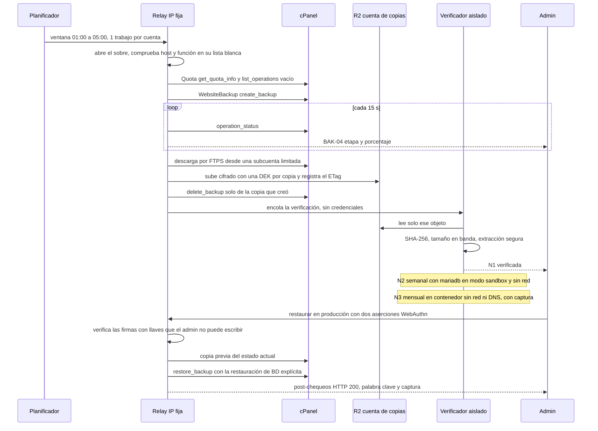

Reglas de F2:

- **El relay solo orquesta y nunca abre el contenido de una copia.** La verificación corre en workers efímeros sin credenciales de base de datos ni de nube y sin red, salvo la lectura de su objeto. Un dump malicioso puede ejecutar comandos en el cliente de MariaDB [133]: se importa siempre con `mariadb --sandbox` en una versión parcheada, nunca con el cliente de MySQL. La extracción rechaza rutas absolutas, `..` y symlinks, con límites de tamaño y de número de archivos.
- **Lista blanca de funciones por tipo de trabajo**, escrita en el código del relay: monitoreo solo lee; copia solo usa create, status y `delete_backup` de las copias que él creó; restauración solo con aprobación firmada.
- **Sin WebsiteBackup** (cPanel antiguo): copia de cuenta completa semanal con `fullbackup_to_scp_with_key` [20] hacia un **receptor SCP separado del relay**, de solo escritura (sin listar, con cuota por cliente), del que lo recibido sale al instante. Queda marcada "Restaurable por: hosting" [24].
- **Si falla N1 o N2:** alerta S2 "copia no restaurable" y se reprograma; S1 solo si es una tienda con más de 72 h sin copia válida.
- **Restaurar:**
  - Primero se ofrece la **carpeta de prueba** (`extract_backup`, solo archivos, fuera del docroot), que no requiere aprobación.
  - La pantalla de impacto es obligatoria.
  - En producción: escribir el dominio, WebAuthn del solicitante y de un segundo aprobador distinto, y copia previa. Solo se pide confirmación en lo grave y poco frecuente [93].
  - "Revertir a la copia previa" queda disponible 72 h y hereda la aprobación de la restauración original.
- **Cuenta completa:** el relay empuja la copia por SFTP a SeguriServer y abre un ticket con el SHA-256; no se entrega una URL prefirmada a un tercero.

### 5d. Compartir una credencial con un cliente y offboarding de un empleado

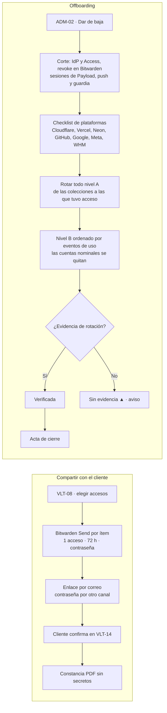

- **Entrega:**
  - Nadie exporta la organización de Bitwarden (política Remove export). Se entrega con un Send por ítem.
  - Un Send dura como máximo 31 días y admite un límite de accesos y contraseña [71].
  - En sentido contrario (VLT-07) se **delega primero**. Lo que el cliente ya mandó por WhatsApp se marca para rotar.
- **Offboarding:**
  - Revocar no borra lo que la persona ya vio, y los eventos de uso los envía el cliente de Bitwarden, que puede suprimirlos [66]. Por eso **todo el nivel A se rota sí o sí**; los eventos solo ordenan el nivel B.
  - Las cuentas nominales generan tareas de "quitar usuario", no de "rotar todo".
  - El caso se cierra cuando todas las tareas de nivel A están verificadas.

### 5e. De cotización pública a proyecto (`1A`)

```mermaid
flowchart LR
  A["Botón flotante · el prospecto configura"] --> B{"¿Cómo sigue?"}
  B -- "Deja datos y autorización" --> C["Worker público recalcula<br/>con la versión vigente · Turnstile"]
  B -- "WhatsApp con código" --> SR["Sin reclamar"]
  SR --> C2["El comercial vincula el lead"]
  C2 --> D
  C --> D["Lead + Cotización R1 Enviada<br/>PDF con token en R2"]
  D --> E["Rotación asigna comercial<br/>SLA de 24 h hábiles"]
  E --> F["Clic en la página del enlace → Vista"]
  F --> G["Primer contacto registrado → En conversación<br/>se pausan los seguimientos"]
  G --> H["Revisión R2 con ajustes y motivo<br/>APR-01 si supera el tope"]
  H --> I{"Decisión"}
  I -- "Acepta + anticipo" --> J["Convertir en proyecto<br/>horas por rol y primitiva"]
  J --> K["CLI-04 alta precargada"]
  I -- "No" --> L["Perdida · motivo obligatorio<br/>reactivar en 3, 6 o 12 meses"]
  D -- "15 d sin respuesta" --> M["Expirada · D+7 y D+14 enviados"]
```

Ciclo de vida alineado con el cotizador (corrige su §5.3: "Ajustada" es una revisión y aparece "Sin reclamar"):

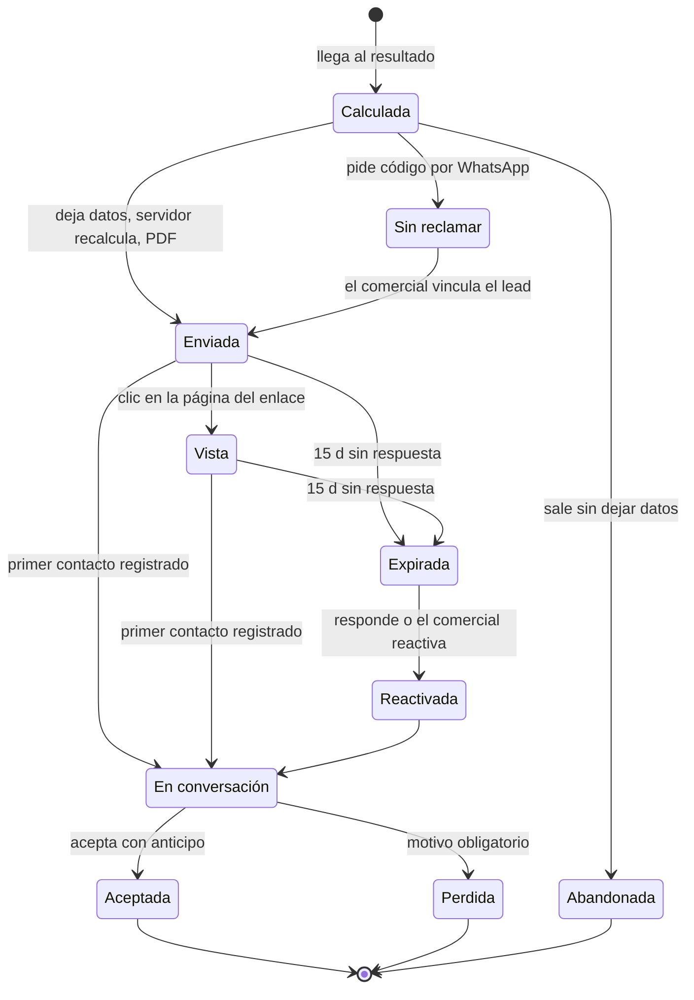

Reglas:

1. "Vista" solo se marca con un clic en el botón "Ver cotización" de una **página intermedia sin datos personales** (`Cache-Control: private`). Ni un píxel ni la vista previa de un enlace en WhatsApp o en un escáner de correo cuentan; Apple MPP precarga los píxeles [99].
2. El código de reclamo por WhatsApp tiene límite de intentos.
3. Si el precio visto y el recalculado difieren en más del 1 %, salta una alerta S2.
4. D+7 y D+14 se envían por correo en el MVP. Por WhatsApp solo con plantillas aprobadas [83], en F2.
5. Cada nueva revisión (R2, R3…) mantiene la cotización en "En conversación"; el diff vive en COT-02.
6. El proyecto es la línea base de COT-09.

### 5f. Publicar una página con chequeo SEO

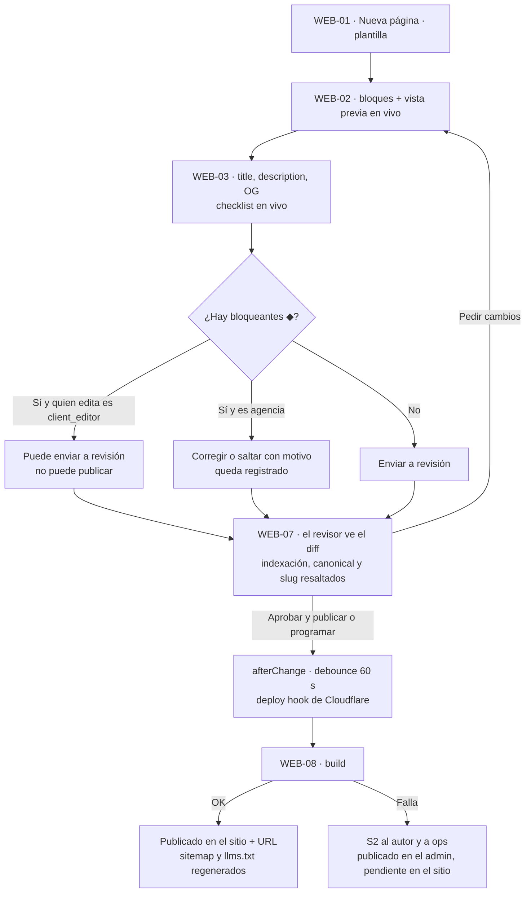

Bloqueantes:

- title vacío o duplicado;
- 0 H1 o más de uno;
- imagen sin alt;
- canonical inválido;
- choque de slug;
- falta un campo requerido del schema.

En `1A` (pantallas de Payload) los bloqueantes se aplican como validaciones con hooks y la revisión es un estado del documento; WEB-03, WEB-07 y WEB-08 propios llegan en F2. Las mejoras (▲) nunca bloquean. Si se cambia el slug de una página ya publicada, se crea una 301 con opción de "Deshacer". Programar una publicación necesita el ejecutor de jobs con su cron externo [4][6]. El deploy hook se guarda como secreto en `connections`, nunca en `tenants` [134].

### 5g. Alerta crítica de madrugada → respuesta desde el móvil

**MVP (`1B`): el proveedor avisa y escala; el núcleo refleja.**

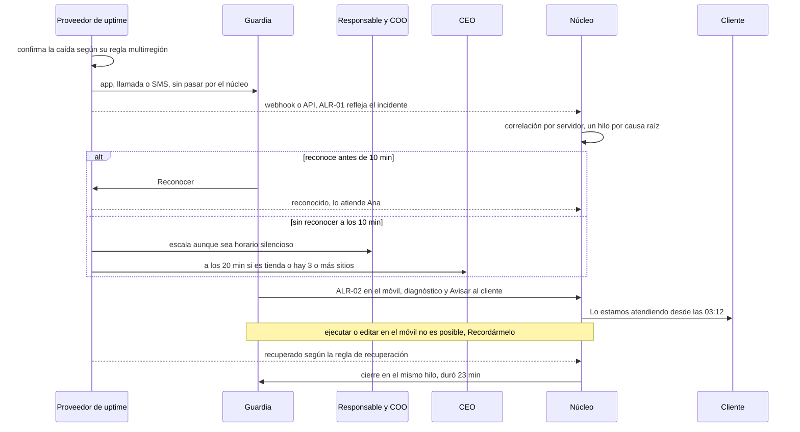

Detalles:

- **Sin dependencia del núcleo:** si Vercel, Neon o el ejecutor de jobs caen, la guardia recibe igual el aviso de disponibilidad. El propio admin y Neon también son monitores del proveedor.
- **Reconocimiento con vencimiento (F2):** un S1 reconocido vuelve a "Abierta" a los 30 min si nadie publica una actualización, y la escalera se reanuda (§7.3), como el ack timeout de PagerDuty [146]. En 1B lo que haga el reconocimiento depende del proveedor (no verificado); el COO revisa al empezar el día los S1 reconocidos sin actualización.
- **WhatsApp y Web Push (F2):** el botón "Reconocer" de una plantilla llega al webhook como mensaje de tipo `button` [84]; se valida la firma `X-Hub-Signature-256` [141]. Reconocer por WhatsApp **solo silencia a esa persona**; los S1 de bóveda o de integridad se reconocen en la app con passkey. En iOS, Web Push solo funciona con la PWA instalada [95].
- **Horario silencioso:** nunca bloquea un S1 de guardia ni la cadena de escalamiento.
- **Aviso al cliente:** manual en el MVP con la plantilla del §7.4; automático tras 15 min de S1 reconocido, a decidir (§12).
- **Cierre:** automático tras la regla de recuperación del proveedor, con la causa raíz para el informe.

---

## 6. Inicio por rol (un solo Panel, widgets filtrados por rol)

Sigue "resumen primero, después zoom y filtro, detalle bajo demanda" [98]: KPI → decisiones → atención → tabla → Lista. Cada bloque con tope muestra "Ver las N →". En el móvil solo se ven los bloques 1–3, como tarjetas.

| Orden | **CEO (owner) · "Todos los clientes"** | **Comercial (sales)** | **Cliente (client_admin) · CLI-02 · F2** |
|---|---|---|---|
| 1 | Franja S1, si hay uno abierto y es de su cadena: incidente, cliente, minutos y quién lo atiende · Ver | **Mis leads sin contactar** (solo DKODING · casa), con cuenta regresiva en horas hábiles y botón de WhatsApp | **Estado en una línea:** "Tu sitio está en línea · última copia probada hoy 03:10 · SSL al día". Si hay un incidente, en lenguaje llano y con responsable. Los primeros 7 días: checklist de configuración |
| 2 | **Requiere tu decisión** (las primeras 5 de APR-01): descuentos sobre el tope, versión de tarifas por publicar, accesos A pedidos, rotaciones de exempleados, restauraciones (F2) | **Seguimientos de hoy:** D+7 y D+14, cotizaciones "Calientes" y vistas sin respuesta | **5 tarjetas del periodo** (30 o 90 d) con nota llana y "vs. mes anterior": contactos, clics en Google (F2), velocidad real, disponibilidad, visibilidad en IA (si la contrató). Aviso "Search Console llega con 2–3 días de retraso" |
| 3 | **Requiere atención del equipo**: las primeras 7 de ALR-01 en su orden, con responsable, y la cifra de "Sin asignar" | **Mis cotizaciones por estado** y su valor | **Gráfico principal** (contactos o clics por semana) con tabla accesible |
| 4 | **≤ 5 KPI:** sitios arriba (36 de 38) · copias en destino ≤ 26 h · leads del mes · pipeline abierto COP · % aceptación (meta > 20 %, con muestra pequeña) | **Embudo del cotizador del mes** (F2), con el paso de más abandono destacado | **Los 5 contactos más recientes** con WhatsApp y "N sin responder > 24 h" |
| 5 | **Los 10 clientes en peor estado**, con enlace a CLI-01 filtrado: sitios, uptime 30 d, última copia, leads, responsable | **Oportunidades:** renovaciones a 60 d, clientes con caída de clics (vender SEO), clientes sin GEO o sin plan de mantenimiento con riesgos | **"Lo que hicimos este mes"**, generado de los trabajos + **próximo paso recomendado** |
| 6 | **Pipeline por estado** y cotizaciones que vencen esta semana | Accesos rápidos: Copiar enlace del cotizador · Ver tenant demo | **Plan y horas** (6 de 8 h), informe del mes, solicitudes abiertas |
| 7 | **Próximos 30 días:** dominios, SSL, planes, tokens, informes por enviar | — (no ve incidentes técnicos; solo la forma de estado de cada cliente en el Directorio) | Acciones: "Pedir un cambio" · "Escribir a mi responsable". Nunca: accesos ajenos, horas internas, notas, costos, datos del servidor ni otros clientes |

Variantes:

- **Ops:** lo mismo que el CEO, con sus aprobaciones en el bloque 2 y "Informes por enviar".
- **PM:** lo mismo que ops, limitado a sus clientes.
- **Producción · "Mi trabajo":** revisiones que esperan (WEB-07), rotaciones asignadas (VLT-10), contenido por revisar (SEO-04), cambios de integridad por clasificar (MON-06), solicitudes asignadas y **Mis horas** (imputación, F2).
- **client_editor:** "Continuar editando" arriba, sin plan ni contactos (salvo permiso).
- **client_viewer:** bloques 1, 2, 3 y 5, sin datos personales.
- **Cliente con WordPress:** "Tu sitio se administra en WordPress; pide cambios aquí".

---

## 7. Alertas y notificaciones

### 7.1 Severidad y canales

El **estado** (● ▲ ◆ ◌) describe el objeto; la **severidad** decide a quién se avisa y cuándo. Un objeto puede estar en ◆ y avisar como S2. Solo despierta lo urgente y accionable; lo que tiene una respuesta mecánica o puede esperar se reclasifica [144][145].

| Nivel | Forma | Significa | Canales | Escalamiento |
|---|---|---|---|---|
| **S1 Crítico** | ◆ | Solo tres clases: **caída confirmada**, **defacement o malware confirmado** y **acceso indebido en curso** | 1B: app, llamada o SMS del proveedor de uptime (disponibilidad) · franja en la app para la cadena · campana · copia por correo. F2: Web Push y WhatsApp (plantilla utility con Reconocer y Ver) | Guardia → a los 10 min, responsable del cliente + COO → a los 20 min, CEO (si es tienda o hay 3+ sitios afectados). Reconocer detiene la escalera (modelo Better Stack [35]); en F2 el reconocimiento vence a los 30 min sin actualización. La cadena ignora el horario silencioso |
| **S2 Alto** | ▲ | Riesgo en días o un compromiso que se incumple | Campana con contador · correo inmediato **en horario laboral**, repetido cada día mientras siga abierta · push opcional (F2) · WhatsApp **solo** "lead sin contactar", al comercial asignado (F2) | Sin escalamiento nocturno; si en 24 h hábiles nadie la reconoce, pasa a ops |
| **S3 Medio** | △ | Hay que hacerlo esta semana | Campana sin push · resumen diario a las 07:00 | Ninguno |
| **S4 Info** | ○ | Confirmaciones y novedades | Solo el feed · resumen semanal (CEO, lunes) | Ninguno |

**Modo sombra:** toda regla nueva y, al arrancar 1B, todo el sistema pasan **2 semanas registrando sin avisar**. Se mide el volumen por severidad y la meta para activar avisos es **≤ 1–2 S1 por semana** en toda la flota. No hay una estimación previa del volumen: depende de datos que aún no existen.

### 7.2 Umbrales concretos

Los umbrales de CWV y de uptime tienen respaldo público [54][126]. Los de clics, copias, leads e IA son propuestas que hay que calibrar con 2–3 meses de datos.

| Dominio | S1 (despierta) | S2 (horario laboral) | S3 / S4 |
|---|---|---|---|
| Disponibilidad | Caída confirmada por el proveedor (su regla multirregión) o falta la palabra obligatoria en esa misma confirmación | p95 > 3 s durante 15 min · uptime de 30 d < 99,5 % | Falla en una sola región (interno) |
| Integridad (F2) | Defacement o malware confirmado: palabra prohibida presente · título cambiado **y** script de un dominio tercero nuevo · `.php` en uploads · core ≠ checksums | Script de un dominio tercero nuevo, solo · `index.php` o `.htaccess` modificados fuera de una ventana | Cambio del DOM normalizado fuera de un deploy (S3 informativo) |
| Copias | Tienda con más de 72 h sin copia válida · cambio en la configuración de bloqueo del bucket | 1 fallo · 2 fallos seguidos · sin copia > 48 h (diaria) o > 8 d (semanal) · N1 fallida · tamaño −30 % / +50 % · disco > 85 % (> 95 %: S2 repetido a diario) | Sin simulacro N2 en 35 d (tiendas) · resumen diario · restauración ejecutada (S4 al CEO y al cliente) |
| SSL y dominio | SSL inválido o vencido · dominio vencido | SSL ≤ 7 d (estado ◆) · SSL ≤ 14 d (≤ 21 d con DCV) · dominio ≤ 14 d (estado ◆, también al CEO) · dominio ≤ 30 d | Dominio a 60 d |
| Conexiones | — | Autenticación fallida (la señal pasa a ◌) · token ≤ 7 d | Token ≤ 14 d · llave de Bitwarden > 90 d |
| Software (F2) | — | CVSS ≥ 7 sin parche (tarea en 24 h) | Con parche · PHP sin soporte |
| SEO y despliegues | — | Página de dinero con noindex o canonical a otra URL · robots efectivo que bloquea un buscador o un bot de búsqueda IA · despliegue fallido o programada sin ejecutar · bucle de redirecciones · clics −30 % semana contra semana con ≥ 50 clics previos | **Fuera de alertas**, al resumen semanal de SEO por responsable y a la cola de SEO-01: −5 posiciones en una consulta seguida · canibalización · errores nuevos de auditoría · CrUX de ● a ▲ · cadenas de redirección · `_redirects` > 90 % · builds > 80 % |
| Ventas y cotizador | — | Lead sin contactar > 24 h hábiles (al comercial; > 72 h hábiles, al COO) · leads o eventos clave en 0 durante 7 d con una media previa ≥ 1 al día · aprobación pendiente > 24 h hábiles · diferencia > 1 % entre el precio visto y el recalculado | Cotización "caliente" · vence en ≤ 3 d · estancada · paso del embudo −20 % (al resumen) |
| Bóveda | Acceso indebido en curso: JIT vencido que sigue activo · empleado desactivado que sigue activo en Bitwarden · exportación (1602/1007) sin solicitud aprobada · diferencia entre la membresía real y las concesiones (F3) | Política o miembro cambiados en Bitwarden sin una solicitud registrada (si fue un owner conocido en horario laboral: S3 de registro) · > 20 ítems vistos o copiados en 10 min · acceso A sin concesión o fuera de horario · logins fallidos repetidos | Miembro sin 2FA · revisión mensual vencida · rotación sin evidencia |
| Núcleo y fuentes | — (si cae el admin, lo avisa el proveedor como caída de un sitio más) | Heartbeat del ejecutor de jobs o de una ingesta ausente > 1 h (lo envía el proveedor) · cron con 3 fallos seguidos | Fuente desconectada > 48 h · cuota > 80 % (interno) |

### 7.3 Agrupación, silencio, orden y ciclo de vida

- **Un incidente, un hilo:** caído → confirmado → diagnóstico → recuperado. Nunca un mensaje por cada chequeo fallido.
- **Correlación por servidor:** si caen 9 sitios del mismo hosting se abre "SeguriServer: 9 sitios sin respuesta" (colección de agencia) y un ticket, no 9 alertas. Cada cliente ve su propia proyección.
- **Causa raíz:** las alertas derivadas (GA4 en 0 porque el sitio cayó) quedan dentro de la principal.
- **Resúmenes:** los S4 repetidos se agrupan ("36 copias en destino · 2 más grandes de lo normal").
- **Autoasignación:** al `sites.responsable`; si no hay, a la guardia de la semana. El contador de cada persona = asignadas a mí + sin asignar de mis clientes.
- **Orden único** (ALR-01, INI-01, campana y Panels): primero la severidad (un S1 siempre va arriba), luego el impacto y luego la antigüedad. Impacto: +30 si afecta ingresos (caída, formulario, checkout) · +20 si hay riesgo de perder datos · +15 si el cliente tiene retainer · criticidad del sitio (tienda +10, corporativo +5, landing 0). La edad se muestra como texto y nunca sube el nivel. Cada fila dice por qué está ahí.
- **Silenciar:**
  - Posponer 1 h, 4 h o hasta mañana a las 8:00, con motivo (S2–S4).
  - Silenciar un sitio o cliente 1, 4 o 24 h, con motivo.
  - Programar ventanas de mantenimiento.
  - Horario silencioso personal (22:00–07:00), que **nunca** bloquea un S1 de guardia ni la cadena de escalamiento.
  - Todo silencio caduca y se ve en la fila ("Silenciado hasta 15:00 por Ana").
- **Por qué recibes esto:** cada aviso lleva la regla que lo disparó y el enlace para ajustar la preferencia.
- **Cliente:** recibe solo sus contactos (si lo activa), el informe y el aviso de un incidente que le afecta, en lenguaje llano. Nunca alertas técnicas crudas (tokens, disco, plugins).

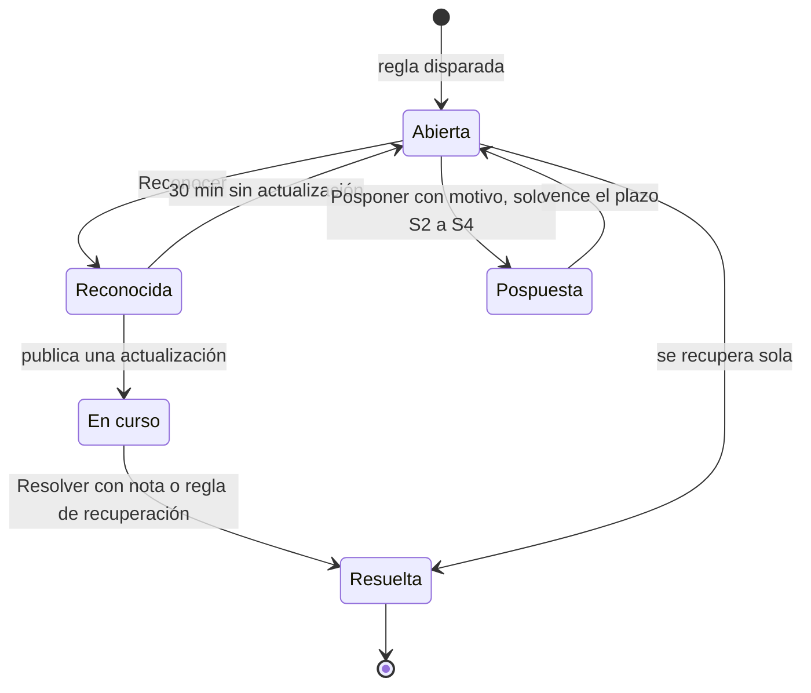

### 7.4 Avisos al cliente (textos base)

| Momento | Texto | Canal |
|---|---|---|
| Incidente en curso | "Hola, {nombre}. Desde las {hora} tu sitio {sitio} no responde. Ya lo estamos atendiendo; {responsable} te escribirá cuando vuelva a estar en línea. No necesitas hacer nada." | Correo; WhatsApp con plantilla aprobada (F2) |
| Recuperación | "Tu sitio {sitio} volvió a estar en línea a las {hora}. Estuvo fuera {duración}. En el informe del mes te contamos la causa y qué hicimos para que no se repita." | Ídem |
| Restauración | "Recuperamos tu sitio con la copia del {fecha} a las {hora}. Lo que se haya publicado o recibido después de esa hora puede no estar: revisa {qué revisar} y avísanos si falta algo." | Correo |
| Informe | "Tu informe de {mes} está listo: {3 puntos}. Ver informe ↗" | Correo |
| Incidente de datos | Plazo contractual de 48–72 h para avisar al Responsable; texto revisado por un abogado (§12) | Correo |

---

## 8. Modelo de datos de los módulos nuevos

Solo lo que no está en arquitectura §4 ni en cotizador §5.4. Toda colección de cliente lleva `tenant`, que inyecta el plugin [1]; las **colecciones de agencia** (marcadas *agencia*) no llevan tenant y solo las ve la agencia. Las tablas `monitoring_*` pasan a referenciar **`site`**. La columna Fase indica cuándo nace cada entidad; el MVP (1A + 1B) usa unas 24.

**Cambios en colecciones existentes**

| Entidad | Cambio | Fase |
|---|---|---|
| `tenants` | + `marca{logoCuadrado, logoHorizontal, acento, acentoDerivado}` · `flags[]` (módulos activos, incluida `gestionLeads`) · `plan` · `responsables{comercial, tecnico}` · `esCasa` · `esDemo` · `saludCuenta` (calculada) · `archivadoEl`. **Sale `deployHookUrl`** (es un secreto [134]; pasa a `connections`) | 1A |
| `users` (solo agencia en el MVP) | `rolAgencia` (owner · ops · sales · production) · `clientesAsignados[]` · `delegacion{de, hasta}` · `bitwardenMemberId` · `pushSubscriptions[]` (F2). Con `update: false` en rol, tenants, asignados y Bitwarden salvo para el owner. `useAPIKey` desactivado; `useSessions` en true | 1A |
| `alerts` | Se divide en `alert_rules` (configuración) y `alerts` (instancias) | 1B |
| `leads` | + `ambito` (casa · cliente) · `consentimientoId` · `slaVenceEn` (en horas hábiles) | 1A |
| `pages`, `services`, `cases`, `posts` | + `workflowState` · `revisorAsignado` · `lastReviewedAt` · `reviewedBy` · `reviewIntervalDays` · `canonical` · `robots{index, follow}` · `keywords{principal, secundarias[]}` · `schemaExtra` (solo agencia) · `seoCheck{estado, n, m, bloqueantes[], override{por, motivo, fecha}}` | 1A (seoCheck F2) |

**Entidades nuevas**

| Grupo | Entidad | Campos clave | Fase |
|---|---|---|---|
| Identidad | `memberships` | tenant · user · rol (client_admin · client_editor · client_viewer) · invitadoPor · aceptadoEl | F2 |
| | `machines` | nombre · propósito · llave de API · alcance · creadaPor · rotadaEl | 1A |
| Sitios | `sites` | tenant · nombre · `dominios[]` · `stack` · `hosting` · `servidor` · `criticidad` (tienda · corporativo · landing) · `docroot` · `versionCms` · `versionPhp` · `urlsClave[≤5]` · `palabrasObligatorias[]` · `palabrasProhibidas[]` · `ventanasMantenimiento[]` · `responsable` · `contactosAlerta[]` · `capacidades{}` (derivadas, con fecha) · `estadoPorSenal{}` · `estadoAgregado` · `productorCopias` · `uptimeMonitorId` · `gscProperty` · `ga4PropertyId` · `cfProjectId` · `pluginSeoDetectado` · `rum` (none · propio · cf) · `mainwpId` | 1B |
| Conexiones | `connections` (*agencia* si abarca varios clientes) | tipo · **consumidor** (núcleo · worker · relay · aislado) · **almacén** (vercel_env · cf_secret · sobre_sellado) · host y usuario (solo para mostrar; el relay usa los del sobre) · alcance · `aclWhm[]` · `sites[]` · `capacidades{}` · estado (ok · por_vencer · rechazada) · `ultimaPrueba` · `venceEl` · `rotadaEl` · `creadaPor` · `selloRef` · `huella` | 1B inventario · F2 sellos |
| | `sealed_secrets` (**proyecto o esquema Postgres aparte, con dueño distinto de Payload**) | sobre (`crypto_box_seal` con la llave pública del relay [165]) que contiene token, host, puerto, usuario, connectionId, propósito y versión · `huella` (HMAC, 8 caracteres) · `version` · `versionAnteriorHasta`. Rol de la app: solo INSERT; rol del relay: SELECT | F2 |
| | `secret_uses` | conexión · job · runner · ts · resultado (ok · auth_fallida · error) | F2 |
| Monitoreo | `monitors` (espejo del proveedor) | site · tipo (http · keyword · ssl · dominio · heartbeat · integridad · malware · cwv) · intervalo · `regiones[]` · regla de confirmación y recuperación del proveedor · `pausadoHasta` · `proveedorId` | 1B |
| | `uptime_daily` | monitor · fecha · uptime % · p50 · p95 · incidentes. Los chequeos crudos se quedan en el proveedor | 1B |
| | `heartbeats` | nombre (ejecutor de jobs, ingesta, relay) · intervalo esperado · último latido · `proveedorId` | 1A |
| | `incidents` (*agencia* si es por servidor) | site o servidor · tipo · severidad · inicio · fin · estado · `regionesConfirmadas[]` · `reconocidoPor` · `timeline[]` · `causaRaiz` · `explicacionCliente` · `visibleCliente` · `proveedorId` | 1B |
| | `incident_projections` | incident · tenant · texto propio para el cliente · visible | 1B |
| | `alerts` | site · tipo · severidad (S1–S4) · impacto (calculado) · `porQue` · incident (causa raíz) · estado (abierta · reconocida · en_curso · pospuesta · resuelta) · `reconocidaHasta` · responsable (autoasignado) · `pospuestaHasta` + motivo · `accionUrl` · `visibleCliente` · `modoSombra` | 1B |
| | `alert_rules` (*agencia*) / `on_call` (*agencia*) / `notification_prefs` | evento · severidad · umbral · canales · `escalamiento[{min, rol}]` · aplicaA (plantilla · tenant · site) · `modoSombraHasta` / semana · persona · suplente / usuario · canal por severidad · horario silencioso | 1B |
| | `file_baselines` / `file_changes` | site · instantánea · fuente (externa · cpanel · agente) · ruta · zona · tamaño · mtime · permisos · hash · hashDomNormalizado · tipoCambio · clasificación (esperado · no_esperado · aceptado) · motivoEsperado · acción · `resueltoPor` | F2 |
| | `software_inventory` | site · componente (core · plugin · tema · php) · slug · instalada · última · `vulnerabilidades[{id, cvss, corregidaEn, fuente}]` | F2 |
| | `expirations` | site o connection · tipo (dominio · ssl · token · hosting · licencia) · `venceEl` · fuente (rdap · whois · tls · cpanel · manual) · autorrenovación · `problemasDcv[]` · quiénPaga · responsable · `visibleCliente` (solo dominio, SSL y plan) | 1B |
| Copias | `backup_policies` | site · productor · alcance (website_bd · cuenta_completa · solo_bd) · cron · ventana · `concurrenciaMax` · `retencion{d, s, m}` · `destinos[{cuenta, bucket, bloqueoDias}]` · `simulacros{n2Cada, n3Cada}` | 1B |
| | `backups` | site · policy · productor (jetbackup · updraftplus · managewp · websitebackup · relay) · alcance · tamaño · `deltaPct` · ubicación `{cuenta, bucket, key, etag, bloqueadaHasta}` · sha256 (F2) · `manifiesto{}` · estado · `nivelVerificacion` 0–3 · `restaurablePor` (dkoding · productor · hosting) · `retencionLegal` | 1B |
| | `backup_drills` | site · backup · tipo (sitio_bd · archivos · bd) · nivel · quién · cuándo · evidencia · resultado | 1B |
| | `backup_verifications` | backup · nivel · `checks[{nombre, ok, detalle}]` · evidencia · worker · `ejecutadoEn` | F2 |
| | `restores` | site · backup · alcance · destino (carpeta_prueba · staging · produccion) · modo (merge · clean) · `restaurarBd` (explícito) · **`backupPrevio` (obligatorio en producción)** · `solicitadoPor` · `aprobaciones[{usuario, aserciónWebAuthn, hashOperacion}]` · `textoConfirmacion` · `postChecks{}` · `revertido` · `ticketHosting` | F2 |
| | `jobs` | tipo · site · connection · estado · etapa · `progresoPct` · bytes · `operationIdRemoto` · `logRef` · intentos · error · `creadoPor` · `aprobadoPor` | F2 |
| Métricas | `kpi_definitions` (*agencia*) + `kpi_overrides` (con tenant) | key · etiqueta (una sola por concepto) · unidad · `mejorSi` · `umbralOk` · `umbralAviso` · `volumenMinimo` · aplicaA · `visibleParaRoles[]` / tenant · umbrales · motivo | 1B |
| | `metric_snapshots` | site · metricKey · periodo · valor · anterior · `deltaAbs` · `deltaPct` · estado (ok · aviso · critico · sin_datos) · fuente (crux_url · crux_origen · rum · cf_web_analytics · psi · gsc · ga4 · uptime · productor · geo · payload) · formFactor · `nMuestras` · `datosHasta` · `provisional` · `sparkline[]` | 1B |
| | `data_sources` · `rum_daily` · `activity_log` | fuente · `ultimoExito` · `datosHasta` · `cuotaUsada` / p75 por ruta, sin IP ni cookies / `descripcionCliente` (generada desde los trabajos) · `visibleCliente` | 1B |
| | `monthly_reports` | mes · estado · **`snapshotJson` congelado** · `comentarioAgencia[3]` · `seccionesActivas[]` · `pdfR2Key` · `destinatarios[]` · `envioProgramadoEn` · `abiertoEn` · version | F2 |
| | `ui_events` | usuario · rol · pantalla · evento (vista · accion_primaria · estado_vacio_mostrado) · ts | 1A |
| SEO | `seo_settings` (isGlobal) | entidad{nombreLegal, NIT, logo, sameAs[], dirección, areaServed} · plantillas de título · ogPorDefecto · intervalos · `reglasBloqueo` · `robotsPreset` + reglas · `llmsResumen` · `competidoresGeo[]` | 1A |
| | `deploys` · `review_events` | site · trigger · `documentos[]` · estado · `cfDeploymentId` · logUrl · error / documento · de · a · por · nota · versiónId | F2 |
| | `audit_runs` / `audit_issues` | site · `urlsRastreadas` · `saludPct` · límite / url · tipo · severidad · tema · estado (nueva · persistente · resuelta · ignorada) · motivo | F2 |
| | `gsc_daily` · `keywords_tracked` · `cannibalization_findings` (F2) · `internal_link_suggestions` · `geo_prompts` · `geo_runs` (F3) | `gsc_daily(site, fecha, query, page, device, clicks, impressions, position, dataState)` · `keywords_tracked(query, urlObjetivo, cluster)` · `cannibalization_findings(query, urls[], alternancias, decisión)` · `geo_prompts(texto, ubicación, motores[], k)` · `geo_runs(prompt, motor, intento, aparece, citado, urlsCitadas[], proveedor, costeUsd)` | F2/F3 |
| Bóveda | `access_records` | tipo · servicio · urlLogin · nivel (A · B · C) · método (delegado · compartido_bitwarden · maquina) · `dueñoLegal` · `titularRol` (sin correo ni usuario; oculto al cliente) · `bwItemId` · `bwCollectionId` · `segundoFactor{tipo, custodio}` (custodio oculto al cliente) · `rotacion{politica, ultima, proxima, evidencia}` · dependencias · notas (con validador anti-secretos) | 1B |
| | `access_reviews` | mes · conteos (débiles, reutilizadas, expuestas, sin 2FA) · revisadoPor · revisadoEl | 1B |
| | `vault_links` · `bw_members` (caché) | `bwOrgId` · `bwCollectionIds[]` · `bwGroupIds{proyecto, jit}` · estadoSync / `twoFactorEnabled` · colecciones · grupos | F3 |
| | `access_grants` · `access_requests` · `handoffs` | usuario · alcance · motivo · ticket · desde/hasta · aprobador · estado · `rotacionObligatoria` · `revocacionVerificadaEl` / `items[{tipo, metodo, estado}]` · `venceEl` / accesos · método (send) · confirmado · `supresion{itemsBorrados, papeleraVaciada, tokensRevocados}` · constancia | 1B grants manuales · F2 resto |
| | `offboarding_cases` · `rotation_tasks` · `credential_incidents` | persona · hora · checklist de plataformas · revocaciones · tareas · acta / acceso o connection · origen · lote (servidor) · vence · responsable · estado · evidencia / afectaDatosPersonales · `venceAvisoResponsable` · `venceReporteSic` · reportadoEl | 1B (incidentes F2) |
| Cotizador | `pricing_versions` (amplía) | estado (borrador · programada · vigente · archivada) · `basadaEn` · `publicarEn` · `periodoGraciaHoras` · `aprobadaPor` · `notaVersion` · `hashSnapshot` · `jsonPublicadoKey` · **`ordenCalculo`** · `topeDescuentoAcumulado` · `primitivas[P1–P11]{horas, split}` · `bloques[]` · `tiposSitio[]` · `reglas[]` | 1A |
| | `quotes` / `quote_lines` (amplían) | `revision` (R1..Rn) · `cadenaId` · `estadoRevision` (borrador · enviada · reemplazada · aceptada) · estado del ciclo (§5e) · origen (cotizador · whatsapp · telefono · referido) · `codigoReclamo` · `tokenPdf` (≥ 128 bits) · `precioCerrado` · `reemplazadaPor` · `consentimientoId` · `proximaAccion` / `horasAjustadas` · `ajuste{delta, motivo, autor}` · `categoriaCalibracion` · `visiblePdf` | 1A |
| | `approval_requests` · `follow_up_jobs` · `funnel_events` | tipo · objeto · `hashOperacion` · impacto (texto llano) · motivo · solicitante · aprobador · estado · vence / quote · paso D+N · canal · plantilla · estado / sessionId anónimo · evento · paso · versión · dispositivo · UTM | 1A (funnel F2) |
| | `reference_scenarios` · `project_actuals` · `calibration_findings` · `quoter_settings` (isGlobal) | escenario JSON con rango esperado (pruebas de CI) / `entradas[{rol, primitiva, horas}]` + reglas de mapeo / estimadas · mediana real · desviación · n / horario · festivos · SLA hábil · rotación · cadencia · umbrales · modo de precio público | 1A (calibración F2) |
| Transversal | `audit_events` (**esquema propio, solo inserción**) | secuencia · fuente (admin · bitwarden · relay · kms) · código · actor · rol · tenant · objeto · `funcionApi` · ip · ts · `lecturaSensible` · `hashPrevio` · `hash` · `anclaHora` | 1A |
| | `habeas_requests` · `processing_register` | solicitante · tenant · tipo · recibidaEl · vence · estado · constancia / tratamiento · finalidad · base · encargados y subencargados · transferencia internacional · retención | F2 (registro como documento en la Fase 0) |
| | `projects` · `tickets` · `retainers` | cotización origen · hitos · horas estimadas frente a reales / sitio · urgencia · SLA · horas / servicio · valor · horas incluidas y consumidas · renovación · `alegraId` | 1A proyecto mínimo · F2 resto |

---

## 9. Seguridad del admin

### 9.0 Modelo de amenazas

| Actor | Qué busca | Controles principales |
|---|---|---|
| Empleado que se va o que actúa de mala fe | Llevarse accesos o exportar leads | Corte en el IdP y Access en minutos · revoke en Bitwarden · rotación obligatoria de todo nivel A de sus colecciones · política Remove export · exportaciones con límite, marca de agua y aviso · registro de lecturas sensibles |
| Cliente malicioso o cuenta de cliente robada | Ver otros tenants o escalar privilegios | `memberships` · acceso por campo · denegar por defecto · pruebas de fuga · portal en otro hostname · roles de agencia solo por el hostname con Access |
| WordPress comprometido de un cliente | Saltar a otros clientes o a la plataforma | Un bucket y un token por cliente · verificación en workers aislados sin credenciales · `mariadb --sandbox` · extracción segura · carpeta de prueba fuera del docroot · SSRF · medios en dominio aparte |
| Robo de la cuenta Cloudflare principal | Borrar sitios, medios y copias | Copias en una cuenta Cloudflare separada, con otros titulares y FIDO2 · alerta S1 por cambio de bloqueo · copia secundaria con bloqueo de cumplimiento (F2) |
| Robo de la cuenta Bitwarden de un owner | Todos los vaults de la organización | Sin recuperación de cuenta para todos · FIDO2 para Owners y Admins · alerta S1 en los eventos de recuperación si se activa · clientes de Bitwarden actualizados |
| Servidor de Bitwarden malicioso [73] | Romper el cifrado de extremo a extremo | Riesgo residual aceptado; si un cliente exige separación criptográfica, organización propia vía Provider Portal o 1Password Business [75] |
| Admin comprometido (XSS, sesión robada de ops) | Redirigir tokens o aprobar restauraciones | Destino sellado con el token · lista blanca de funciones en el relay · N3 con WebAuthn de dos personas verificado por el relay · CSP con nonces · Access |
| Relay comprometido (F2) | Los tokens de unas 30 cuentas cPanel | Sin puertos entrantes · receptor SCP separado · infraestructura como código · parches con responsable · heartbeat · plan de revocación en bloque (§9.3) |
| Dependencia comprometida (plugin comunitario, paquete npm) | Ejecutar código en el núcleo | Lockfile, Renovate, SBOM, escaneo de secretos, auditoría de payload-totp antes de usarlo |
| Abuso externo del cotizador | Costo de WhatsApp, spam, enumeración de cotizaciones | Worker público con Turnstile y límites · tope diario de WhatsApp (F2) · tokens de ≥ 128 bits · límite de intentos del código de reclamo |

### 9.1 Secretos de personas frente a secretos de máquina

| | Personas (contraseñas de clientes y de la agencia) | Máquina de la agencia (MVP) | Máquina por cliente: tokens cPanel/WHM (F2) |
|---|---|---|---|
| Dónde viven | Bitwarden Password Manager Enterprise: una organización, colecciones `Clientes/{slug}`, solo empleados. US$6 por usuario al mes [63] | En el almacén de su consumidor: variables cifradas de Vercel (núcleo: R2 de medios, deploy hooks, proveedor de uptime, correo) y secretos de Workers (Worker público). La llave de la organización Bitwarden y la cuenta de servicio de Google (F2/F3) van a un **servicio aislado**, nunca al núcleo | `sealed_secrets`: sobre sellado con la llave pública del relay [165], en un proyecto o esquema aparte, siguiendo la guía de gestión de secretos de OWASP [80]. Bitwarden Secrets Manager no sirve aquí: no permite escribir sin poder leer [81] |
| Quién escribe | La persona, en Bitwarden | Owner u ops, en la consola del proveedor; CON-01 registra metadatos | El navegador de owner u ops: el servidor del admin solo recibe el sobre |
| Quién lee | Quien tiene acceso a la colección; la extensión autocompleta ("ver con contraseñas ocultas" no sirve como control: igual permite autocompletar [72]) | El consumidor declarado | **Solo el relay**, con su llave privada fuera de la base de datos y respaldada offline con dos custodios. Ningún humano |
| Qué ve el admin | Metadatos, salud, rotación; uso en F3 | Consumidor, almacén, huella, caducidad, rotación | Huella, caducidad, último uso, estado. **Nunca el valor**: tampoco en logs, Sentry, búsqueda, paleta ni exportaciones (con pruebas automáticas) |
| Rotación | Por evento: offboarding (todo nivel A), JIT A vencido, exposición, sospecha, fin de contrato. Sin rotación periódica forzada [78] | Llave de Bitwarden cada 90 d; Google sin llaves JSON; el resto según el proveedor | Tokens de 90 d alineados por servidor; recordatorios a 30/14/7 d; rotación en lote |
| Mínimo privilegio | Grupos por proyecto; nivel A solo por JIT. **Recuperación de cuenta no activada para todos**: permite a owners y admins restablecer la contraseña maestra y quitar el 2FA de cualquier miembro [135]. Automatic confirmation apagado [136] | Una llave por consumidor y propósito; pocos administradores de Vercel y Cloudflare, con FIDO2 | WHM: un token por función con ACL mínimas e IP del relay. cPanel: dos tokens (lectura y gestión) con propósitos distintos dentro del sobre; no admite IP ni módulo [18] |
| Riesgo residual | La separación entre clientes es lógica, no criptográfica [69] | Quien administre el proyecto en Vercel o Cloudflare puede leer sus variables (inferencia, no verificado) | Un token cPanel equivale a la cuenta entera, correo incluido: si el relay cae en manos ajenas, quedan expuestas unas 30 cuentas (§9.4 y §9.3) |

### 9.2 Controles

| Control | Regla | Fase |
|---|---|---|
| **Acceso de la agencia** | Hostname propio detrás de Cloudflare Access; el IdP impone el segundo factor; FIDO2 obligatorio para owner y ops. Un hook de login rechaza a los roles de agencia que lleguen por otro hostname. En lugar del bloqueo duro por intentos (que permitiría a un atacante bloquear a los owners en plena emergencia), límite por IP con Turnstile | 1A |
| **2FA del portal** | payload-totp solo tras auditarlo con pruebas sobre la API (login por REST, llaves de API, GraphQL desactivado): su README no deja claro si el login por API exige TOTP ni documenta códigos de recuperación [14]; la revisión de seguridad señala que ya existe una versión 3.0.6 frente a la beta citada. Passkeys en Payload: sin verificar. Recuperación: un segundo client_admin, o ops tras una llamada al contacto registrado, con registro. Contraseñas de 15 caracteres o más, comprobadas contra HIBP por rango [79] | F2 |
| **Sesiones** | Agencia: sesión de Access de 12 h (propuesta), Payload 12 h e inactividad de 2 h. Cliente: 12 h y reautenticación para las acciones S. `useSessions` en true [131]. El offboarding cierra todas | 1A / F2 |
| **Modo protegido** | 15 min tras WebAuthn para roles, tarifas, aprobaciones, conexiones y exportaciones | F2 |
| **Acciones por nivel** | **N1** (se puede deshacer: despublicar, mover de etapa): toast con Deshacer. **N2** (reversible: restaurar en carpeta de prueba o staging, cuarentena, revocar un JIT, "Abrir cPanel"): confirmación en la pantalla y registro. **N3**: tabla siguiente | 1A |
| **Promover roles y restablecer 2FA** | Crear o promover un rol privilegiado (owner, ops) y restablecer el segundo factor de alguien de la agencia exige al owner, la aprobación del segundo owner si existe, **24 h de espera** y aviso a toda la agencia. Ops no promueve | 1A |
| **Copias** | Cuenta Cloudflare separada, con otros titulares y FIDO2; un bucket y un token por cliente; el lector del núcleo solo tiene lectura [128]. La interfaz dice "Bloqueada · revocable por un administrador de la cuenta de copias" [37]. Alerta S1 ante cualquier cambio de bloqueo. F2: copia secundaria con bloqueo en modo cumplimiento, que nadie puede borrar ni sobrescribir, ni siquiera la cuenta raíz [132], en una cuenta aparte. Descargas (F2): un endpoint autenticado que transmite el archivo, con registro y aviso a ops; nunca una URL al portador entregada a terceros | 1B / F2 |
| **Auditoría** | `audit_events` en un esquema propio con dueño distinto del rol de Payload; REVOKE de UPDATE, DELETE y TRUNCATE; inserción por una función SECURITY DEFINER con secuencia y advisory lock (sin bifurcar la cadena). El hash cabeza se ancla **cada hora** fuera del perímetro: objeto bloqueado en la cuenta de copias (MVP) y bloqueo de cumplimiento (F2). `cleanupAfterTenantDelete: false` [1]: eliminar un cliente es archivarlo. Registra cada función de cPanel llamada, cada cambio de indexación, canonical, robots, redirecciones, umbrales, tarifas o roles, cada bloqueante saltado y las **lecturas sensibles**. Se construye con hooks propios; payload-auditor solo tiene un post como documentación [15] | 1A |
| **Aislamiento** | Denegar por defecto y pruebas de fuga (§3.3). Staging y preview con datos sintéticos y otras llaves, nunca ramas de Neon con datos de producción. Protección de despliegues de Vercel obligatoria | 1A |
| **Superficie web** | CSP con nonces en `/admin` · regla de lint que prohíbe `dangerouslySetInnerHTML` · medios en un dominio aparte sin cookies (WEB-06) · vista previa en otro origen con `sandbox` · JSON-LD con `<` escapado · CORS solo para los orígenes de los sitios · `Cache-Control: private, no-store` en `/admin` y `/api` · rutas públicas en el Worker aparte (§4.8) · cookies y CSRF de Payload por revisar en el pentest (no verificado) | 1A |
| **SSRF** | El rastreador, "Probar URL", los webhooks de formularios y la prueba de hosts corren en un worker aislado sin credenciales. Se resuelven todas las IP del nombre, se validan contra rangos privados, link-local e IPv6 mapeadas, y se conecta solo a esas IP; las redirecciones no se siguen sin revalidar [166]. MON-03 rechaza IP | 1A / F2 |
| **Credenciales de hosting** | Dos tokens por cuenta (lectura para monitoreo; gestión solo para copias y restauraciones). En WHM, un token por función, sin `create_user_session` ni ACL de tokens (las ACL "Everything" y "Manage API Tokens" saltan las restricciones [19]). "Abrir cPanel" solo owner y ops, en modo protegido, con motivo, registro y aviso al cliente. Nivel A = todo lo que da control de hosting, DNS, registrador, correo o administrador de WordPress | F2 |
| **MainWP** | El Dashboard guarda las llaves que firman las órdenes a todos los sitios hijos, y MainWP Child exige ser administrador en cada WordPress [139]. Host dedicado (nunca el hosting compartido de los clientes), detrás de Access con FIDO2, sin plugins extra, actualizaciones automáticas, llave de cifrado fuera del docroot, monitoreo de integridad del propio Dashboard y solo owner y ops | F2 |
| **Exportaciones** | Toda exportación con datos personales o secretos exige modo protegido, motivo, límite de filas, marca de agua, registro y aviso S2 a ops. La exportación de la organización Bitwarden está prohibida; los eventos 1602/1007 sin solicitud aprobada son S1. Detección de volumen anómalo de lecturas de leads | 1A / F2 |
| **Ley 1581** [106] | DKODING es **Responsable** de sus leads, sus contactos y su equipo, y **Encargado** de los datos de sus clientes. Contrato de transmisión por cliente · autorización versionada en cada lead · registro de tratamientos (Fase 0) · solicitudes de titulares con reloj (ADM-08) · contratos con los subencargados (Vercel, Neon, Cloudflare, Bitwarden, Google, Meta y AWS si se usa) · retención que cubra las copias · aviso al Responsable en 48–72 h. El Encargado debe informar al Responsable y a la SIC (artículo 18, fuente secundaria [142]); el reporte de 15 días hábiles al RNBD aplica a quien está obligado a registrarse (fuente secundaria [107]). Si la transferencia internacional de copias con datos personales exige algo más: no verificado (§12) | 0 / F2 |

**Acciones N3** (única lista; P4, §0.1 y §3 remiten aquí):

| Acción | Por qué es N3 | Requisitos |
|---|---|---|
| Restaurar en producción, en modo espejo o restaurar una BD | Sobrescribe datos vivos | Solo desde el Detalle en escritorio · escribir el dominio · pantalla de impacto · WebAuthn del solicitante + WebAuthn de un 2.º aprobador distinto (autenticadores con ≥ 7 d) sobre el hash de la operación, verificados por el relay · copia previa obligatoria |
| Revertir a la copia previa (≤ 72 h) | Vuelve a sobrescribir | Hereda la aprobación de la restauración original mientras duran las 72 h; registro |
| Borrar copias o reducir la retención | Pérdida de datos | Owner + 2.º owner u ops · espera de 72 h · respeta el bloqueo · aviso a todos |
| Reemplazar una credencial o cambiar su host o usuario | Puede redirigir un token | Sellar un token nuevo · WebAuthn · cuatro ojos · alerta al equipo |
| Desconectar un hosting o revocar una conexión WHM | Deja ciegos varios sitios | Escribir el nombre · WebAuthn · aviso |
| Exportar datos personales en masa | Fuga | Controles de exportación de arriba |
| Archivar un cliente | Corta su servicio | Escribir el nombre · WebAuthn; la supresión real es un proceso con constancia (VLT-08) |
| Cambiar la configuración de bloqueo del bucket de copias | Anula la protección | No existe en el admin: se hace en la consola de la cuenta de copias y siempre dispara S1 |

**Romper el vidrio** (propuesta, pendiente de §12): solo para **restaurar en producción**, nunca para borrar copias, cambiar la retención ni exportar. Un owner con FIDO2 y motivo escrito; aviso inmediato a owners, ops y al cliente; revisión posterior en 24 h.

### 9.3 Continuidad y respuesta

| Situación | Respuesta |
|---|---|
| El núcleo cae | Las alertas de disponibilidad siguen llegando (P7). El Worker público guarda los leads en cola y manda copia por correo al comercial. Runbook "admin caído" con responsables y pasos |
| Hay que recuperar el núcleo | PITR de Neon (ventana según el plan, no verificada) + volcado lógico diario cifrado en la cuenta de copias. Propuesta: RPO 24 h, RTO 4 h, prueba de restauración trimestral |
| Se compromete la plataforma | Revocación en bloque: tokens WHM por servidor, tokens cPanel por cuenta, llave de Bitwarden, llaves de `machines`, deploy hooks. Nuevo par de llaves del relay (los sobres viejos dejan de servir; se generan tokens nuevos). Aviso a los clientes en el plazo contractual |
| Cuentas de proveedores | FIDO2, como máximo 2 superadministradores y alertas de su registro de auditoría en Cloudflare (principal y copias), Vercel, Neon, GitHub, Google Workspace y Cloud, Meta Business, Bitwarden, proveedor de uptime, AWS si existe y WHM |
| Cadena de suministro | Lockfile, Renovate, SBOM, escaneo de secretos en el repositorio y en CI; los plugins comunitarios se auditan antes de entrar |
| Equipos del personal | Disco cifrado, bloqueo de pantalla y extensión de Bitwarden solo en equipos que cumplan la política escrita |
| Pruebas externas | Pentest antes de F2 (relay y portal) y `security.txt` con política de divulgación |
| Retención de logs | Sentry, Vercel, capturas de N3 y `ui_events` con retención definida y sin datos personales; se guarda `uptime_daily`, no los chequeos crudos |

### 9.4 Condiciones para construir el relay y el portal (F2)

No se escribe código del relay ni del portal sin cumplir esto:

1. **Destino sellado** con el token (P2, §5b) y **lista blanca de funciones UAPI** por tipo de trabajo en el código del relay.
2. **Aprobaciones N3 con WebAuthn** de dos personas sobre el hash de la operación, verificadas por el relay contra llaves públicas que el admin no puede escribir. TLS estricto por nombre, nunca a IP.
3. **Verificación aislada**: workers efímeros sin credenciales ni red, `mariadb --sandbox` [133], extracción segura, N3 sin red ni DNS. El relay nunca abre una copia.
4. **Restauración segura**: carpeta de prueba = `extract_backup` fuera del docroot; la BD se envía desactivada de forma explícita salvo en producción aprobada; toda llamada a `restore_backup` es N3 [27].
5. **Portal**: `memberships`, acceso por campo, invitación con aceptación y las tres pruebas de escalada del §3.3.
6. **Custodia de copias**: DEK por copia; el borrado criptográfico solo es real si la llave por cliente no vive en Postgres (el PITR y las ramas de Neon la conservarían): KMS con borrado programado o un almacén sin PITR con respaldo offline. Mientras no exista, la supresión es "borrado de objetos al vencer el bloqueo", declarado en el contrato.
7. **Operación del relay**: receptor SCP separado del host que abre los sobres, de solo escritura y con cuota por cliente · heartbeat externo por trabajo · responsable de parches con plazo acordado · infraestructura como código para reconstruirlo en menos de 1 h.
8. **Si se usa AWS** (bloqueo de cumplimiento o KMS): cuenta dedicada; raíz con FIDO2 y sin llaves de acceso; el relay se autentica con IAM Roles Anywhere u OIDC; condiciones de IP de origen y de propósito; una política de organización que niegue cambiar la política de la llave, crear grants o programar su borrado salvo al rol de emergencia, con alertas S1; llave separada para las copias con respaldo offline. El contexto de cifrado aparece en claro en CloudTrail [76].
9. **Pentest** aprobado.

---

## 10. Integraciones y límites reales

| Integración | Límites verificados (fuente) | No verificado o riesgo |
|---|---|---|
| **Payload 3** [1][6][12][127][129][130][131] | Una sola colección de autenticación puede usar el panel. Sin acceso definido, una colección permite todo a cualquier usuario autenticado. El plugin multi-tenant no filtra las colecciones fuera de su configuración y limpia los documentos al borrar un tenant salvo que se desactive. Las llaves de API no caducan ni se anulan al cambiar la contraseña. Los JWT sin estado no se pueden revocar. Jobs: nunca `autoRun` en serverless | Si el plugin envuelve versiones y borradores · si lee el tenant de la URL (hace falta lógica propia) · el valor por defecto de `readVersions` |
| **cPanel UAPI** con token de cuenta [16][17][18][20][21][23][24][27] | El token da acceso total a la cuenta y no admite restricción por IP. `readonly=1` y `expires_at` existen en la 11.138, pero `readonly` sigue leyéndolo todo. La caducidad no se edita y un token vencido no se borra solo. Las copias completas solo van al home, a FTP o a SCP (no a S3 ni R2) y devuelven un pid sin progreso. WebsiteBackup es asíncrono, informa `operationId` y %, exige la función de copias activa en la cuenta, no admite otra operación simultánea y tiene topes de 2 h al crear y 6 h al restaurar. `restore_backup` restaura en el mismo lugar e incluye la BD salvo que se desactive; `extract_backup` copia solo archivos a una carpeta del home; `restore_files` acepta cualquier directorio; `restore_databases` no tiene destino. Una copia completa no se restaura desde la cuenta | Versión de cPanel de SeguriServer y si incluye WebsiteBackup, FTPS o SSH. Si los tokens de cPanel se saltan el 2FA de la cuenta |
| **WHM API 1** [19][25] | ACL por token, hasta 100 IP o CIDR, caducidad, `uapi_cpanel` y `create_user_session` (15 min). Las ACL Everything y Manage API Tokens permiten saltarse las restricciones | Si SeguriServer da WHM de revendedor |
| **JetBackup 5** [26][158] | API en el servidor y por `:2087/cgi/addons/jetbackup5/api.cgi` con token WHM | No se encontró API remota para un usuario de cPanel. Que su destino remoto acepte R2 u otro S3 compatible no está verificado (la documentación devolvió 403) |
| **ManageWP / UpdraftPlus** [157] | ManageWP Premium Backup: unos US$2 por sitio o US$75 por 100 sitios al mes, con almacenamiento propio (según la revisión de viabilidad) | Si UpdraftPlus escribe en un destino S3 compatible y en qué plan · cómo leer el estado de ManageWP sin API pública |
| **R2** [37][128][162] | El bloqueo prevalece sobre el ciclo de vida, pero lo quita quien edite la configuración del bucket. No hay permiso de solo escritura; los tokens de objeto se limitan a buckets concretos. US$0,015 por GB-mes | Costo real: las copias completas no deduplican |
| **S3 Object Lock en modo cumplimiento** [132] | Nadie puede sobrescribir ni borrar el objeto durante el bloqueo, ni la cuenta raíz | Costo y operación de una cuenta AWS (F2) |
| **Imunify / ClamAV** | Hay ClamScanner por UAPI | No se encontró una API de Imunify para cPanel (403). Mientras no haya fuente, malware = ◌ |
| **Proveedor de uptime** [34][35][36][154][156] | Better Stack: periodos de confirmación y recuperación configurables; la escalera sigue hasta que alguien reconoce; heartbeats, guardias, llamadas y SMS; unos US$21–25 por cada 50 monitores + US$29–34 por persona que responde. UptimeRobot Team: US$39–46, 100 monitores a 30 s y 3 puestos; su plan gratis se presenta para uso no comercial (precios según la revisión de viabilidad) | Webhook o API para reflejar incidentes en el núcleo · si el reconocimiento vence solo · precio para unos 38 monitores en 3 regiones |
| **Cloudflare Access** [161] | Gratis hasta 50 usuarios; US$7 por usuario después (fuente secundaria) | Cómo impone FIDO2 el IdP elegido |
| **CrUX / CrUX History** [42][43][44] | 150 consultas por minuto, sin tope diario documentado. Media de 28 días, actualizada a diario hacia las 04:00 UTC. Responde 404 si no hay suficientes muestras (el umbral no se publica). El historial llega a 40 semanas | Cuántos de los ~34 sitios tienen datos (se mide en la Fase 0) |
| **Cloudflare Web Analytics** [159] | Su beacon JS reporta LCP, INP y CLS también en sitios que no pasan por Cloudflare | Lectura de esos datos por API |
| **PageSpeed Insights** [45] | Devuelve laboratorio y CrUX en la misma respuesta; se recomienda clave | La cuota de 25.000 al día solo la reportan terceros [46] |
| **Search Console** [47][48][49][50][143] | 1.200 QPM por sitio y usuario · `rowLimit` de 25.000 con `startRow` · 50.000 filas al día por sitio y tipo · página × consulta es la consulta más cara · 2–3 días de retraso · 16 meses de historial [125] · URL Inspection: 2.000 al día por sitio. El permiso Completo permite eliminar URLs de Google y enviar sitemaps; Restringido basta para Rendimiento | Si la cuenta de servicio funciona igual que un usuario (fuentes secundarias [55][163]) |
| **GA4 Data API** [51][52][53][57] | 200.000 tokens al día y 40.000 por hora por propiedad, 10 concurrentes. Procesamiento de 24–48 h; los eventos clave se pueden reatribuir hasta 12 días después → se vuelven a bajar 3 días y el PDF va congelado. Canal "AI Assistant". `runFunnelReport` está en alpha | — |
| **Cloudflare Pages** [58][59][60][134][160] | Free: 500 builds al mes y 1 a la vez; Pro: 5.000 y 5; la concurrencia se cuenta por cuenta; 100 proyectos por cuenta; timeout de 20 min. `_redirects`: 2.000 + 100 reglas, sin 410. El robots.txt gestionado antepone sus reglas. Los deploy hooks no piden autenticación y se tratan como secreto | Si conviene Workers con static assets para los sitios nuevos (§12) |
| **Browser Rendering /pdf** [61][62] | Gratis: 10 min de navegador al día y 3 concurrentes; de pago: 30 solicitudes por segundo | — |
| **RDAP / WHOIS** [38][39] | .com y .net tienen RDAP; **.co no** (verificado el 2026-10-06) | rdap.nic.co |
| **WhatsApp** [82][83][84][85][141] | Cobro por mensaje desde el 1-jul-2025. Las plantillas utility son gratis dentro de una ventana abierta de 24 h; fuera de ella, solo plantillas aprobadas. El botón de una plantilla llega al webhook como mensaje de tipo `button` (según la revisión de viabilidad). La firma del webhook se valida. `wa.me` sirve para el envío manual | Costo por mensaje en Colombia (la revisión de viabilidad indica que subió el 1-oct-2025) |
| **Bitwarden** [65][66][67][68][135][136][137] | La Public API maneja miembros, grupos, revoke, eventos y políticas, **no ítems**. La llave de la organización da control total, incluido cambiar políticas. `PUT groups/{id}/member-ids` reemplaza la lista completa. Los eventos los envía el cliente cada ~60 s y se pueden suprimir; se consultan por bloques de 367 días. Send: hasta 31 días. La recuperación de cuenta permite restablecer la contraseña maestra y quitar el 2FA | Si hay API para los informes de salud · si una política puede imponer FIDO2 · cuáles de los ataques de [73] ya se corrigieron (cobertura secundaria [138]) · precio MSP |
| **libsodium sealed boxes** [165] | Cualquiera con la llave pública cifra; solo el dueño de la llave privada descifra; quien cifra no puede descifrar después; el receptor verifica la integridad, no la identidad del emisor | — |
| **MariaDB** [133] | Un dump malicioso puede ejecutar comandos en el cliente; existe el modo sandbox | Versión mínima parcheada a usar |
| **AWS KMS** [76][77] (solo si se adopta) | El contexto de cifrado debe coincidir al descifrar, sirve como condición de política y aparece en claro en CloudTrail. US$1 por llave al mes + US$0,03 por cada 10.000 solicitudes | — |
| **Wordfence v3 / MainWP** [29][31][139] | Wordfence es gratis también para uso comercial; las v1 y v2 se apagaron el 9-mar-2026. MainWP no cobra por sitio, tiene REST y su Dashboard guarda las llaves que firman las órdenes a los hijos | MainWP Child exige ser admin en cada WordPress |
| **Clockify / Alegra / Siigo / Documenso** [101][102][103][104] | Clockify: API gratis con 30 solicitudes por hora por workspace (basta para CSV, no para sincronizar). Alegra: timbra hasta 10 facturas por llamada y tiene webhooks | Cómo dispara Siigo el envío a la DIAN |
| **GEO** [109][110][113] | Claude web search cuesta US$10 por 1.000 búsquedas más tokens. OpenAI devuelve `url_citation` y acepta `user_location`. Con k = 3 son 360 ejecuciones al mes por tenant | Hay que revisar el supuesto de 5–15 USD por tenant (arquitectura §5). La API no coincide con la interfaz web |

### 10.1 Costo mensual estimado (herramientas)

Precios en USD; los marcados se tomaron de la revisión de viabilidad o son supuestos. **El costo mayor son las horas de personas** (guardia y mantenimiento de integraciones), que no están estimadas (§12).

| Partida | Fase | USD/mes | Base |
|---|---|---|---|
| Vercel Pro (núcleo; obligatorio para el cron por minuto) | 1A | 20 por puesto | Arquitectura §8 y [155] |
| Neon Postgres | 1A | 0–19 | Arquitectura §8 |
| Cloudflare principal (Pages, Workers, R2 de medios, Turnstile) | 1A | 0–5 | Arquitectura §8 |
| Cloudflare Access (agencia, < 50 usuarios) | 1A | 0 | [161], secundaria |
| Bitwarden Enterprise (~10 usuarios) | 0 | ~60 | [63] |
| Proveedor de uptime: Better Stack (~38 monitores, 3 personas) **o** UptimeRobot Team | 1B | ~110–130 o 39–46 | [154] / [36], según la revisión de viabilidad |
| Cuenta de copias en R2 (~2,3 TB) | 1B | ~35 | Supuesto: 3 GB por sitio × 34 sitios × 23 puntos GFS, a US$0,015 por GB-mes [162] |
| ManageWP Premium Backup (solo si no hay JetBackup ni UpdraftPlus hacia R2) | 1B | ~75 por 100 sitios | [157] |
| Clockify | 0 | 0 | [103] |
| **Subtotal MVP** | | **~180–350** | Según proveedor de uptime y si hace falta ManageWP |
| VPS del relay | F2 | ~15–20 | Referencia de VPS de la arquitectura §8 |
| WhatsApp por plantilla | F2 | Variable | [82] |
| Copia secundaria con bloqueo de cumplimiento | F2 | Sin estimar | — |
| GEO | F3 | 5–15 por tenant | Arquitectura §5, por revisar [109] |

---

## 11. Roadmap por fases

El orden respeta lo pedido: **primero la landing y después el admin**. Lo que la landing necesita del admin desde el primer día (leads y cotizador) va en 1A, y lo que la landing promete en su sección 9 (monitoreo) va en 1B, antes que la profundidad del cotizador y el SEO.

**Capacidad (supuestos, a recalibrar con la velocidad real de las dos primeras semanas):** 2–3 desarrolladores que también construyen la landing, unas 2–2,5 personas equivalentes para el admin. Una pantalla propia con sus 5 estados ≈ 0,5 semana-persona; una colección con pantallas generadas por Payload, acceso y campos ≈ 0,2 semana-persona; integraciones e infraestructura se estiman aparte.

Equivalencias con las fases de arquitectura §10: 1A ≈ fases 1–2 · 1B ≈ fase 3 · F2 ≈ fases 4–5 · F3 es posterior.

| Fase | Alcance | Esfuerzo (supuesto) | Criterio de salida (todos deben cumplirse) |
|---|---|---|---|
| **0 · Preparación** (en paralelo a la landing; sin código del admin; 2–4 semanas) | Contratar Bitwarden Enterprise con sus políticas, migrar los accesos que circulan por WhatsApp, Excel o Chrome y rotar los de nivel A · registrar horas en Clockify con etiquetas P1–P11 y rol · preguntar a SeguriServer (§12) · inventario CSV de los 30+ sitios · prueba de CrUX sobre los ~34 orígenes · elegir proveedor de uptime y productor de copias · crear la cuenta Cloudflare de copias con 2 titulares y FIDO2 · IdP y Cloudflare Access · registro de tratamientos | — | 100 % de los accesos nivel A en Bitwarden, con 2 Owners y FIDO2 · respuestas de SeguriServer por escrito · CSV validado · resultado de CrUX (cuántos sitios tienen datos de campo) · proveedor y productor elegidos |
| **1A · MVP comercial** (con la landing; ~4–5 semanas) | Payload en Vercel Pro con Neon y el plugin multi-tenant · Access y 4 roles de agencia · `machines` · auditoría en esquema propio · tenants "DKODING · casa" y demo · Worker público (formularios, recálculo, PDF con token) · sitio de DKODING en las pantallas de Payload con hooks de bloqueantes · VEN-01/02 · COT-01 (tabla), COT-02, COT-04, COT-05 con panel de impacto, COT-07 simple · `quoter_settings` · APR-01 · INI-01 básico · ADM-01/02, ADM-05, ADM-07 con heartbeats · 5 escenarios como pruebas de CI | ~6 pantallas propias + ~12 colecciones generadas + infraestructura ≈ 10 semanas-persona | Versión semilla aprobada por el CEO y los 5 escenarios dentro de su rango en CI · 0 discrepancias > 1 % entre precio visto y recalculado (si hay menos de 20 cotizaciones, se revisan todas a mano) · SLA en horas hábiles medido para cada lead · 100 % de la agencia detrás de Access con segundo factor y FIDO2 en owner y ops · pruebas de fuga y de "denegar por defecto" en verde · los 5 estados en cada pantalla entregada |
| **1B · MVP operación** (~5–6 semanas) | CLI-01, CLI-03, CLI-04 · MON-10 con importación · monitores creados por API en el proveedor, con su guardia y escalera · cron de SSL y dominio · MON-01, MON-02, MON-04 en lectura con su pestaña de disponibilidad, MON-07 · ALR-01 y ALR-02 (con diseño móvil), ALR-03 umbrales, ALR-04 · BAK-01, BAK-02 y BAK-03 leyendo la cuenta de copias · simulacros registrados · CON-01 inventario · VLT-01 (con la revisión mensual), VLT-02/03/04, VLT-09 checklist, VLT-10, VLT-12 · MET-01 con 5 tarjetas y SEO-08 · INI-01 completo · Looker Studio como informe al cliente · modo sombra de 2 semanas | ~10 pantallas propias + ~8 colecciones generadas + integraciones ≈ 13 semanas-persona | 100 % de los sitios con disponibilidad monitoreada y **un aviso que llega al teléfono con el admin caído** (simulacro) · 100 % de los sitios con la fecha de su última copia conocida y su fuente · un simulacro de restauración exitoso por tipo (sitio+BD, archivos, BD) · ≤ 1–2 S1 por semana al salir del modo sombra · simulacro S1 de madrugada reconocido en < 10 min · offboarding de prueba con la rotación de nivel A verificada · cero secretos en respuestas de la API (prueba automática) · lo que dice la sección 9 de la landing coincide con lo que existe |
| **2 · Profundidad** | Relay propio, MON-03, CON-02/03, BAK-04/05, N2 automática y MON-06 (tras el §9.4 y el pentest) · MainWP endurecido + Wordfence (MON-09) · ingesta de Search Console y GA4 en worker aislado · SEO-01/02/03/04/06/07 · vistas WEB propias cuando se venda el primer sitio Astro · portal del cliente con `memberships`, 2FA y CLI-02, CLI-05/06, CLI-07, CLI-08, VLT-14 · shell completo (registro de módulos, selector en la URL, paleta, atajos, modo protegido, "Ver como cliente") · COT-03, COT-06, COT-08…11, Kanban, VEN-03 · PWA, Web Push y WhatsApp · VLT-07/08/13 · ADM-04, ADM-06, ADM-08 · retainers y Alegra o Siigo (CLI-09) · cobro de renovaciones · copia secundaria con bloqueo de cumplimiento | Se planifica con la velocidad medida en 1A/1B. Con los supuestos: ~45 pantallas propias ≈ 23 semanas-persona, más el relay (≈ 8–12) y el pentest | Informes enviados automáticamente a todos los clientes con retainer durante 2 meses seguidos sin valores inventados · desviación de calibración medida en un trimestre · adopción de Search Console medida y criterio fijado con esa base · SLA de soporte medido · pentest sin hallazgos críticos abiertos |
| **3 · Diferenciación** | GEO (SEO-09/10/11) · enlazado interno (SEO-05) · migración WP → Astro (WEB-12) · JIT automatizado y conciliación con Bitwarden desde un servicio aislado (VLT-05/06/11, VLT-01 sincronizado) · seguimientos por plantillas de WhatsApp · contratos con Documenso · buzones · sondas propias (si el costo lo justifica) · cotizador vendible a clientes · spike de clic en la vista previa | Sin estimar | GEO en el informe de ≥ 3 clientes con su costo real medido · primera migración WP → Astro sin caída de clics > 10 % a 30 días |

**Pruebas de usabilidad:** 3 rondas de 5 usuarios [151] (al cerrar el diseño de 1A, al cerrar 1B y antes del portal), con tareas para el CEO en el móvil (aprobar, reconocer un S1), un comercial (contactar un lead a tiempo, ajustar una cotización) y un cliente no técnico (entender "Mi sitio" y pedir un cambio). Los textos del portal se prueban con 5 clientes reales.

**Pruebas técnicas y entornos:** staging con datos sintéticos y llaves propias; pruebas de fuga (colecciones × roles × REST, Local API y versiones); pruebas de escalada de usuarios; prueba de "cero secretos en respuestas"; regresión visual de los 5 patrones (diseño del admin §7).

---

## 12. Preguntas abiertas para DKODING

| # | Pregunta | Por qué bloquea |
|---|---|---|
| 1 | **SeguriServer:** ¿qué versión de cPanel? ¿WebsiteBackup, JetBackup 5, Imunify, ClamAV, FTPS o SSH? ¿Dan WHM de revendedor con ACL e IP permitida? ¿JetBackup puede escribir en un destino S3 compatible de DKODING y darnos lectura de su estado? ¿Qué SLA de restauración de cuenta completa ofrecen? | Define el productor de copias del MVP, el MON-03 y lo que figura como "requiere hosting" |
| 2 | **SeguriServer, términos:** ¿aceptan descargas masivas nocturnas, copias completas semanales, el uso de CPU e IO que implican y la lista blanca de la IP del relay? | Sin esto, el relay de F2 puede violar los términos del hosting compartido |
| 3 | ¿Quién es dueño de cada dominio (cliente o DKODING) y quién paga las renovaciones? | Vencimientos, avisos y la colección "Dirección" |
| 4 | ¿Usan Google Workspace? ¿Correo corporativo para todo el equipo? ¿Llaves FIDO2 para el CEO y el COO? | IdP de Cloudflare Access, segundo factor, Bitwarden y delegaciones de Google |
| 5 | ¿Quiénes serán los 2 titulares de la cuenta Cloudflare de copias? | Separación frente al robo de la cuenta principal |
| 6 | ¿Qué software contable usan (Alegra, Siigo u otro)? | Integración de facturación (F2) |
| 7 | ¿Con qué registran horas hoy, si es que lo hacen? | Calibración del cotizador |
| 8 | ¿Aceptan el "romper el vidrio" propuesto en §9.2 (solo restaurar, un owner con FIDO2 y motivo, aviso inmediato a owners, ops y cliente, revisión en 24 h)? | Cuatro ojos frente a la velocidad de respuesta a las 3 a. m. |
| 9 | ¿El aviso al cliente de un incidente es automático tras un S1 reconocido de más de 15 min, o siempre manual? | Comunicación con el cliente |
| 10 | ¿Quién hace guardia semanal y con qué compensación? ¿Las tiendas exigen respuesta 24/7? ¿Cuántas horas al mes se aceptan para guardia y mantenimiento de integraciones? | Escalamiento S1 y el costo mayor, que no está en §10.1 |
| 11 | ¿Los clientes editan su contenido o solo la agencia? ¿Qué planes permiten publicar sin aprobación? | Permisos de client_admin y bandeja de revisión |
| 12 | ¿Algún cliente contratará la gestión de sus contactos por parte de DKODING? | Única vía por la que un comercial ve contactos de un cliente |
| 13 | ¿Cuál es la política de bots de IA por defecto: "máxima visibilidad" o "búsqueda IA sí, entrenamiento no"? | Preset de robots.txt |
| 14 | ¿Qué umbral de Δ de precio exige la aprobación del CEO al publicar tarifas, y cuál es el tope de descuento del comercial? | COT-07 y APR-01 |
| 15 | ¿El cotizador público muestra un rango, solo "desde" o solo horas? La landing no tendrá precios | `quoter_settings` y el resultado del cotizador |
| 16 | ¿Algún cliente exige separación criptográfica de sus accesos (y paga una organización propia)? | Bitwarden con una organización frente a Provider Portal o 1Password |
| 17 | ¿Presupuesto mensual aceptable para las herramientas del §10.1? ¿Better Stack o UptimeRobot? | Proveedor de uptime y productor de copias |
| 18 | ¿Retención de copias (GFS 7/4/12) y de las respuestas GEO (¿13 meses?)? ¿Hay contratos de transmisión de datos firmados con los clientes y con los subencargados? ¿La transferencia internacional de copias exige algún trámite? (pedir concepto a un abogado) | Costo de R2 y Ley 1581 |
| 19 | ¿Cómo se resuelve el multiplicador de idiomas (toda la base o solo el contenido)? ¿Llevan multiplicador la dirección de proyecto y el paquete incluido? | Orden de cálculo único del COT-05 |
| 20 | El botón flotante y los pasos del cotizador público todavía no están diseñados. ¿Cuándo se diseñan? | El Worker público de 1A, "Ver como prospecto" (COT-06), el embudo (COT-08) y los presets por página (COT-11) dependen de esos pasos |
| 21 | ¿Los sitios Astro nuevos van en Cloudflare Pages o en Workers con static assets? | WEB-08 y el límite de 100 proyectos por cuenta |
| 22 | Si 1B no está listo al lanzar la landing, ¿se reescribe su sección 9 ("Monitoreo incluido")? | No vender lo que aún no existe |

---

## 13. Fuentes

Las URLs de [1]–[126] vienen de las investigaciones de este trabajo; las de [127]–[166], de las revisiones o de comprobaciones hechas al cerrar esta versión. Las marcadas como secundarias o "no verificado" en el texto no se confirmaron en la fuente primaria.

**Payload**
[1] Plugin multi-tenant — https://payloadcms.com/docs/plugins/multi-tenant · [2] Root components — https://payloadcms.com/docs/custom-components/root-components · [3] Custom views — https://payloadcms.com/docs/custom-components/custom-views · [4] Drafts — https://payloadcms.com/docs/versions/drafts · [5] Versions — https://payloadcms.com/docs/versions/overview · [6] Jobs Queue — https://payloadcms.com/docs/jobs-queue/overview · [7] Live Preview (server) — https://payloadcms.com/docs/live-preview/server · [8] Plugin SEO — https://payloadcms.com/docs/plugins/seo · [9] Plugin Redirects — https://payloadcms.com/docs/plugins/redirects · [10] Blocks field — https://payloadcms.com/docs/fields/blocks · [11] Control de acceso por campo — https://payloadcms.com/docs/access-control/fields · [12] Local API — https://payloadcms.com/docs/local-api/overview · [13] Visual Editor (Enterprise) — https://payloadcms.com/enterprise/visual-editor · [14] payload-totp — https://app.unpkg.com/payload-totp@3.0.0-beta.3/files/README.md · [15] payload-auditor — https://dev.to/shaadcode/tracking-and-security-in-payload-cms-with-the-payload-auditor-plugin-mpk · [127] Admin overview, opción `user` ("The Admin Panel can only be used by a single auth-enabled Collection", verificado el 2026-10-06) — https://payloadcms.com/docs/admin/overview · [129] Control de acceso — https://payloadcms.com/docs/access-control/overview · [130] API keys — https://payloadcms.com/docs/authentication/api-keys · [131] Autenticación (useSessions) — https://payloadcms.com/docs/authentication/overview

**cPanel, WHM, hosting y copias**
[16] Tokens de API de cPanel — https://api.docs.cpanel.net/cpanel/tokens/ · [17] Manage API Tokens en cPanel — https://docs.cpanel.net/cpanel/security/manage-api-tokens-in-cpanel/ · [18] Tokens::create_full_access — https://api.docs.cpanel.net/specifications/cpanel.openapi/api-token-management/tokens-create_full_access.md · [19] Manage API Tokens en WHM — https://docs.cpanel.net/whm/development/manage-api-tokens-in-whm/ · [20] UAPI Backup — https://api.docs.cpanel.net/specifications/cpanel.openapi/backup.md · [21] UAPI WebsiteBackup — https://api.docs.cpanel.net/specifications/cpanel.openapi/websitebackup/websitebackup-create_backup.md · [22] BackupInfo::progress — https://api.docs.cpanel.net/specifications/cpanel.openapi/backupinfo/backupinfo-progress.md · [23] Backup::restore_files — https://api.docs.cpanel.net/specifications/cpanel.openapi/file-restoration/backup-restore_files.md · [24] Backup for cPanel — https://docs.cpanel.net/cpanel/files/backup-for-cpanel/ · [25] WHM API: uapi_cpanel y create_user_session — https://api.docs.cpanel.net/whm/use-whm-api-to-call-cpanel-api-and-uapi · [26] JetBackup 5 API — https://docs.jetbackup.com/v5.4/api/ · [27] Índice de UAPI 11.138 (incluye WebsiteBackup restore_backup y extract_backup) — https://api.docs.cpanel.net/specifications/cpanel.openapi.md · [133] MariaDB: cambio de compatibilidad de los dumps (modo sandbox) — https://mariadb.org/mariadb-dump-file-compatibility-change/ · [157] ManageWP, precios — https://www.managewp.com/pricing · [158] JetBackup 5 API, común — https://docs.jetbackup.com/v5.3/api/common.html

**WordPress y vulnerabilidades**
[28] Checksums del core — https://api.wordpress.org/core/checksums/1.0/?version=6.8&locale=en_US · [29] Wordfence Intelligence v3 — https://www.wordfence.com/help/wordfence-intelligence/v3-accessing-and-consuming-the-vulnerability-data-feed/ · [30] WPScan, planes — https://wpscan.com/pricing/ · [31] MainWP — https://mainwp.com/ · [33] REST API de Yoast — https://developer.yoast.com/customization/apis/rest-api/ · [139] MainWP: llaves OpenSSL y seguridad de la conexión — https://docs.mainwp.com/advanced/openssl-keys-encryption · https://docs.mainwp.com/advanced/miscellaneous/mainwp-connection-security

**Monitoreo, dominios y almacenamiento**
[34] Better Stack: confirmación y recuperación — https://betterstack.com/docs/uptime/confirmation-and-recovery-period/ · [35] Better Stack: escalamiento — https://betterstack.com/docs/uptime/escalation-policies/ · [36] UptimeRobot, precios — https://uptimerobot.com/pricing/ · [37] R2 bucket locks — https://developers.cloudflare.com/r2/buckets/bucket-locks/ · [38] Bootstrap RDAP de IANA — https://data.iana.org/rdap/dns.json · [39] IANA, TLD .co — https://www.iana.org/domains/root/db/co.html · [40] Versiones de PHP soportadas — https://www.php.net/supported-versions.php · [128] R2: tokens de API (permisos y alcance por bucket, verificado el 2026-10-06) — https://developers.cloudflare.com/r2/api/tokens/ · [132] S3 Object Lock — https://docs.aws.amazon.com/AmazonS3/latest/userguide/object-lock.html · [154] Better Stack, precios — https://betterstack.com/pricing · [156] UptimeRobot y uso comercial (secundaria) — https://dev.to/velprove/uptimerobot-commercial-use-free-alternatives-for-business-sites-in-2026-5d75 · [162] R2, precios — https://developers.cloudflare.com/r2/pricing/

**Google (métricas y búsqueda)**
[42] CrUX API — https://developer.chrome.com/docs/crux/api · [43] Metodología de CrUX — https://developer.chrome.com/docs/crux/methodology · [44] CrUX History API — https://developer.chrome.com/docs/crux/history-api · [45] PSI: About — https://developers.google.com/speed/docs/insights/v5/about · [46] Límites de PSI (tercero) — https://unlighthouse.dev/learn-lighthouse/pagespeed-insights-api/rate-limits · [47] Límites de Search Console API — https://developers.google.com/webmaster-tools/limits · [48] searchanalytics.query — https://developers.google.com/webmaster-tools/v1/searchanalytics/query · [49] Performance data deep dive — https://developers.google.com/search/blog/2022/10/performance-data-deep-dive · [50] Frescura de datos de Search Console — https://support.google.com/webmasters/answer/96568 · [51] Cuotas de GA4 Data API — https://developers.google.com/analytics/devguides/reporting/data/v1/quotas · [52] Frescura de datos de GA4 — https://support.google.com/analytics/answer/11198161 · [53] GA4: canal AI Assistant — https://support.google.com/analytics/answer/9164320 · [54] Web Vitals — https://web.dev/articles/vitals · [55] Search Console con cuenta de servicio (Airbyte, secundaria) — https://docs.airbyte.com/integrations/sources/google-search-console · [56] FAQPage (retirada) — https://developers.google.com/search/docs/appearance/structured-data/faqpage · [57] GA4 runFunnelReport — https://developers.google.com/analytics/devguides/reporting/data/v1/funnels · [115] Crawlers comunes de Google (Google-Extended) — https://developers.google.com/search/docs/crawling-indexing/google-common-crawlers · [121] Ahrefs: Health Score — https://help.ahrefs.com/en/articles/1424673 · [122] Ahrefs: canibalización — https://ahrefs.com/blog/keyword-cannibalization/ · [123] Google: fechas de publicación — https://developers.google.com/search/docs/appearance/publication-dates · [124] W3C WAI: imágenes decorativas — https://www.w3.org/WAI/tutorials/images/decorative/ · [125] Search Console guarda 16 meses — https://seotesting.com/google-search-console/how-long-does-gsc-keep-my-data/ · [126] Calculadora de SLA 99,9 % — https://uptime.is/99.9 · [143] Search Console: permisos de usuario — https://support.google.com/webmasters/answer/2451999 · [163] Permisos de Search Console (seocrawl, secundaria) — https://seocrawl.ai/blog/google-search-console-permissions

**Cloudflare y Vercel**
[58] Límites de Pages — https://developers.cloudflare.com/pages/platform/limits/ · [59] Redirects de Pages — https://developers.cloudflare.com/pages/configuration/redirects/ · [60] Managed robots.txt — https://developers.cloudflare.com/bots/additional-configurations/managed-robots-txt/ · [61] Browser Rendering /pdf — https://developers.cloudflare.com/browser-rendering/rest-api/pdf-endpoint/ · [62] Límites de Browser Rendering — https://developers.cloudflare.com/browser-rendering/limits/ · [134] Deploy hooks de Pages — https://developers.cloudflare.com/pages/configuration/deploy-hooks/ · [155] Vercel: cron jobs, uso y precios — https://vercel.com/docs/cron-jobs/usage-and-pricing · [159] Web Analytics: Core Web Vitals — https://developers.cloudflare.com/web-analytics/data-metrics/core-web-vitals/ · [160] Workers static assets — https://developers.cloudflare.com/workers/static-assets/compatibility-matrix · [161] Cloudflare Zero Trust, plan gratis (costbench, secundaria) — https://costbench.com/software/business-vpn/cloudflare-zero-trust/free-plan/

**Contraseñas, secretos y seguridad**
[63] Bitwarden, precios de empresa — https://bitwarden.com/pricing/business/ · [64] Bitwarden, comparación de planes — https://bitwarden.com/help/password-manager-plans/ · [65] Enterprise Policies — https://bitwarden.com/help/policies/ · [66] Event logs — https://bitwarden.com/help/event-logs/ · [67] Public API — https://bitwarden.com/help/public-api/ · [68] Controladores de la Public API — https://github.com/bitwarden/server/tree/main/src/Api/AdminConsole/Public/Controllers · [69] Security whitepaper — https://bitwarden.com/help/bitwarden-security-white-paper/ · [70] Send — https://bitwarden.com/help/about-send/ · [71] Ciclo de vida de Send — https://bitwarden.com/help/send-lifespan/ · [72] Permisos de colección — https://bitwarden.com/help/collection-permissions/ · [73] ETH Zúrich, "Zero Knowledge (About) Encryption" — https://eprint.iacr.org/2026/058 · [74] Vaultwarden 1.37.4 — https://github.com/dani-garcia/vaultwarden/releases/tag/1.37.4 · [75] 1Password Business — https://1password.com/pricing/business · [76] KMS: contexto de cifrado — https://docs.aws.amazon.com/kms/latest/developerguide/encrypt_context.html · [77] Precios de KMS — https://aws.amazon.com/kms/pricing/ · [78] NIST SP 800-63B-4 — https://pages.nist.gov/800-63-4/sp800-63b.html · [79] HIBP API v3 — https://haveibeenpwned.com/API/v3 · [80] OWASP Secrets Management — https://cheatsheetseries.owasp.org/cheatsheets/Secrets_Management_Cheat_Sheet.html · [81] Bitwarden Secrets Manager — https://bitwarden.com/products/secrets-manager/ · [100] Microsoft Entra PIM — https://learn.microsoft.com/en-us/entra/id-governance/privileged-identity-management/pim-configure · [135] Bitwarden: recuperación de cuenta — https://bitwarden.com/help/account-recovery/ · [136] Bitwarden: confirmación automática — https://bitwarden.com/help/automatic-confirmation/ · [137] Bitwarden server: GroupsController y PoliciesController — https://github.com/bitwarden/server/blob/main/src/Api/AdminConsole/Public/Controllers/GroupsController.cs · https://github.com/bitwarden/server/blob/main/src/Api/AdminConsole/Public/Controllers/PoliciesController.cs · [138] Cobertura del estudio de ETH Zúrich (secundaria) — https://thehackernews.com/2026/02/study-uncovers-25-password-recovery.html · [140] CVE-2025-29927 — https://www.offsec.com/blog/cve-2025-29927 · https://access.redhat.com/security/cve/CVE-2025-29927 · [165] libsodium: sealed boxes (verificado el 2026-10-06) — https://doc.libsodium.org/public-key_cryptography/sealed_boxes · [166] OWASP SSRF Prevention (verificado el 2026-10-06) — https://cheatsheetseries.owasp.org/cheatsheets/Server_Side_Request_Forgery_Prevention_Cheat_Sheet.html

**WhatsApp**
[82] Precios — https://developers.facebook.com/docs/whatsapp/pricing · [83] Plantillas — https://developers.facebook.com/documentation/business-messaging/whatsapp/templates/overview · [84] Webhook de botones — https://developers.facebook.com/documentation/business-messaging/whatsapp/webhooks/reference/messages/button · [85] Enlaces wa.me (secundaria) — https://bird.com/explained/whatsapp/what-is-a-whatsapp-click-to-chat-link · [141] Webhooks: primeros pasos y validación de la firma (no se abrió en las revisiones) — https://developers.facebook.com/docs/graph-api/webhooks/getting-started

**Patrones de UX y operación**
[86] Vercel: rediseño de la navegación — https://vercel.com/changelog/dashboard-navigation-redesign-rollout · [87] Linear: navegación — https://linear.app/enablement/guides/navigating-linear · [88] Stripe: precios inmutables — https://docs.stripe.com/products-prices/manage-prices · [89] Stripe: revisar una cotización — https://docs.stripe.com/quotes/clone · [90] Pipedrive: rotting — https://support.pipedrive.com/en/article/the-rotting-feature · [91] Pipedrive: motivos de pérdida — https://support.pipedrive.com/en/article/lost-reasons · [92] GitHub: sudo mode — https://docs.github.com/en/authentication/keeping-your-account-and-data-secure/sudo-mode · [93] NN/g: diálogos de confirmación — https://www.nngroup.com/articles/confirmation-dialog/ · [94] WCAG 2.2, 1.4.1 — https://www.w3.org/WAI/WCAG22/Understanding/use-of-color.html · [95] WebKit: Web Push en iOS — https://webkit.org/blog/13878/web-push-for-web-apps-on-ios-and-ipados/ · [96] Stripe: sandboxes — https://docs.stripe.com/sandboxes/dashboard/manage · [97] Shopify: navegación de apps — https://shopify.dev/docs/apps/design/navigation · [98] Shneiderman, "The Eyes Have It" — https://drum.lib.umd.edu/handle/1903/5784 · [99] Postmark: Apple Mail Privacy Protection — https://postmarkapp.com/blog/how-apples-mail-privacy-changes-affect-email-open-tracking · [120] Carbon: status indicator — https://carbondesignsystem.com/patterns/status-indicator-pattern/ · [144] Google SRE: monitoreo de sistemas distribuidos — https://sre.google/sre-book/monitoring-distributed-systems/ · [145] PagerDuty: fatiga de alertas — https://www.pagerduty.com/resources/digital-operations/learn/alert-fatigue/ · [146] PagerDuty: incidentes y vencimiento del reconocimiento (visto en un resultado de búsqueda) — https://support.pagerduty.com/docs/incidents · [147] NN/g: divulgación progresiva — https://www.nngroup.com/articles/progressive-disclosure/ · [148] NN/g: lenguaje llano para expertos — https://www.nngroup.com/articles/plain-language-experts/ · [149] NN/g: estados vacíos — https://www.nngroup.com/articles/empty-state-interface-design/ · [150] NN/g: dashboards — https://www.nngroup.com/articles/dashboards-preattentive/ · [151] NN/g: probar con 5 usuarios — https://www.nngroup.com/articles/why-you-only-need-to-test-with-5-users/ · [152] Material: bottom navigation (visto en un resultado de búsqueda) — https://m2.material.io/components/bottom-navigation · [153] WCAG 2.2, 1.4.11 — https://www.w3.org/WAI/WCAG22/Understanding/non-text-contrast.html

**Negocio, legal y GEO**
[101] Alegra Developers — https://developer.alegra.com/llms.txt · [102] Siigo API — https://developers.siigo.com/docs/siigoapi/ · [103] Clockify API — https://clockify.me/help/getting-started/clockify-api-overview · [104] Documenso — https://docs.documenso.com/ · [106] Ley 1581 de 2012 (HTTP 503 el 2026-10-06) — http://www.secretariasenado.gov.co/senado/basedoc/ley_1581_2012.html · [107] Reporte de incidentes al RNBD (Forvis Mazars, secundaria) — https://www.forvismazars.com/co/es/acerca-de-nosotros/noticias-publicaciones-y-media/nuestras-publicaciones/actualidad-juridica-y-tributaria/2021/reporte-de-novedades-por-incidentes-de-seguridad · [109] Claude web search tool — https://platform.claude.com/docs/en/agents-and-tools/tool-use/web-search-tool · [110] OpenAI web search — https://developers.openai.com/api/docs/guides/tools-web-search · [111] LLMrefs — https://llmrefs.com/ · [112] Peec AI — https://peec.ai/ · [113] The Decoder: ChatGPT web frente a API — https://the-decoder.com/chatgpts-news-picks-swing-wildly-depending-on-whether-you-use-the-web-interface-or-the-api/ · [114] Ahrefs: estudio de llms.txt — https://ahrefs.com/blog/llmstxt-study/ · [116] Crawlers de OpenAI — https://developers.openai.com/api/docs/bots · [117] dkoding.net/soporte (verificado el 2026-10-06) — https://dkoding.net/soporte/ · [118] dkard.co (verificado el 2026-10-06) — https://dkard.co/ · [142] Ley 1581, artículo 18 (leyonline, secundaria) — https://leyonline.co/laws/ley-1581-de-2012/articulo-18-deberes-de-los

---

## Cambios tras revisión

Identificadores: **S** = seguridad, **U** = usabilidad, **V** = viabilidad; **C** crítica, **A** alta, **M** media, **B** baja; el número es el orden del hallazgo en su revisión.

### Aplicados

**Seguridad**

| ID | Hallazgo | Dónde quedó |
|---|---|---|
| S-C1 | El relay como intermediario confundido (host editable recibe el token) | Destino sellado con el token, lista blanca de funciones, aprobaciones WebAuthn verificadas por el relay, TLS por nombre: P2, §5b, §8 `sealed_secrets`, §9.4 |
| S-C2 | El bloqueo de R2 no es inmutable | Cuenta de copias separada, texto "revocable por un administrador", S1 ante cambios de bloqueo, reducir retención = N3 con 72 h, copia secundaria en modo cumplimiento en F2: §0.1, BAK-01/03, §9.2 |
| S-C3 | El relay procesa archivos no confiables con autoridad para descifrar | Verificador aislado sin credenciales ni red, `mariadb --sandbox`, extracción segura, N3 sin red: §4.5, §5c, §9.4 |
| S-C4 | `restore_backup` restaura en el mismo lugar y con BD | Carpeta de prueba = `extract_backup` fuera del docroot; staging con BD aislada; BD desactivada explícitamente; toda llamada a `restore_backup` es N3; matriz corregida: BAK-05, §3.2, §5c, §9.4 |
| S-C5 | client_admin puede escalar editando `users` | `memberships`, `update: false` en campos de rol, invitación con aceptación, pruebas de las tres escaladas, hostname de agencia con Access (la separación de colecciones se sustituyó: ver Rechazados): §0.1, §3.1, §3.3, §9.4 |
| S-A1 | Fuga entre tenants por olvido | Denegar por defecto con build que falla, GraphQL desactivado, buscador revalidado, `no-store`, matriz de pruebas: §3.3, §2.3 |
| S-A2 | "Solo el relay descifra" no se sostiene | Inventario por consumidor en CON-01, sellado en el navegador, Bitwarden y Google en servicio aislado, `deployHookUrl` fuera de `tenants`: §9.1, CON-01/02, §8 |
| S-A3 | La llave de la organización Bitwarden da control total | JIT manual en el MVP; en F3 grupo por persona o `members/{id}/group-ids` con bloqueo y GET, conciliación cada 5 min, Automatic confirmation apagado, llave aislada con rotación de 90 d: §4.7, §7.2 |
| S-A4 | Recuperación de cuenta como KPI | No se activa para todos; FIDO2 para Owners y Admins; políticas Remove export y Manage Send; se quita "% en recuperación": §4.7, §9.1, VLT-01 |
| S-A5 | Rotación basada en eventos que el cliente puede suprimir | Rotar todo nivel A en el offboarding y al vencer un JIT A; checklist de plataformas; `useSessions`: VLT-05, VLT-09, §5d |
| S-A6 | Cuatro ojos falsificables | WebAuthn de dos personas sobre el hash, autenticadores con ≥ 7 d, promoción de roles con 2.º owner y 24 h, romper el vidrio acotado, regla única del móvil: §3.3, §9.2, §2.6 |
| S-A7 | Autenticación y sesiones | Access con FIDO2, `useAPIKey` desactivado y colección `machines`, 2FA para quien ve datos personales, sesión del cliente de 12 h, límite por IP con Turnstile, auditoría de payload-totp: §3.1, §9.2 |
| S-A8 | La auditoría no es inmutable | Esquema propio con dueño distinto, REVOKE, función SECURITY DEFINER con secuencia y advisory lock, ancla horaria fuera del perímetro, `cleanupAfterTenantDelete: false`, lecturas sensibles: §9.2, ADM-05 |
| S-A9 | Ventas ve y exporta los leads de todos los clientes | Ventas solo ve "DKODING · casa"; contactos de un cliente solo con gestión contratada; controles de exportación: §3.2, VEN-01, §9.2 |
| S-A10 | Custodia de las copias | DEK por copia, condiciones de borrado criptográfico, descargas autenticadas, SFTP a SeguriServer, receptor SCP de solo escritura: §5c, §9.2, §9.4 |
| S-A11 | Endurecimiento de AWS | Condición obligatoria si se usa AWS en F2: §9.4 punto 8 |
| S-A12 | Alcance excesivo de las credenciales de hosting | Dos tokens, WHM por función, "Abrir cPanel" controlado, definición de nivel A: MON-03, MON-04, §9.2 |
| S-A13 | El Dashboard de MainWP es un punto único de ataque | Endurecimiento completo: §9.2 |
| S-A14 | XSS almacenado de un cliente hacia la agencia | Medios en dominio aparte, SVG rasterizado o en lista blanca, CSP con nonces, lint, vista previa en otro origen: WEB-02, WEB-06, §9.2 |
| S-M1 | Autorizar el tenant en el middleware | La URL solo elige contexto: §2.3 |
| S-M2 | Objetos que abarcan varios tenants | Colecciones de agencia sin tenant y proyección por tenant: §3.3, §8 |
| S-M3 | "Ver como cliente" amplía permisos | Intersección de permisos, registro y solo tenant demo para ventas: §2.3, §3.2 |
| S-M4 | Reconocer por WhatsApp | Firma validada, solo silencia a esa persona, S1 de bóveda o integridad en la app con passkey, caché móvil solo con metadatos, plantillas sin datos del cliente: §5g, §2.6, ADM-06 |
| S-M5 | SSRF | Worker aislado, IP validada y fijada, sin redirecciones sin revalidar, MON-03 rechaza IP: §9.2 [166] |
| S-M6 | Roles de base de datos y ramas de Neon | `sealed_secrets` y `audit_events` con dueño distinto, staging con datos sintéticos, protección de despliegues: §8, §9.2 |
| S-M7 | Ley 1581 incompleta | Responsable y Encargado, ADM-08, registro de tratamientos, subencargados, retención de copias, aviso de 48–72 h: §9.2, ADM-08, §12 |
| S-M8 | Sin regla común de exportación | Regla única y prohibición de exportar la organización: §9.2, VLT-08 |
| S-M9 | Rutas públicas en el mismo núcleo | Worker público aparte con cola, Turnstile y límites: §4.8 |
| S-M10 | Cuenta de servicio de Google con permiso Completo | Restringido y Lector, federación de identidad, varias cuentas: CON-03 |
| S-B1 | `access_records` como mapa para phishing | Custodio del 2FA y titulares ocultos al cliente; producción ve solo lo que puede usar: VLT-02, §8 |
| S-B2 | PDF y "Vista" falsas, IDs enumerables | Token ≥ 128 bits, página intermedia, límite de intentos: COT-02, §5e |
| S-faltantes | Modelo de amenazas, respuesta a compromiso, continuidad del núcleo, cabeceras, cadena de suministro, cuentas de proveedores, hostnames, equipos, pentest, habeas data, retención de logs | §9.0, §9.3, §2.3, §11 |

**Usabilidad**

| ID | Hallazgo | Dónde quedó |
|---|---|---|
| U-C1 | Cambio de DOM como S1 | S3 informativo, DOM normalizado, `modified` de WordPress como esperado, modo sombra: MON-06, §7.2 |
| U-C2 | S1 demasiado amplio | Tres clases de S1; lo demás S2 en horario laboral repetido a diario; modo sombra con meta de ≤ 1–2 S1 por semana: §7.1, §7.2 |
| U-A1 | Un S2 viejo supera a un S1 | Orden lexicográfico único con "por qué está aquí": §7.3, ALR-01 |
| U-A2 | El reconocimiento no vence | Vencimiento de 30 min, estados Reconocida y En curso, la cadena ignora el horario silencioso, acciones unificadas: §7.3 (en 1B la escalera es del proveedor) |
| U-A3 | 51 ítems de navegación | ≤ 5 por grupo y unos 25 visibles por rol; el resto como pestañas o filtros: §2.1 |
| U-A4 | "Requiere atención" en seis lugares | ALR-01 como bandeja única; MON-08 como vista; tarjetas "N alertas →": §2.1, MON-01, SEO-01 |
| U-A5 | Alertas sin responsable | Autoasignación, contador con "sin asignar de mis clientes" y vista Sin asignar: §7.3, ALR-01 |
| U-A6 | El CEO móvil no tiene producto | APR-01, barra inferior de 4 destinos, INI-01 reducido, contradicción del móvil resuelta: §2.6, APR-01 |
| U-A7 | Falta el nivel de sitio | Selector Cliente › Sitio, migas y URL con sitio, ámbito por pantalla: §2, §2.3 |
| U-A8 | El cliente ve lo interno | Proyectos sin rol ni primitiva, actividad en lenguaje llano, vencimientos limitados, VLT-14 por rol: §2.2, CLI-07, ADM-05, MON-07, VLT-14 |
| U-A9 | Pantallas técnicas y jerga para el cliente | Portal con 7 destinos y diccionario, prueba con 5 clientes: §2.2 |
| U-A10 | "Calculada" en el pipeline | Pipeline desde Enviada, "Sin reclamar", revisión como badge, ciclo alineado: COT-01, §5e |
| U-A11 | Leads de clientes mezclados con los de DKODING | Vista por defecto "casa" y KPI separados: VEN-01, §6 |
| U-A12 | Carga de rotación de tokens | WHM primero, rotar en 2 pasos, lote por servidor, vencimientos alineados, carga visible: MON-03, CON-02, VLT-10, VLT-01 |
| U-M1 | KPI solapados entre Panels | INI-01 para la agencia y MET-01 para el cliente, ≤ 5 KPI, una etiqueta por concepto: §4.3, §8 |
| U-M2 | Mapa de calor ilegible | Solo filas con fallos, top 10 en INI-01, "+N más": MON-01, §6 |
| U-M3 | Navegación y matriz se contradicen | Menú generado desde la matriz, columna PM, "Mi trabajo", delegación temporal: §2.1, §3.2, §6 |
| U-M4 | Formas con varios significados | Formas solo para salud y severidad; chips de texto para flujos; checklist ◆ ▲ ●: Convenciones, WEB-01/03, SEO-09 |
| U-M5 | Alta de 7 pasos y exceso de Asistentes | Alta de 3 pasos + checklist; regla de ≥ 3 decisiones; invitar y rotar son diálogos: CLI-04, ADM-01, CON-02 |
| U-M6 | Pantallas sin sentido dentro de un cliente | Ámbito agencia/cliente/sitio y regla al cambiar de cliente: §2 |
| U-M7 | El menú cambia por stack | Se oculta solo por rol o fase; estado "no aplica" en la página: P1, §4.0 |
| U-M9 | Primeros días vacíos para el cliente | "Primeros 7 días", tarjetas que se explican y se ocultan, "Lo que hicimos" automático: CLI-02 |
| U-M10 | Estados vacíos sin texto | Texto V en cada pantalla señalada y SEO-08 con "sin datos de campo" por defecto: §4 |
| U-M11 | SLA en horas calendario | Horas hábiles con horario y festivos: VEN-01, §7.2, COT-11 |
| U-M13 | Eventos de SEO como alertas | Resumen semanal y cola de SEO-01: §7.2 |
| U-M14 | Franja S1 para todos | Solo guardia, cadena y owners; una sola franja: §2.3 |
| U-M15 | Pantallas fuera de los cinco patrones | MOB-01 → diseño móvil de ALR-02, VLT-11 → vista de ADM-05, ADM-04 → Detalle de un rol, MON-05 → pestaña, pipeline como Lista: §4 |
| U-M16 | Bóveda frente a Conexiones | Filas de solo lectura en VLT-02 y búsqueda con tipo: VLT-02, §2.3 |
| U-M17 | Tema claro sin contraste | Sin tema claro en el MVP; tokens del PDF con contraste calculado: §2.4 |
| U-M18 | Lista de N3 dispersa | Tabla única: §9.2 |
| U-M19 | Recuperación del 2FA del cliente | Segundo client_admin o llamada verificada: §3.1, §9.2 |
| U-B1 a U-B5 | Pestañas de CLI-03, lente única, descarga del cliente, atajos y "por qué recibes esto" | CLI-03, §2.3, BAK-01, §7.3 |
| U-faltantes | Aprobaciones, móvil, vencimiento del reconocimiento, autoasignación, sitio, diccionario, primer ingreso y recuperación, primeros 7 días, "Mi trabajo", analítica interna, plan de pruebas, tokens claros, textos al cliente, carga operativa, i18n | APR-01, §2.2–§2.6, §6, §7.3, §7.4, ALR-04, §11 |

**Viabilidad**

| ID | Hallazgo | Dónde quedó |
|---|---|---|
| V-C1 | Roadmap sin capacidad | MVP de ~16 pantallas propias con esfuerzo por fase y supuestos explícitos: §0, §11 |
| V-C2 | Las alertas dependen del núcleo | El proveedor avisa y escala; heartbeats externos; Vercel Pro; runbook: P7, §5g, ADM-07, §9.3 |
| V-A1 | La landing promete monitoreo que llega tarde | 1B antes que la profundidad del cotizador; reescribir la sección 9 si hace falta: §0.1, §11, §12 |
| V-A2 | Relay propio en el MVP | Copias integradas hacia la cuenta de copias; relay en F2: §1, §4.5, §5c |
| V-A3 | KMS y otra nube | Sin tokens cPanel en el MVP; sobre sellado en F2; KMS solo si hace falta: §0.1, §9.1 |
| V-A4 | PAM sobre Bitwarden | `access_records` generado, offboarding como checklist, JIT manual; automatización en F3 (se mantiene Enterprise: ver Rechazados) |
| V-A5 | Cotizador completo antes de tener datos | 1A con versiones, COT-01 tabla, COT-02, COT-05 con escenarios de CI; COT-06…11 en F2; nuevo criterio de salida: §4.8, §11 |
| V-A6 | El shell completo es un proyecto | Navegación de Payload y selector del plugin en el MVP; paleta, URL, modo protegido y lente en F2: §2.3 |
| V-A7 | 2FA con un plugin en beta | Access con IdP para la agencia; payload-totp solo para el portal tras auditarlo: §0.1, §9.2 |
| V-A8 | Guardia propia | Escalera del proveedor en el MVP; PWA, Push y WhatsApp en F2: §5g, §7.1 |
| V-M1 | Proveedores de uptime mezclados | Proveedor de pago con uso comercial; regla del proveedor elegido; sin chequeos crudos: MON-05, §8, §10 |
| V-M2 | CrUX vacío en sitios pequeños | Laboratorio etiquetado y Cloudflare Web Analytics según la Fase 0: MET-01, SEO-08 |
| V-M3 | Vistas WEB sin usuarios | Pantallas de Payload en 1A; propias en F2; decisión Pages o Workers: §4.2, §12 |
| V-M5 | DOM como S1 | Igual que U-C1 |
| V-M6 | Relay como host único | Receptor SCP separado, heartbeat, parches, IaC: §9.4 |
| V-M7 | Cuatro ojos a las 3 a. m. | Romper el vidrio propuesto; en el MVP la restauración es del productor: §9.2, §12 |
| V-M8 | Costos ocultos | Tabla de costo mensual: §10.1 |
| V-B1 | Clockify con 30 solicitudes por hora | CSV en el MVP: §10, CLI-07 |
| V-B2 | Criterio de "80 % con Search Console" | Se mide la adopción y se fija con esa base; plantilla de solicitud: §11, §5a |
| V-faltantes | Esfuerzo, costo, continuidad del núcleo, vigilancia del monitoreo, términos de SeguriServer, transferencia internacional, copia verificada de terceros, pruebas y staging, Pages o Workers | §11, §10.1, §9.3, ADM-07, §12, §4.5 |

### Rechazados o aplicados en parte

| Corrección propuesta | Decisión y motivo |
|---|---|
| S-C5 (4): separar las colecciones de autenticación de la agencia y de los clientes | **Rechazada.** Payload admite una sola colección de autenticación en el panel [127]; separarlas obligaría a construir un editor propio para los clientes con sitio Astro. Se sustituye por `memberships`, acceso por campo, pruebas de escalada y login de los roles de agencia solo por el hostname con Access |
| S-A2 (3): cifrar en el navegador con una llave asimétrica de KMS y volver a envolver con contexto | **Sustituida** por el sobre sellado de libsodium [165], que logra lo mismo (el admin escribe sin leer) sin abrir una cuenta de AWS, como pide V-A3. El destino va dentro del sobre, lo que cubre también S-C1 (1) sin contexto de KMS |
| S-C2 (1): copia en S3 Object Lock en modo cumplimiento desde ya | **Aplazada a F2** como copia secundaria. En el MVP se aplica la opción (2) del mismo hallazgo: otra cuenta de Cloudflare con titulares distintos y FIDO2 |
| S-A11: endurecimiento de la cuenta de AWS | **Condicional:** el MVP no usa AWS; se exige si F2 la adopta (§9.4 punto 8) |
| S-A3 (1)(2): grupos JIT por persona y conciliación cada 5 min en el MVP | **Aplazada a F3** con el JIT automatizado. En el MVP aplica su opción (5): el owner concede el nivel A a mano en Bitwarden |
| S-M6 (1): `vault` en otro proyecto de Neon | **En parte:** proyecto aparte **o** esquema con dueño distinto. Los sobres solo se abren con la llave privada del relay, así que un proyecto aparte deja de ser imprescindible |
| V-A4: Bitwarden Teams en lugar de Enterprise | **Rechazada.** Las correcciones de seguridad (S-A4, S-M8) necesitan Require two-step login, Remove export y Manage Send, que Bitwarden documenta como "Enterprise Policies" [65]; que Teams las tenga no está verificado |
| V-M4: solo 3 roles de agencia en el MVP (admin = owner + ops) | **En parte:** 4 roles. Publicar tarifas, aprobar lo de ops y promover roles (S-A6) exigen distinguir al owner |
| V (cotizador): COT-11 a F2 | **En parte:** la pantalla propia va a F2, pero un global `quoter_settings` generado entra en 1A, porque el SLA en horas hábiles (U-M11) necesita horario y festivos |
| U-A2: vencimiento del reconocimiento en el MVP | **Aplazada a F2.** En 1B la escalera la ejecuta el proveedor (V-A8, V-C2) y no se verificó si su reconocimiento vence; mientras tanto, el COO revisa cada mañana los S1 reconocidos sin actualización |
| U-M8: "Pedir un cambio" por `wa.me` en el MVP | **No aplica:** el MVP no tiene portal. El portal y las Solicitudes llegan juntos en F2. Sí se aplica el formulario de 3 preguntas para pedir una restauración |
| U-M12: una sola regla de muestra mínima, también en la calibración | **En parte:** n < 20 para todo porcentaje; la calibración mantiene n < 5 proyectos, porque sus sugerencias son medianas de proyectos y no porcentajes |
| U (faltante): estimar el volumen de alertas con 100 clientes | **Sustituida** por 2 semanas de modo sombra con medición real; estimarlo sin datos habría sido inventar un número |
| Borrador: "Revelar 30 s", Vaultwarden, bóveda propia | Se mantienen rechazados (§1) |
